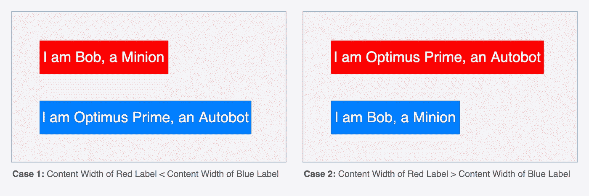
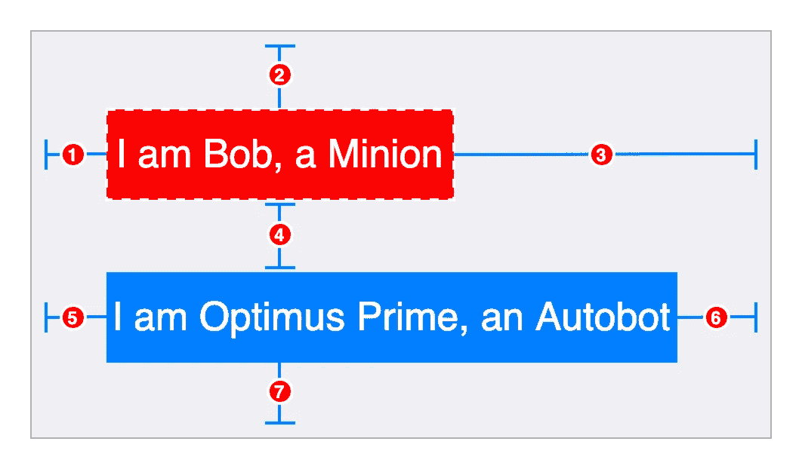
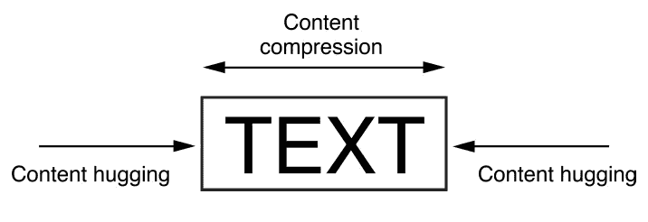
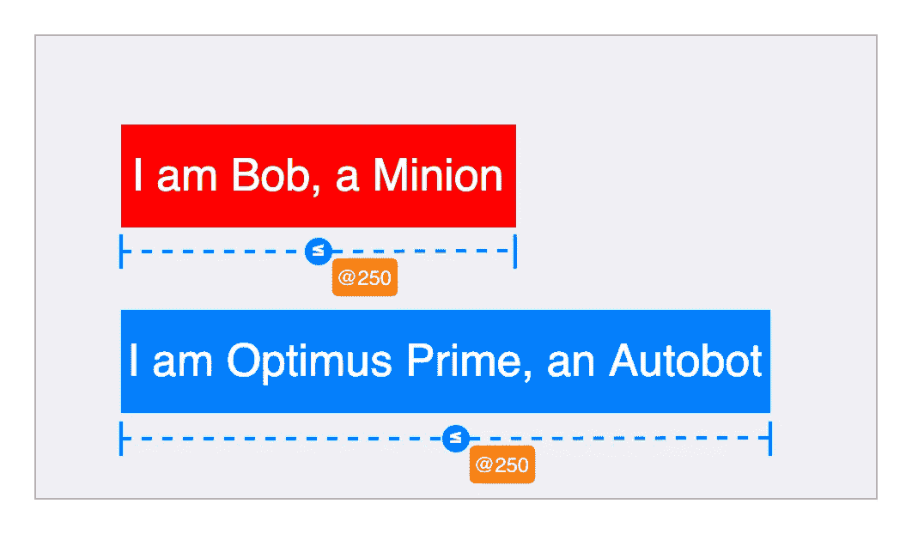
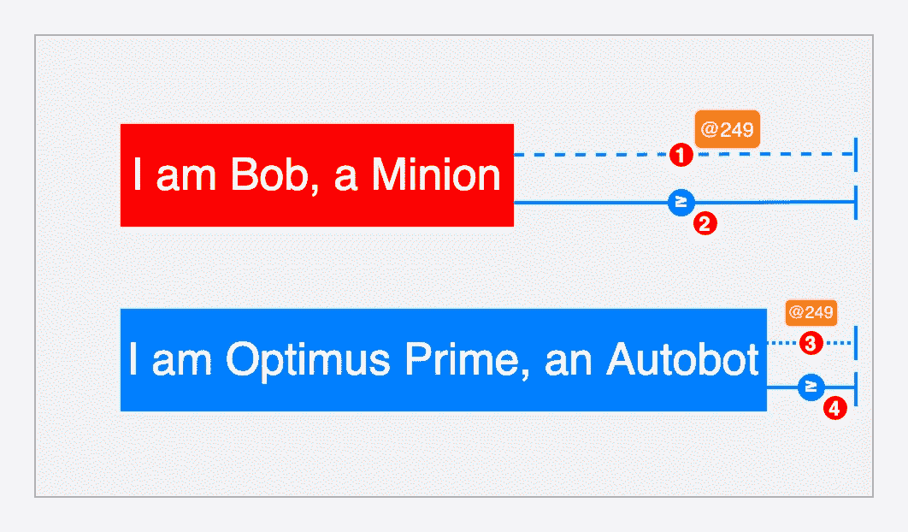
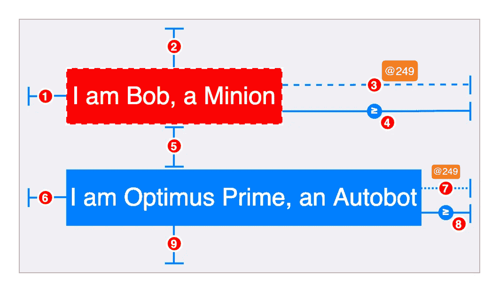

# 让我们构建您的堆栈视图

> 原文：<https://medium.com/geekculture/how-stackview-works-861035c72e83?source=collection_archive---------30----------------------->

Credits: [The Venetian](https://www.venetian.com)

> 当形势对你不利时，使用 StackView 和 chill。
> 
> -菠萝

你知道吗，一场扑克比赛曾经持续了将近八年半！
既然我拥有最珍贵的礼物；请注意，让我们直接进入这篇文章的主题:

**观众** 初级、中级
**我们在构建什么** ui view 中垂直堆叠的两个标签应使用纯自动布局根据较大标签的内容宽度自动调整大小:

Fig 1

**我们没有构建什么** 从零开始构建 StackView 实现，这更像是对自动布局如何工作的理解，这在 StackView 中得到了利用

# 迭代 0

让我们试着做我们大多数人第一次尝试会做的事情:

Fig 2

1.  红色标签。领先=超级查看。领先+ 20
2.  红色标签。Top = Superview。Top + 20
3.  *红色标签。尾随+ 20 =超级视图。尾随*
4.  蓝色标签。顶部=红色标签。Top + 20
5.  蓝色标签。领先=超级查看。领先+ 20
6.  *蓝色标签。尾随+ 20 =超级视图。尾随*
7.  蓝色标签。底部=超级视图。底部+ 20

这些约束有一个问题，等式(3)和(6)不能同时满足，这在查看图 2 时很明显

但是，有趣的是，大多数时候我们都侥幸逃脱了:

*   如果你使用 Storyboard，它会显示错误&建议通过碰撞标签水平内容拥抱和抗压优先级(CHCR 优先级)中的任何一个来修复。
    尽管它消除了错误，但可能不是正确的解决方案。Storyboard 非常聪明，但还不足以了解人类的需求，在这种情况下，我们不希望任何一个标签增长或收缩。
*   如果您以编程方式创建视图，那么在模拟器上看起来可能没问题，因为较小的标签会被拉伸&可能没有设置背景颜色。但是我们会在控制台上看到违反约束的日志，老实说，我们有时会方便地忽略它。

# 迭代 1

现在我们知道约束只在尾部冲突，让我们只关注它，记住我们的需求。

但是，在我们这样做之前，在图 2 的*中有一个捕捉，两组约束(对于宽度*&*高度*)对我们来说是不可见的，这是由布局引擎为所有具有固有内容大小的视图自动添加的。我们将关注*宽度*的约束集，因为它将帮助我们解决尾部的冲突约束。**

**

*Fig 3: Content Hugging & Compression | Credits: [Apple](https://developer.apple.com/)*

**

*Fig 4*

*布局引擎为标签的*宽度*添加了以下约束:*

**对于内容拥抱:*
label . width≤0.0 * NotAnAttribute+intrinsic width***(优先级:250)****

**抗压:*
label . width≥0.0 * NotAnAttribute+intrinsic width***(优先级:750)****

*如果你想知道为什么优先考虑抗压性，那是因为 iOS 不希望我们的内容被剪切，如果它被扩展，对用户来说是没问题的。*

*现在，我们知道了布局引擎隐藏的约束，我们可以回到只在尾部修正冲突约束。让我们退一步&想清楚我们想要什么或者我们的要求是什么:*

*   *如果我们只考虑较小的标签，我们需要尾部间距大于 20*
*   *如果我们只考虑较大的标签，我们需要尾部间距等于 20*

*如果我们能把这两个条件结合起来，我们最终会得到:*

*   *两个标签都需要大于或等于 20 的尾部间距*
*   *如果能够满足布局引擎对*宽度*的约束，两个标签可能都需要等于 20 的尾部间距。基本上，我们可以给它设置一个比图 4 中*宽度*约束集的最低优先级 **(250)** 更低的优先级**(比如 249)** 。*

***注:**
在计算约束方程的解时:*

*   *自动布局试图按照从高到低的优先级顺序满足所有约束。*
*   *如果它不能满足可选约束*(一个不需要的约束；非 1000 优先级)*，跳过该约束，继续下一个约束。*

*因此，自动布局还会考虑到两个标签可能都需要等于 20 的尾部间距，但它会更倾向于布局引擎对*宽度*的约束集。如果它满足其他约束，它将保留它，在我们的情况下，只有更大的标签将满足。*

*焦点中的尾随约束看起来是这样的:*

**

*Fig 5*

1.  *红色标签。尾随+ 20 =超级视图。尾随***(优先级:249)****
2.  *超级视角。尾随≥红色标签。尾随+ 20*
3.  *蓝色标签。尾随+ 20 =超级视图。尾随***(优先级:249)****
4.  *超级视角。尾随≥蓝色标签。尾随+ 20*

*图 1 中**案例 1** ，上面的(1)不能满足，但(3)可以满足。反之，对于**情况 2** ，(3)不能满足，但(1)可以。*

*因此，完整的工作约束将如下所示:*

**

*Fig 6*

1.  *红色标签。领先=超级查看。领先+ 20*
2.  *红色标签。Top = Superview。Top + 20*
3.  *红色标签。尾随+ 20 =超级视图。尾随***(优先级:249)****
4.  *超级视角。拖尾≥红色标签。尾随+ 20*
5.  *蓝色标签。顶部=红色标签。Top + 20*
6.  *蓝色标签。领先=超级查看。领先+ 20*
7.  *蓝色标签。尾随+ 20 =超级视图。尾随***(优先级:249)****
8.  *超级视角。尾随≥蓝标。尾随+ 20*
9.  *蓝色标签。底部=超级视图。底部+ 20*

# *编码时间到了*

*我将它设置为 IBDesignable，这样我们只需设置 IBInspectable 属性就可以在故事板上看到预览。图 1 中的两种情况看起来都是这样的:*

**

*Fig 7*

*上面的 *VerticalStack* 代码也适用于 2 个按钮或 1 个标签& 1 个按钮，基本上适用于任何具有固有内容大小的视图。*

***注意:**
它只完美地处理了*宽度*方面，因为为了简单起见，我故意不考虑*高度*。但是，处理高度的概念仍然相似。*

# *收场白*

*在本文中，借助两个标签的垂直堆叠的简单用例，我们讨论了:*

*   *约束如何转化为简单的数学方程*
*   *冲突约束是如何发生的*
*   *布局引擎如何为具有内在内容大小的视图自动生成约束*
*   *什么是约束优先级*
*   *什么是内容拥抱和抵抗优先*
*   *自动布局如何解决具有不同优先级的约束*

*我希望你知道自动布局是如何思考的&你应该如何在布局视图时思考。*

*暂时就这样吧，下次见…*

*快乐编码和分享😍
干杯🍺
[沙鲁克阿拉姆](https://www.linkedin.com/in/alamshahrukh/)*