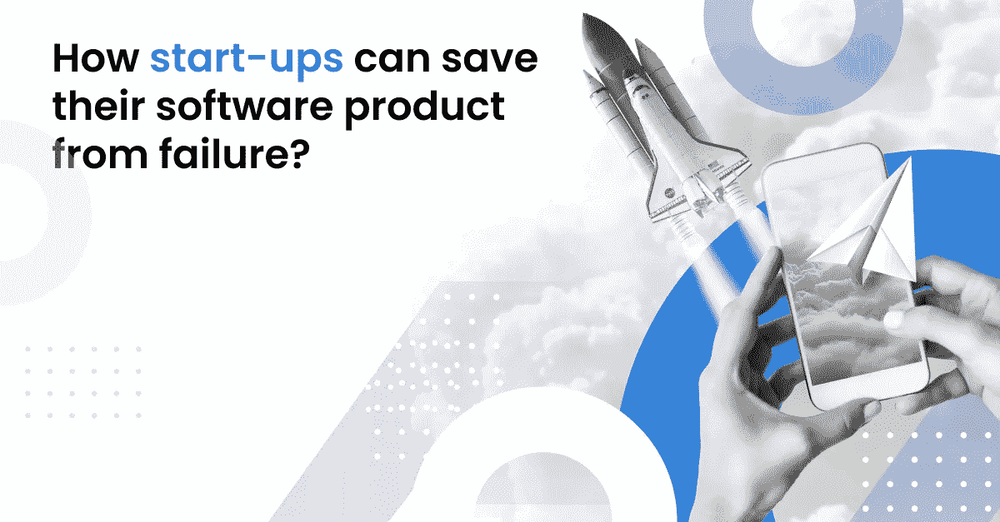
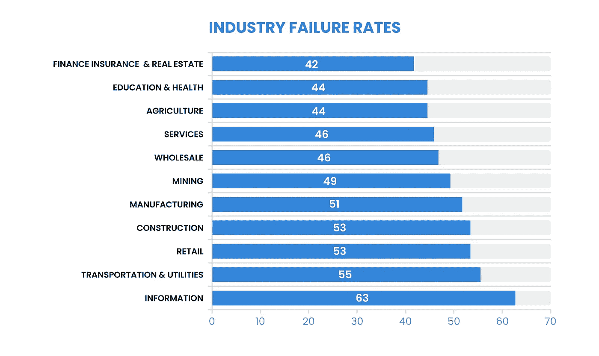
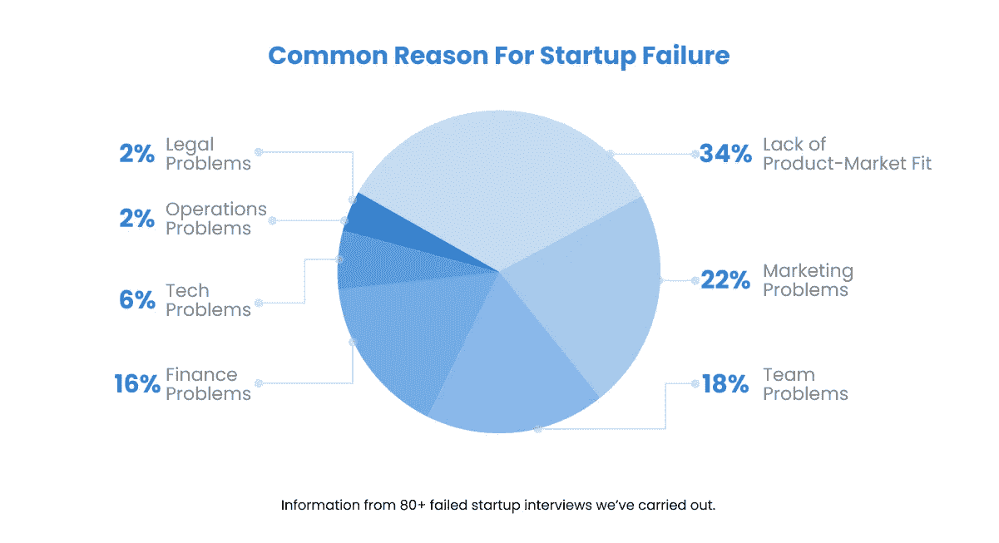

# sturt-ups 如何拯救他们的软件产品免于失败？

> 原文：<https://medium.com/geekculture/how-sturt-ups-can-save-their-software-product-from-failure-f6edb679bf6d?source=collection_archive---------18----------------------->

在 IT 行业 10 多年了，我遇到过很多人，他们在职业生涯的某个阶段至少有过创业的想法。那些真正开始把这变成现实的人从来没有达到他们努力的最终目标和成功发展。原因各不相同，而且似乎显而易见。但我决定在全球范围内深入了解原因:为什么初创企业和软件产品总的来说会失败？

# 严酷的统计数字

没有冗长的介绍，让我们从头开始研究统计数据。

至于 2021 年，[美国有 3250 万家](https://cdn.advocacy.sba.gov/wp-content/uploads/2021/08/30144808/2021-Small-Business-Profiles-For-The-States.pdf)小企业，占美国所有企业的 99.9%。根据 T2 劳动统计局的数据，大约 50%的新小企业在 5 年内倒闭。

创业公司的数据更加苛刻，因为不是每个小企业在技术上都是创业公司。初创公司特别关注创新和增长:它们是为了测试全新的假设(技术、产品、服务)而创建的，并且高度可扩展，具有指数增长而非线性增长的潜力。

每个月都会有几十个创新的想法出现，但是所有行业的失败数据都很高。深入研究广泛引用的事实和数据:

*   一个众所周知的事实是，从长远来看，大约 90%的创业公司都会失败；[初创公司基因组](https://startupgenome.com/)报告称，10 家初创公司中只有 1 家成功登顶
*   10%的初创公司通常会在第一年内退出*(失败)*
*   70%的创业公司在 2-5 年内失败*(失败)*
*   所有行业的失败率似乎接近相同*(统计大脑研究所)*

如果更精确地谈论工业，失败率最高的是信息技术，也就是软件产品。

*来源:* [*统计脑研究所*](https://www.statisticbrain.com/)

平均而言，不同来源的统计数据差异最大为 10%。但严格的准确性不是这里的问题，因为早期创业公司通常不会从投资者那里筹集资金，而其中一些甚至没有法律实体(这很自然，因为他们不需要它来测试想法本身)。因此，很多创业公司就这样默默无闻地死去了。Failory 甚至有一个单独的页面，上面有一个启动记录。

所以，简单的事实是，创业是 100%有风险的，尽管一旦成功就会有回报。

# 从一个独特的想法到失败:产品为什么会失败？

启动失败的原因因源而异，但有 5 个最常见的原因。这里有更多的统计数据:

1.  营销问题

CB Insights 、[和其他许多公司报告的头号原因是缺乏产品市场契合度。根据采访了 80 多家失败创业公司的](https://www.embroker.com/blog/startup-statistics/) [Failory](https://www.failory.com/blog/startup-mistakes) ，34%的项目失败仅仅是因为没有人需要这样的解决方案。

**另有 22%** 报告他们的营销失误是(价值递减):行业内竞争、缺乏价值主张、留住用户、市场规模小、缺乏对核心方向的关注。

因此，这幅画面很难让人相信:**56%的项目因为缺乏市场调研和系统化的营销方法而夭折。此外，“致命的营销错误比所有其他致命错误都多( **56%对 44%** )”。**

**2.财务问题**

**根据 CB Insights，第二个最致命的原因是“资金和个人资金耗尽” **(29%的案例**)。在他们的研究中，Failory 报告了 16%的此类案例。所以我想，介于两者之间的才是真正的统计数据。**

**如果谈到财政方面，我指的不仅仅是资金。当项目开始发展成为“真正的商业”时，资金尤其重要。除了财务问题，我们还增加了考虑不周的货币化、低利润率和超支。**

**3.团队问题**

**平均来说，**大约有 20%的**创业公司由于团队问题而倒闭(根据[CB insights](https://www.cbinsights.com/research/startup-failure-reasons-top/)的数据为 21%，根据 [Failory](https://www.failory.com/blog/startup-mistakes) 的数据为 18%)。**

**值得一提的不仅是团队不和谐(比如动机不同、努力贡献不同、摩擦)，还有包括营销、业务、技术、行业/领域在内的经验不足。**

**4.技术问题**

**这很少是致命的原因(**约 6%** 的病例)。最大的错误是在验证想法和市场之前，对昂贵的技术和额外的功能进行额外的投资。**

**5.运营和法律问题**

**这两个方面是最少致命的。*失败案例*只报告了 **4%的案例**项目因运营或法律问题而失败(两者分别为 2%)。尽管如此，*CB insights*报告了 18%的案例，其中最主要的失败原因是监管或法律挑战。**

****

**[*来源:失败的*](https://www.failory.com/blog/startup-mistakes#toc-common-team-problems)**

# **成功的核心秘诀**

**是的，创业总是高风险的。但是考虑到所有这些数字和分析，采纳失败和成功的企业和产品的经验，有一种方法可以增加成为 1%富人的机会。**

1.  **市场研究**

**如上所述，产品与市场不匹配是创业公司和软件产品失败的首要和最致命的原因。因此，这里的第一课是做一个适当的、准确的市场调查来证明你的软件产品是可行的，是受欢迎的。**

**在全力以赴寻找投资者之前——定义你的目标受众，进行竞争研究，与客户交谈，测试你的假设和市场。简而言之，确保人们需要你的产品，并愿意为此买单。**

**CustDev、MVP、PoC、Pretotyping 等最佳实践方法将帮助您测试您的目标市场，做出新的假设并继续前进。点击了解更多[。](https://intexsoft.com/market-research-guide/)**

***注:根据德勤的调查，以客户为中心的企业盈利能力要高出 60%。***

**2.利益相关者团队内部的协同作用**

**第二课:确保你的团队拥有相同的愿景，并且有动力为项目付出努力。否则，“你会把项目拉向不同的方向”。**

**众所周知，任何成功的初创公司都需要一个骗子(擅长销售和营销的人)、一个黑客(负责技术方面的工作)和一个潮人(让产品看起来时尚而酷的人)。两者兼而有之很难。因此，对于利益相关者来说，精通不同的方向以补充彼此和产品本身是非常重要的。**

**因此，设定目标，同步你的愿景和期望，并划分责任。**

**3.避免过度投资**

**创业本质上是一种风险，但在早期投入大量资金购买额外功能和昂贵的技术风险更大。**

**让它精益并测试你的想法。如果不成功—旋转！**

**[*注*](https://www.failory.com/blog/startup-failure-rate#toc-6-reasons-why-startups-fail)*:1-2 次转向的创业公司，用户增长好 3.6 倍，融资多 2.5 倍。0 次或超过 2 次的创业公司表现要差得多。***

**4.接受风险**

**以......的药为例，即使遵循所有的商业最佳实践并确保你的团队选择了正确的选项，失败的可能性还是很高的。**

**但是，你仍然可以事先考虑你的财务和个人物品，确保你能够承受失败。**

# **还有机会**

**失败不是终点。**

**真正有动力的创业者通常会从失败的尝试中吸取教训，然后开始一个成功的创业。其他人(在启动自己的项目/产品方面积累了丰富的经验)找到了好的工作机会。**

**显然，并不是每个企业家都有资源进行第二次尝试，但是随着第二次尝试而来的是更大的潜力和更多的成功机会。**