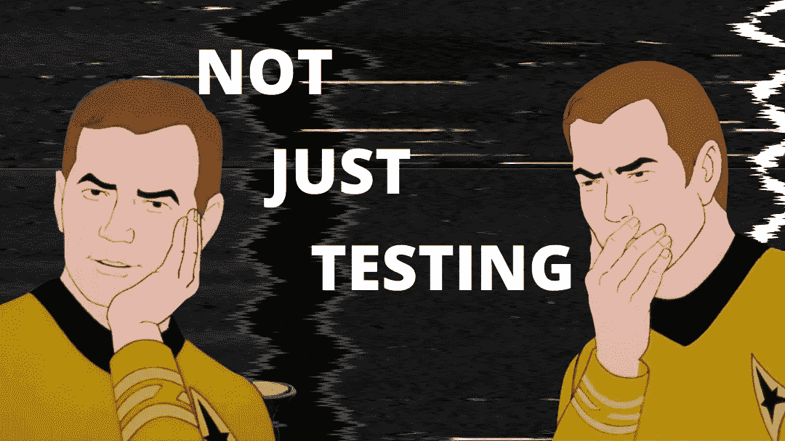
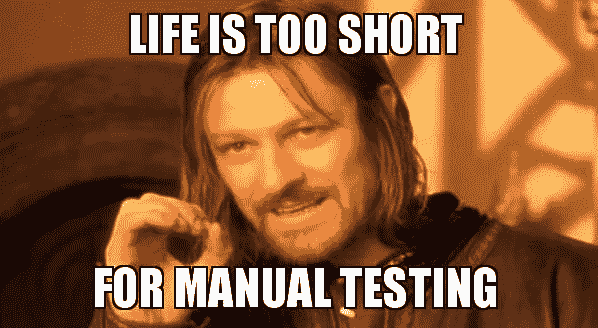
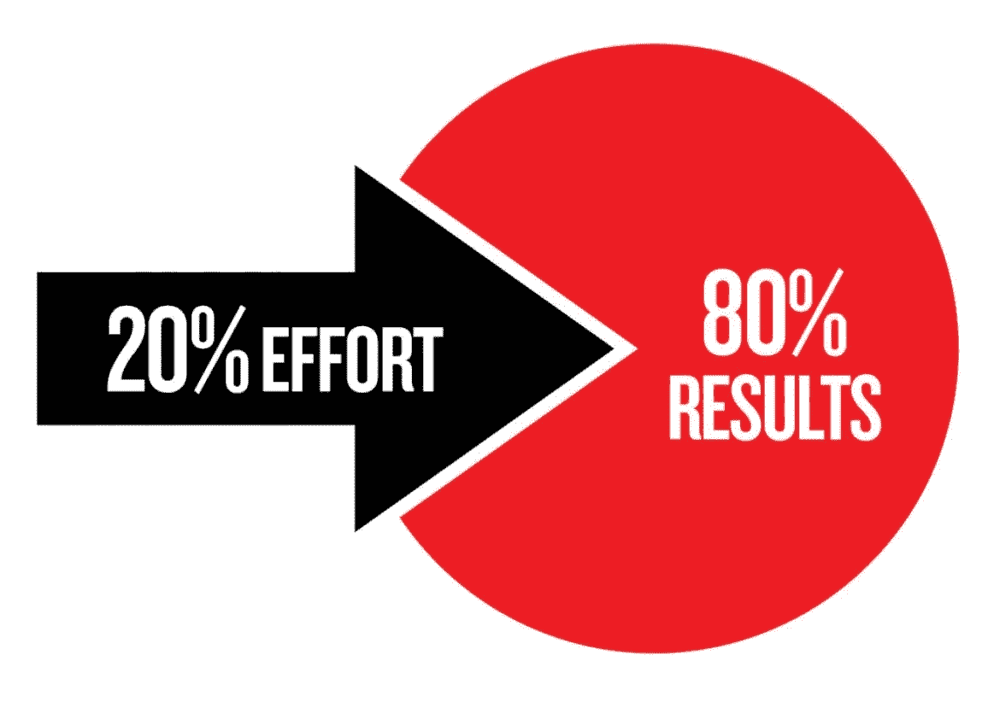

# 除了测试之外，测试人员如何对产品团队有用

> 原文：<https://medium.com/geekculture/how-testers-can-be-useful-to-the-product-team-other-than-just-testing-bd1f1d74182d?source=collection_archive---------26----------------------->

不知何故，历史上 QA 专家/测试人员的能力集中在两个任务上:

1.  最重要的概念是:他们只需要测试产品——点击按钮，看看是否一切正常，然后放心地发布到生产中。
2.  高级水平:质量保证和质量控制。

虽然第一点很清楚，但第二点更复杂，这是一个模糊而宽泛的定义。而那些与细节联系不那么紧密的人，对它是什么一无所知。与质量有关。也许这就是为什么测试员接近猴子测试员的形象，他们时不时地按下按钮。

QA 专家的技能和能力正在发展，不再局限于点击搜索 bug。但与此同时，客户和企业对如何应用这些技能以及应用什么的理解，通常不会超出测试的范围。这种不匹配对双方来说都是一个错失的机会:QA 专家不知道如何向业务部门推销这种能力，也不知道如何传达这些能力的好处，而业务部门反过来只把他们视为错误捕捉者。

在这篇文章中，我想谈谈 QA 工程师拥有、知道、实践的不明显但很酷的技能，以及它如何真正帮助企业。

# **设置工作流程**

项目的**工作过程强烈地影响着产品的质量和用户最终得到的东西。**

工作流程是团队或团队/部门之间的交互，也是开发生命周期本身。

*   ***团队中的互动是什么* :** 谁该质疑谁；问题应该以什么形式提出；任务是如何传递的，传递给谁，在什么时间点，谁负责什么，等等。
*   ***什么是开发过程*** —这是开发生命周期，由分析、开发、测试和支持组成。在这里，理解整个链条是很重要的:分析是如何进行的；谁参与了这个阶段；任务的状态是什么；他们什么时候传递，传递给谁；开发过程中发生了什么等等。

*这一切都可以由 QA 工程师从头开始设置、调整和控制。*

为什么 QA 工程师要这么做？例如，为什么不是首相呢？QA 工程师理解用户的逻辑，产品的业务逻辑，过程如何影响质量，同样重要的是，功能和业务目标应该如何相互联系。他把整个过程看做一个钟表机构，彻底地把它拆开，并加以改进。这听起来非常类似于项目经理所做的，但是质量保证工程师也必须从技术上理解产品，而不仅仅是从经理的高层来理解。

如果流程中的某个地方出现了问题，即使是很小的问题:设计师不同意开发部门的意见，营销部门不同意设计师的意见——这就是产品质量问题的开始。一些任务可能会迷失在流程深处，永远无法发布。结果？用户得到的是一个低质量的产品，业务遭受损失和用户的负面反馈。

***例证:***

我们的一个项目有很高比例的支持服务呼叫。我们开始建立流程:弄清楚各部门如何互动，团队内部发生了什么，任务如何发送给开发，谁负责，等等。经过几个月的调整和流程重组，打给支持服务的电话数量减少了五分之二。仅仅是因为所有的过程都变得透明和精细。

> 立正！我们没有投入资金，或者雇佣更多更好的开发人员和测试人员，他们没有膨胀支持人员来加快收拾残局，但是他们在现有团队的条件下建立了一个新的流程。

# **竞争力分析**

另一件你可以也应该让 QA 工程师做的很酷的事情是竞争分析。

*   首先，在使用现有产品时，您需要它来了解为什么竞争产品更好或更差；他们的产品有哪些特点；用户是否喜欢这些功能；你的产品应该改进/改变什么来获得更多的用户？没有这些信息，就很难跟上发展的步伐，并保持你的产品在市场上的竞争力。如果你有一个商业分析师，这很酷——那是他的工作。但是如果没有，QA 工程师和他对事物的技术观点会有所帮助。
*   其次，如果你刚刚开始，你需要它。假设你有一个新产品。市场上已经有类似的东西了。如果要把事情做好，你需要了解用户对竞争对手产品的体验；用户喜欢什么、舒服什么，不喜欢什么；竞争对手是否有很酷的功能/缺陷。要做到这一点，你需要收集一份竞争对手的名单，并交给 QA 工程师。他们检查你所有网站/应用程序的功能，找出不同之处，找出竞争对手的功能错误或你没有考虑到的很酷的功能。这是你的优势，也是你击败竞争对手而不在产品功能上犯类似错误的机会。

还是那句话，为什么是 QA 工程师？毕竟还有开发商，分析师，营销。QA 工程师有视觉经验，在浏览用户路径方面有很多经验，并且理解用户的逻辑。这就是质量分析所需的全部内容。

# **解析产品逻辑**

QA 是那种宁愿用问题纠缠你，也不愿让怀疑留在产品逻辑上的人。一个 QA 工程师知道什么能与什么相互作用；它如何互动；了解功能和逻辑错误的后果。他开始从一个普通用户的角度提出问题:系统将如何运行？；用户会怎么做？；如果他这么做了，会把他带到哪里？在提问环节中，产品的逻辑错误经常出现。

***例证:***

我们有这样一个案例，当我们拿到一个功能性的测试时，我们开始问问题。事实证明，在产品中，或者说在产品的逻辑中，有很多不一致的地方。结果，产品被送回市场部进行修改，甚至没有送到开发人员那里。这是因为最初与保险公司和律师讨论阶段的问题还没有解决。

> 这就是帕累托 80/20 原则。在开发的最后阶段发现的 20%的错误需要花费 80%的预算来修复。反之亦然:在早期阶段发现的 80%的错误占用了 20%的预算。

# **扩大业务规模**

QA 帮助您扩大业务规模。更具体地说，QA 工程师可以诊断产品，检查其扩展准备情况，以避免可能发生的全局错误，例如，当产品上的负载增加时。假设您想要大幅扩展一个平台。资源在那里，开发部门发誓一切都绝对准备好了，但首先要理解的是:系统能承受负载吗？；现在有什么潜在危险但不易察觉的问题吗？；如果用户不是十个，而是一千个，这个平台还能维持吗？****

***例证:***

一个客户找到我们，他想要大幅扩展。他带着一个成品来做手工测试。我们开始关注平台，我们开始怀疑:系统能支撑住吗，数据库能支撑住吗，服务器能支撑住吗。所以我们建议进行负载测试，而不是手工测试。事实上，问题已经暴露出来，如果平台承受很重的负荷，这些问题就会出现。也就是说，在对 100 个人进行手动测试后，正如客户所希望的那样，一切都很好，但如果你对 10，000 个人启动它，一切都会崩溃。

# **几句善意的临别赠言:**

当然，公平地说，我上面写的内容并不是所有测试人员和 QA 都能做到的。毕竟要看经验，看技巧，看视觉体验。但这是质量保证专家在工作中应该努力的方向。

就像营销人员、商业分析师、战略家和公司的其他专家/部门一样，QA 工程师对使产品为企业创造收入感兴趣。因此，通过超越测试，QA 工程师将他的知识转化为透明的过程，一个有竞争力的、高质量的和用户友好的产品，转化为酷的用户体验。满意的用户意味着金钱和不断增长的业务。