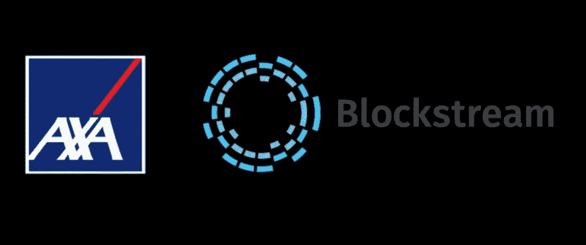
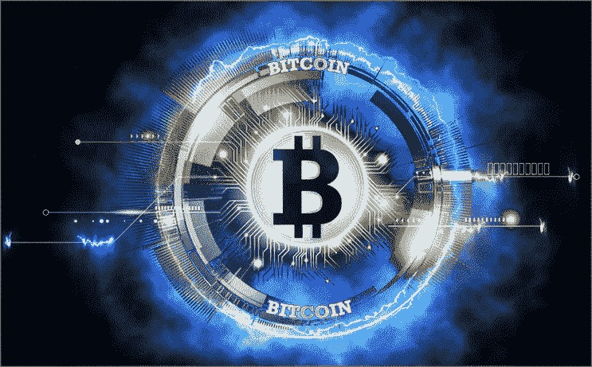
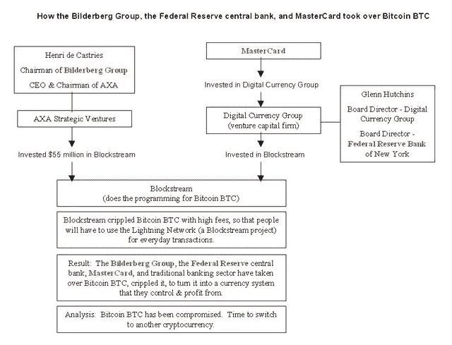
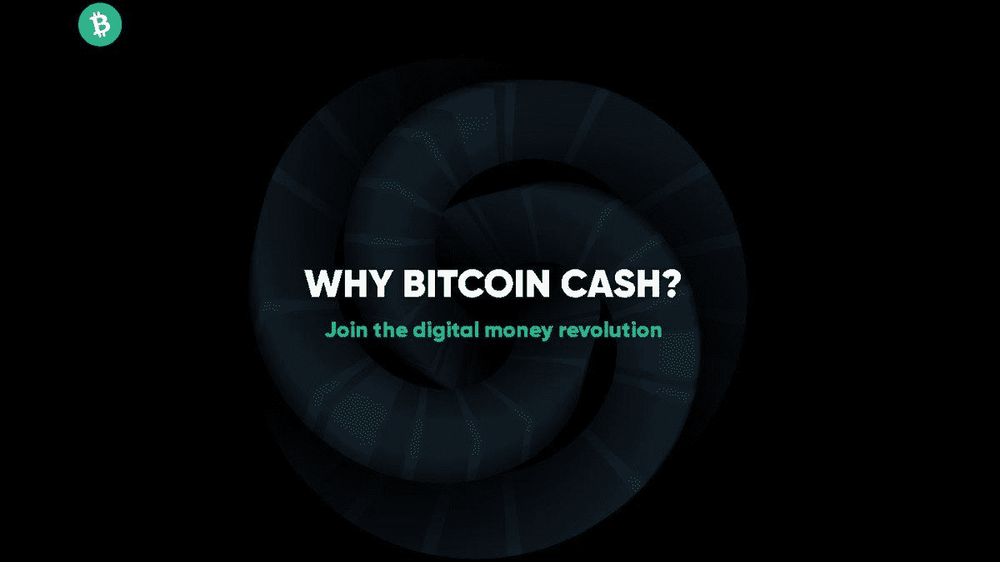

# 银行如何利用区块流作为特洛伊木马劫持比特币——为什么是比特币现金

> 原文：<https://medium.com/geekculture/how-the-banks-hijacked-bitcoin-using-blockstream-as-a-trojan-horse-why-bitcoin-cash-1ea347de5d70?source=collection_archive---------38----------------------->

比特币可以在链上扩展，我们非常清楚这一点，因为比特币现金正在扩展，并消除了那些不希望比特币扩展的人所产生的任何疑虑或“区块链三难困境”。

比特币是“P2P 电子现金”，如果它要扩大规模，它只能在链上扩大规模。第二层不是 BTC 区块链低效的扩展解决方案。

比特币也是抗审查的。当然只有链上的。

开发人员正在开发的任何其他解决方案(Lightning、Liquid 等。)只是在为交易审查创造更好的选择。由于在萨尔瓦多没有什么可以阻止 Strike(一种托管和 KYC 兼容的钱包)，并且该政府希望向其人民强制推行“比特币 LN”，我们见证闪电网络内 BTC 交易的首次金融审查将是一个时间问题。

# 闪电网络——银行和政府的集中化工具

[*Source of Image*](https://www.pinterest.com/pin/766667536561100282/)

任何人认为闪电网络仍然不允许闪电中心接管网络，用户可以通过随时打开和关闭频道来使用闪电，那么请再猜一次。

I)闪电大概是关于微交易的([即](https://read.cash/@Pantera/how-the-banks-hijacked-bitcoin-using-blockstream-as-a-trojan-horse-why-bitcoin-cash-74eb96c5#bad-link)买一杯咖啡或苏打水)。

ii)打开和关闭 LN 频道需要支付矿工费用。

iii)BTC 费用为 50 美元，你会为你的汽水或咖啡支付 55 美元吗？

不，在这种情况下，你被迫使用增加审查几率的**闪电枢纽**。像 Strike 这样完全符合 KYC 法案/反洗钱法案的托管服务正是银行希望比特币成为的样子。

## LN 如何服务于银行系统

它将服务于银行机构，因为拥有 LN 的银行正在控制他们在 2010 年维基解密宣布采用比特币时视为金融颠覆者的东西。

在接下来的几年里，比特币继续快速扩张，甚至被微软、Steam 和 Twitch 接受为一种支付方式！

此外，比特币被认为是对金融稳定和银行体系的威胁。

商家和消费者对比特币的压倒性支持需要在它失去控制之前停止。

## 伪“区块链三难”

“区块链三难”是 Vitalik 的想法，也是用 7000 万枚预开采的硬币(65%预开采)创建比特币区块链副本的借口。).这种三难困境表明，区块链必须牺牲三个基本特征中的一个:

*   分散
*   安全性
*   可量测性

比特币现金已经让这种所谓的三元悖论失效了。如果比特币无法规模化，比特币现金也无法规模化。

然而，比特币现金设法完美地扩展，并且它已经证明是比特币在链上扩展并增加其用户群，而没有牺牲其分散性或安全性。

此外，比特币现金已经证明，顶级比特币核心开发人员(特别是那些在 Blockstream 工资单上的人)所说的和所做的一切都是谎言，是为了阻止比特币在全球范围内的商业指数增长。

## 比特币 BTC 是如何被攻破的

Blockstream 是由银行创建和资助的，其唯一目的是延迟进展，看起来像是金融权力从银行卡特尔到加密货币金融网络的可能重新分配。

区块流有效地削弱了比特币。这张图表包含了不可否认的事实，解释了银行在阻止比特币普及方面走了多远。

这张图表解释了 BTC 和彼尔德伯格集团的联系。Mastercard、AXA 和 gray，以及它们是如何相互关联和资助 Blockstream 的:

*Source:* [*Reddit*](https://www.reddit.com/r/btc/comments/7m046d/how_the_bilderberg_group_the_federal_reserve/)

# 为什么是比特币现金？

*Image from:* [*Whybitcoincash.com*](https://whybitcoincash.com/)

比特币现金现在又开始了，用户群想要一种抗审查的数字货币，快速的 P2P 交易不需要极高的费用，也不需要集中的金融中心来授权交易。

比特币 BTC 目前恰恰相反，它是金融进步的敌人，也是银行和精英保持相关性并继续参与游戏的一种方式。

许多人想知道为什么 BTC 最大化主义者存在，为什么他们支持其他加密货币毫无价值的观点，试图给该领域的初学者洗脑。尤其是针对比特币现金，反应总是相当极端。

Blockstream 背后的精英并没有预料到来自比特币社区和比特币现金分叉的一部分的这种抵制。在这种情况下，计划是保持沉默，从新闻中删除比特币现金，并从所有可用的传播渠道中审查它。

这些曾经只是:Reddit，Bitcointalk，以及像 Coindesk 和 Cointelegraph 这样的加密新闻网站。

一个初学者在阅读比特币现金时，立即被欺骗性的文章、演示和比特币现金及其支持者收到的数百条负面评论所回避。这场诽谤运动持续了许多年，直到它最终赶上了现实。

一些个人投资者和开发者继续斗争，随着比特币现金网络按照比特币应有的方式运行，人们开始再次思考这个问题。2017 年涌入比特币的数百万人中的许多人(包括我自己)再次思考了这个问题，做了更多的研究，并决定比特币现金是我们当初进入 Crypto 的原因。

作为用户，我们想要一种抗审查和去中心化的加密货币，但我们总是认为这将是即时和无感觉的。这就是我们对比特币的看法，也是我们将比特币现金视为真正的比特币的原因。

**跟我来:**

*●*[***read cash***](https://read.cash/@Pantera)*●*[***noise cash***](https://noise.cash/u/Pantera99)*●*[***Medium***](/@panterabch)*●*[***Hive***](https://hive.blog/@pantera1)*●*[***Steemit【t】***](https://steemit.com/@pantera1)

*●* [***推特***](https://twitter.com/Panterabch)

 [## 通过我的推荐链接-潘迪拉加入媒体

### 阅读潘迪拉的每一个故事(以及媒体上成千上万的其他作家)。你的会员费直接支持潘迪拉…

panterabch.medium.com](https://panterabch.medium.com/membership) 

*最初发布于*[*https://read . cash*](https://read.cash/@Pantera/how-the-banks-hijacked-bitcoin-using-blockstream-as-a-trojan-horse-why-bitcoin-cash-74eb96c5)*。*