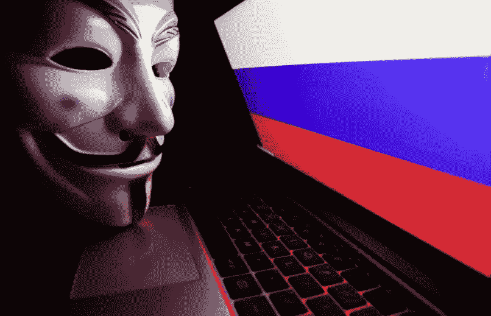

# 互联网是如何扰乱战争的

> 原文：<https://medium.com/geekculture/how-the-internet-is-disrupting-warfare-c6a9c99944b7?source=collection_archive---------7----------------------->

## 技术与社会

## 战争只是遇到了取消文化

Fortune

*俄罗斯对乌克兰的战争——第 7 天*

如果有一件事是独裁者无法忍受的，那就是失去对叙事的控制。控制公共信息的叙述是控制整个人口的第一步。这就是为什么新闻自由和…