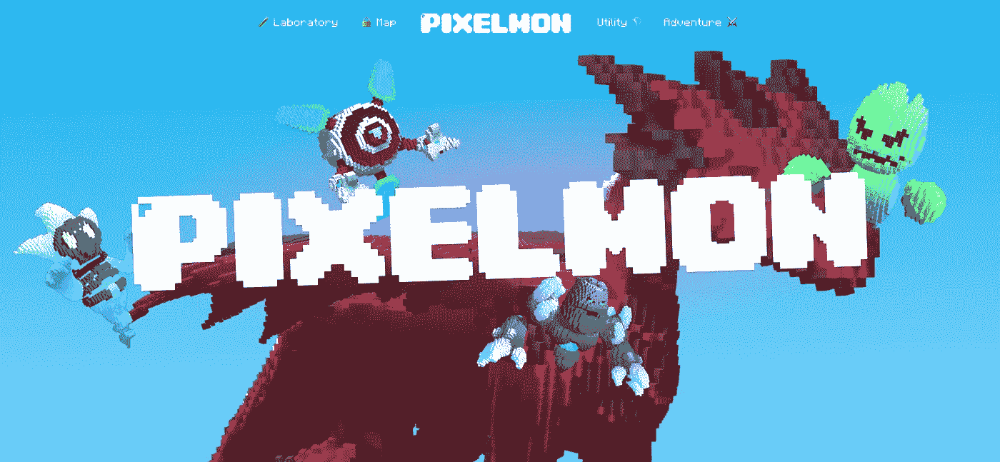

# Pixelmon 游戏如何筹集 7000 万美元并引发争议？

> 原文：<https://medium.com/geekculture/how-the-play-to-earn-game-pixelmon-raises-70m-and-sparks-controversy-4cee59f008ff?source=collection_archive---------14----------------------->

P2E 的游戏 Pixelmon 引起了争议和嘲笑。出售价值 7000 万美元不可替代代币(NFT)的项目远未实现其所有承诺。

How the Play-to-earn game Pixelmon raises $70M and sparks controversy ?

# Pixelmon 引发争议

Pixelmon 是一个从游戏到收入(P2E)的项目，完成了它的第一次预售…