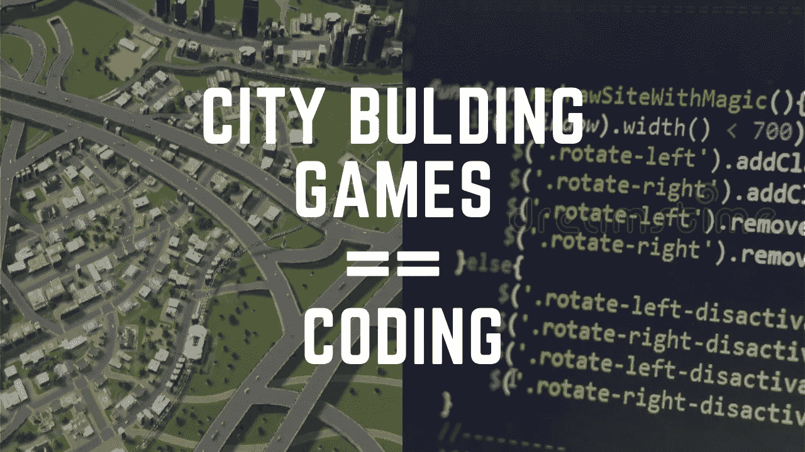

# 这种视频游戏如何大幅提高你的开发技能

> 原文：<https://medium.com/geekculture/how-this-1-kind-of-video-game-drastically-increases-your-development-skills-3a3f6b3d11bd?source=collection_archive---------4----------------------->

## 从本质上讲，软件开发与城市建设游戏有许多相似之处。

Image made by the [Author](http://www.arnoldcode.com) via canva.com

有些游戏是基于解决更大目标的问题，例如《咕的世界》、《模拟城市》和《彦俊》。开发软件可能是一个类似的愉快的过程。