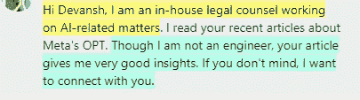
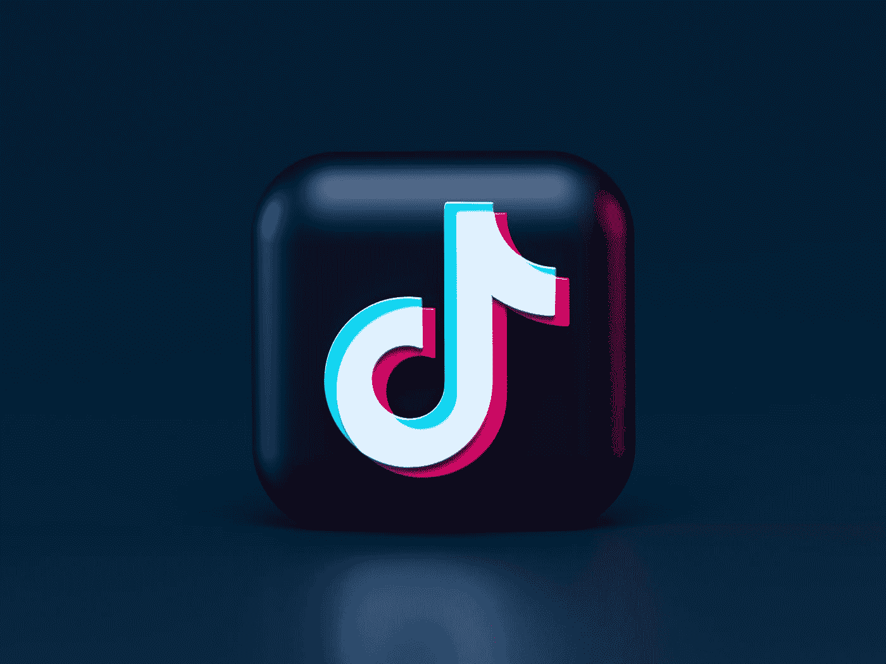
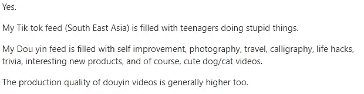

# 抖音如何打破经济学

> 原文：<https://medium.com/geekculture/how-tiktok-breaks-economics-932658d9ea6e?source=collection_archive---------4----------------------->

## 为什么抖音会损失数十亿美元。以及为什么政府应该特别关注。

抖音发展非常迅速。发展如此之快，以至于许多投资分析师都将其推为未来的社交媒体，未来将杀死脸书的社交媒体。与脸书的比较是有意义的，因为抖音攻击了 18-29 岁的年轻人，这曾经是 FB 的据点。这给分析师敲响了警钟，包括 FB 的人，他们已经决定去元宇宙登月，以避免正面竞争。

 [## 元宇宙对投资者来说是个好主意。

### 不，我不是在讽刺。Meta 实际上需要元宇宙。

medium.datadriveninvestor.com](https://medium.datadriveninvestor.com/the-metaverse-is-a-great-idea-56e80c69b1c4) 

但是如果你深入了解，事情就大不相同了。尽管增长令人印象深刻，但抖音离实际利润还差得很远。[2021 年，抖音母公司字节跳动亏损**850 亿美元**](https://musically.com/2022/10/07/bytedance-2021-financials/) 。从数据科学的角度来看，抖音的数据也不如其他主要社交媒体巨头收集的数据有价值。那么，为什么抖音能够继续平稳运行呢？这是另一个风险资本支持的无稽之谈的例子，还是幕后有更多的事情发生？CCP 和这有什么关系？我们将对此进行深入报道。

> *抖音在 2021 年第三季度达到 10 亿用户，预计到 2022 年底将达到 18 亿用户。*

[*-来源*](https://www.businessofapps.com/data/tik-tok-statistics/#:~:text=TikTok%20users,by%20the%20end%20of%202022.)

# 主要亮点

1.  **为什么抖音没有盈利-** 两个因素让抖音亏损——竞争和缺乏有价值的数据。它也主要是一个可视化平台，使得用户行为的分析更加昂贵。这些使得这个平台天生更难赚钱。
2.  **为什么这不重要——**[*【是的中国共产党】在字节跳动拥有股份和董事会席位*](https://www.himalayaustralia.com.au/2022/08/31/ccp-backed-bytedance-has-influence-and-ownership-in-multiple-industries/) 。他们资助它是为了推进他们的地缘政治目标。我知道这让我听起来像一个阴谋论者，但我会在文章中分享证据。只要他们的目标得以实现，CCP 愿意承受损失。
3.  该怎么办- 许多政府(包括我的祖国印度)已经禁止了抖音。人们对它正在如何摧毁我们这一代和下一代提出了担忧和警告。虽然这些担忧是有道理的，但我不知道禁止是否是正确的举措。它没有解决可能被利用的根本问题。我们将介绍一些可以采取的替代措施。

如果你对商业、社交媒体或技术如何影响社会感兴趣，今天的文章会让你非常感兴趣。Esp。如果你对决策/政府感兴趣。

A lot of my writing is relevant to both engineers and non-engineers in tech. If you know anyone who would find this useful, please share my work.

让我们开始吧。

# 为什么抖音不盈利

收入是脸书和抖音之间第一个无法比较的领域。[FB 用了 5 年时间才扭亏为盈。此时，它已经拥有 3 亿用户](https://www.theatlantic.com/business/archive/2009/09/facebook-turns-a-profit-users-hits-300-million/26721/)。TT 的收入是这个数字的 3 倍多，但还远未盈利。有几个原因-

1.  竞争——FB 是第一批真正破解密码的社交网络之一。另一方面，TT 基本上在和每一个科技巨头争夺你的注意力。与获得先发优势的 FB 不同，TT 正在进入一个有很多竞争对手的成熟市场。这确实包括你的，因为时事通讯是注意力经济的一部分。
2.  数据缺乏价值——这是我从未见过其他人触及的问题。但这是有意义的，因为大多数做股票分析的人没有我的数据科学+ AI 背景。将抖音的数据与谷歌、亚马逊、Meta 和微软收集的数据进行比较。其他 4 个国家的数据收集明显更好，因为它们的来源多种多样。**谷歌拥有来自搜索、手机使用、Youtube 等的数据。亚马逊知道你买了什么，看了什么，读了什么等等。FB 和 IG 有许多功能，如卷轴、群组、评论、兴趣等，给 Meta 一个大的数据池来描述你**。别忘了你还用 FB 和 Google 登录很多应用，让他们访问第三方数据。与它们相比，TT 的数据并没有多少附加值。

还有一个方面让 TT 比这些平台更棘手。TT 的数据主要来自视频观看时间和参与度。这种介质本来就很难分析。其他平台也必须这样做，但是他们有其他数据格式来增强他们的分析。他们在游戏中的时间也更长，给了他们更多的时间来微调他们的管道。

Photo by [Alexander Shatov](https://unsplash.com/@alexbemore?utm_source=medium&utm_medium=referral) on [Unsplash](https://unsplash.com?utm_source=medium&utm_medium=referral)

TT 以一种软弱的性格在艰难的模式下玩游戏，与试图扼杀所有竞争的其他竞争者对抗。从这个角度来看，它缺乏盈利能力并不奇怪。那么，为什么人们给它这么多钱来生存呢？它是希望最终获得足够多的用户，从而实现盈利吗？一些预测称，它将很快盈利，但鉴于竞争激烈，完全主导是不可能的。这就是为什么 CCP 的董事会席位如此重要的原因。

# 抖音如何融入 CCPs 地缘政治

相信我。我知道。听起来有点遥远。但是当你阅读这篇文章时，请保持开放的心态。

我不需要告诉你社交媒体是如何成为社会的巨大组成部分的。它给人们提供了一个平台和杠杆来影响人们，这种影响会让历史上最伟大的领导人看起来像业余爱好者。这也意味着你可以通过各种方式影响社会。企业、政治家和有影响力的人都没有失去这种潜力，他们都在广告和创作内容上投入了大量的时间和金钱。他们都想让你听他们的。正如伟大的哲学家和邪教领袖德万什(是的，就是我)所说，“谁拿着麦克风，谁就控制了叙事。”

> 社交媒体广告领域的广告支出预计将在 2022 年达到 2260 亿美元。
> 
> [*——来源*](https://www.statista.com/outlook/dmo/digital-advertising/social-media-advertising/worldwide#:~:text=Ad%20spending%20in%20the%20Social,generated%20through%20mobile%20in%202027.) *。让这个数字深入人心。*

正是因为这个原因，像脸书和推特这样的网络总是在和政客斗争。政府希望控制这些平台来传播他们的叙事，这可能是继续掌权或站在反对派一边大喊大叫的区别。然而，TT 更进一步。TT 是两个不同的应用程序。在中国以外也可以使用的应用程序抖音，以及为中国观众制作的变体斗印。撇开功能不谈，事实证明他们在平台上推广的内容种类非常不同。

斗印因宣扬“文化价值”而闻名。有很多关于努力工作、成就和其他可取品质的内容。[正如这篇 CNN 商业文章](https://www.cnn.com/2021/09/20/tech/china-tiktok-douyin-usage-limit-intl-hnk)提到的- *“该应用程序还表示将引入新的内容——从科学实验和博物馆到美术馆展览和自然风景——以‘激励’更年轻的青少年。”*该应用程序还具有阻止孩子在上面花费太多时间的检查功能。[它还审查许多话题，比如西藏独立](https://gab-china.com/what-are-the-main-differences-between-douyin-vs-tiktok/)。

TikTok is very expensive to run, but can be an effective way to grab the microphone. Photo by [Gabriel Meinert](https://unsplash.com/@gabriel_meinert?utm_source=medium&utm_medium=referral) on [Unsplash](https://unsplash.com?utm_source=medium&utm_medium=referral)

与此形成对比的是 TT，一个非中国的对手。内容要丰富得多。提到毒品是司空见惯的，青少年推广实验性类固醇也不罕见。如果你认为我在夸大其词，那就去谷歌搜索萨姆斯妖精(或者你自己去抖音搜索萨姆斯)。关于抖音破坏注意力持续时间的报道得到了很多关注，但随后新闻周期继续前进。抖音的使用已经和精神健康问题的大量增加联系在一起

> 最近，心理学家注意到一批青春期女孩也声称患有[图雷特综合症](https://www.wsj.com/articles/teen-girls-are-developing-tics-doctors-say-tiktok-could-be-a-factor-11634389201)和[罕见的精神健康疾病](https://www.wsj.com/articles/tiktok-diagnosis-videos-leave-some-teens-thinking-they-have-rare-mental-disorders-11640514602)，如边缘型人格障碍、双相情感障碍和精神分裂症——这些疾病在青少年人口中并不常见。这些有症状的女孩有一个共同点:在抖音上消费精神健康内容。

*-文章-* [***抖音如何成为精神疾病的危险滋生地***](https://nypost.com/2022/03/12/tiktok-has-become-a-dangerous-mental-disorder-breeding-ground/)

所以，窦银和抖音导致了截然不同的结果。虽然 Douyin 可以作为促进遵守社会价值观的工具，但 TT 似乎正在做相反的事情。它正在摧毁它的用户。这位用户总结了两个应用之间的不同体验-

[Source](https://www.quora.com/The-content-on-Chinese-Douyin-is-better-than-American-TikTok-Is-this-true)

把 2 和 2 放在一起应该不难。社交媒体的潜在不稳定影响多年前就已为人所知。政府和有权有势的人一直利用它来传播宣传和错误信息，以动摇反对派(内部和外部)。埃隆·马斯克用它创造了一个巨大的个人崇拜(等着瞧我们打开那罐蠕虫吧)。毁掉了许多散户投资者的加密崩溃，也是由社交网络产生的炒作引起的。CCP 在这方面更进了一步。他们可以在 TT 投资，而不是依赖外部平台，并取得同样的结果。只要他们能继续让用户对 TT 上瘾，吃点亏是很小的代价。

从这个角度来看，担心抖音是电子间谍有点转移视线。即使没有这些，TT 也能够帮助 CCP 实现其目标。

有了这些，我们应该做些什么呢？

# 处理这件事

面对所有这些问题，禁止/限制 TT 听起来很诱人。几个县已经这样做了，或者试图这样做。然而，**禁止事情解决不了什么**。

如果你的孩子在抖音假装精神失常，或者因为几个抖音的视频而决定服用类固醇，那么这是父母、社会和教育的失败。事实是，可笑的是，我们的教育并没有教我们如何利用互联网而不带来负面影响。只要这种情况发生，TikToks 就会不断出现。如果不改革教育(包括学校和家庭教育)，事情只会变得更糟。

这里有一些应该教的事情，让人们变得更健康-

1.  基本医疗保健——睡眠、营养、阳光和其他重要方面的重要性被犯罪性地忽视了。没有这些，你更容易受到影响，这使你容易受到社交媒体的负面影响。
2.  心理健康——人们需要接受照顾心理健康的教育。心理健康不是从紊乱开始的。像学习对小事更加留心和感激这样的小事对于抵消互联网可能引起的问题是很大的。
3.  积极的怀疑——随着社交网络和互联网占据你的生活，你会遇到创作者和平台微妙地推动他们的议程。在我们这个眼镜社会，学会怀疑将阻止你追随假先知。**这一点至关重要，因为我们将看到越来越多的政府、组织和团体利用创作者/平台作为他们的代言人来推动他们的议程**。怀疑会让你从所有的炒作中后退一步。
4.  社交活动——社交媒体非常擅长感受真实。使用社交媒体作为社交支柱的矛盾之处在于拥有一个你可以与之互动的社交团体。这样，人们就不会被诱惑转向社交媒体寻求认可。

社交媒体(包括 TT)很棒。它非常强大，提供了前所未有的机会。然而，我们需要小心不要被它消耗掉。以上 4 个步骤很重要，因为它们有投资回报，会让人们更健康。这是一个比禁止/审查更可持续的选择。我很想听听你对这件事的看法。把它们放在评论里/回复这封邮件/通过我的链接联系我。

我知道我有一些在决策部门/政府部门工作的读者。我请求你与你的同事分享这个。这是一个需要所有人理解和分析的极其重要的话题。围绕科技和社交媒体的政策目前还不能很好地应对未来挑战的问题。更好地理解技术，以及不同的参与者如何操纵技术，将有助于做出更明智的决策。

更多这样的文章，请查看我的时事通讯[技术变得简单](https://codinginterviewsmadesimple.substack.com/)。Tech Made Simple 是寻求在技术领域建立惊人职业生涯的人的最佳资源。它将帮助您概念化、构建和优化您的解决方案。**它涵盖了从系统设计、计算机科学概念和 Leetcode 问题解决的技术方面到网络和职业发展的详细指南。*在一个地方找到你所有的需求，节省你的时间、精力和金钱。* [**使用此处的链接可享受 20%的优惠，优惠期长达一整年**](https://codinginterviewsmadesimple.substack.com/subscribe?coupon=1e0532f2) **。****

我创造了[技术，利用通过指导多人进入顶级科技公司而发现的新技术使](https://codinginterviewsmadesimple.substack.com/)变得简单。时事通讯旨在帮助你成功，避免你在 Leetcode 上浪费时间。**我有一个 100%满意的政策，所以你可以尝试一下，不会有任何风险。[您可以阅读常见问题解答，并在此了解更多信息](https://codinginterviewsmadesimple.substack.com/p/faqs-and-about-this-newsletter?r=4tnbw&s=w&utm_campaign=post&utm_medium=web)**

如果你也有任何有趣的工作/项目/想法给我，请随时联系我。总是很乐意听你说完。

# 向我伸出手

使用下面的链接查看我的其他内容，了解更多关于辅导的信息，或者只是打个招呼。另外，查看免费的罗宾汉推荐链接。我们都得到一个免费的股票(你不用放任何钱)，对你没有任何风险。所以不使用它就等于失去了免费的钱。

为了帮助我了解你[填写此调查(匿名)](https://forms.gle/7MfQmKhEhyBTMDUD7)

查看我在 Medium 上的其他文章。:【https://rb.gy/zn1aiu 

我的 YouTube:[https://rb.gy/88iwdd](https://rb.gy/88iwdd)

在 LinkedIn 上联系我。我们来连线:[https://rb.gy/m5ok2y](https://rb.gy/f7ltuj)

我的 insta gram:[https://rb.gy/gmvuy9](https://rb.gy/gmvuy9)

我的推特:[https://twitter.com/Machine01776819](https://twitter.com/Machine01776819)

如果你想在科技领域发展事业:[https://codinginterviewsmadesimple.substack.com/](https://codinginterviewsmadesimple.substack.com/)

获得罗宾汉的免费股票:[https://join.robinhood.com/fnud75](https://join.robinhood.com/fnud75/)