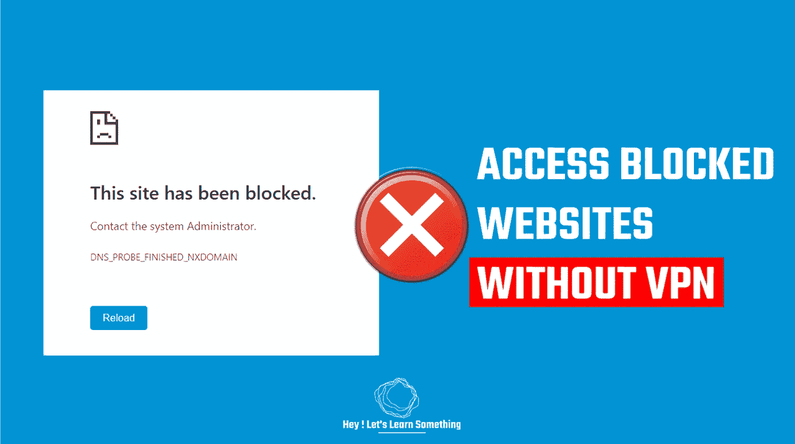

# 如何在 Windows 上没有 VPN 的情况下访问被屏蔽的网站？| 2022

> 原文：<https://medium.com/geekculture/how-to-access-blocked-websites-without-a-vpn-on-windows-2022-4169513cc3da?source=collection_archive---------6----------------------->

通过对 DNS 的简单更改，您将能够访问被阻止的网站

如果你想访问一个被屏蔽的网站而不在你的电脑上做任何安装，那么这篇文章将指导你如何做。我们不会安装任何软件，chrome 扩展，或使用 VPN，相反，我们会对 DNS 做一个小的配置。更多内容…