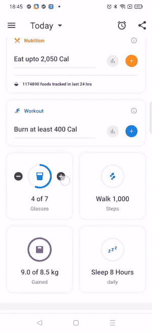
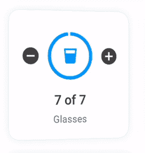
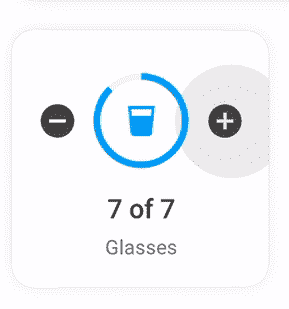

# 如何在 android 应用程序中添加翻牌动画

> 原文：<https://medium.com/geekculture/how-to-add-card-flip-animation-in-the-android-app-3060afeadd45?source=collection_archive---------3----------------------->



HealthifyMe App Dashboard

最近，我们在 HealthifyMe 改进了我们的应用仪表板，使其更具用户参与性。我们尝试了一些非常酷的动画。其中之一就是翻牌动画。当用户跟踪水、睡眠或其他任何东西时，我们会显示一个满意的屏幕，上面写着*“耶，你实现了你的目标】*，你想与你的朋友分享吗？因此，在仪表板上，一旦用户实现了他们的目标，我们就将进度卡翻转为满足卡。

在本文中，我们将看到如何实现这一点，以及我们不应该做什么。

**第一步:**制作正反面卡片设计。

#. `Card_gratification.xml` —背面设计

这里，我没有为父视图提供任何固定的宽度和高度，而是提供了 match_parent。因此它可以支持多种设备尺寸。要理解它，你可以看看我之前的文章“设计应用时选择最佳布局”。

[](/nerd-for-tech/choosing-the-best-layout-while-designing-your-android-application-560ba2a7f0d4) [## 设计 android 应用时选择最佳布局

### 在上一篇文章中，我们讨论了约束布局如何减少布局的嵌套。

medium.com](/nerd-for-tech/choosing-the-best-layout-while-designing-your-android-application-560ba2a7f0d4) 

继续让我们设计前视图，这是水的进展情况。

# `card_water_tracker.xml`

**步骤 2:** 在一个 xml 中包含两种布局。

**第三步:**让我们创建一个动画 drawable。正如我们所知，当我们翻牌时，一种布局是顺时针旋转并返回，另一种布局是在后面逆时针旋转并来到前面，因为这两种情况应该平行发生。

让我们更仔细地看动画。



# `flip_out.xml`:这个动画是针对前面的卡，需要放到后面。在 y 轴上旋转 0 到 180 度。现在，请记住，当我们向后推进时，我们会将布局放在前面，因此，如果动画的完整持续时间为 1500，那么在半场时间为 750 时，将 alpha 属性从 1 更改为 0。

# `flip_in.xml`:这个动画是给前面来的卡看的。在 Y 轴上反向旋转。

**第四步:**在视图上应用动画。旋转前显示后视图，动画结束后隐藏前视图。

`visibleView`——您想放在前面的视图

`inVisibleView` —想要推回的视图



现在，这个翻转要跳出框框。为了避免这种情况，我们需要增加两个视图的相机距离。

**第五步:**添加摄像头距离。`view.CameraDistance`

设置沿 Z 轴从相机到该视图的距离。相机的距离会影响 3D 变换，例如，围绕 X 轴和 Y 轴的旋转。如果 rotationX 或 rotationY 属性被更改，并且此视图很大(超过屏幕大小的一半)，建议始终使用大于此视图的高度(X 轴旋转)或宽度(Y 轴旋转)的相机距离。

当围绕 x 或 y 轴旋转时，相机与视图平面的距离会对视图的透视变形产生影响。比如，大的距离会产生大的视角，视图旋转时不会有太大的透视失真。较短的距离可能会在旋转时导致更多的透视失真，并且如果旋转后的视图最终部分位于相机后面，还可能导致一些绘图伪像(这就是为什么如果要旋转视图，建议使用至少与视图大小一样远的距离。)

```
val cameraDist = 8000 * scale
visibleView.*cameraDistance* = cameraDist
inVisibleView.*cameraDistance* = cameraDist
```

下面是完整的代码:


HealthifyMe App Dashboard

# 结论

动画可以帮助我们改善用户体验，同时过多的动画会分散用户执行某些任务的注意力。因此，在设计你的应用程序时，一定要了解你的受众是谁，你怎样才能最好地告诉他们去做一个特定的动作。

如果你有任何反馈，请给我回信，地址是*karishma.agr1996@gmail.com。*非常感谢您的鼓掌帮助他人找到这篇文章😃。

