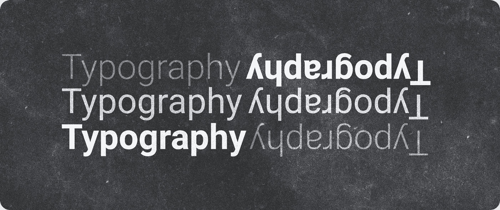
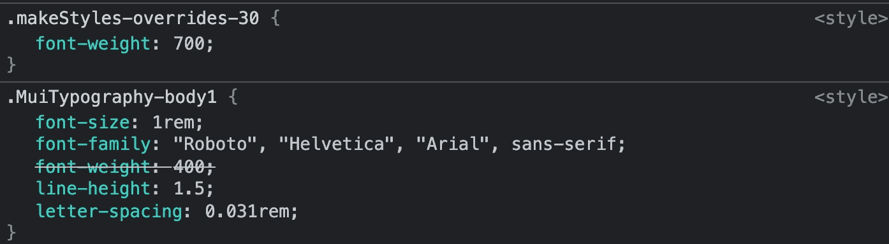

# 如何添加自定义道具到材质-UI 排版组件

> 原文：<https://medium.com/geekculture/how-to-add-custom-props-to-material-ui-typography-component-2e47117e76bf?source=collection_archive---------6----------------------->



在我们开始之前，下面是我们在本文结束时将达到的最终结果:

✔️一个带有自定义`fontWeight`和`emphasis`道具的排版组件。[JavaScript React Codesandbox](https://codesandbox.io/s/custom-material-ui-typography-props-6lfk2)

在本文中，为了简单起见，我使用了 JavaScript，但是我也包括了 Typescript 版本。[Typescript React code sandbox](https://codesandbox.io/s/custom-material-ui-typography-props-typescript-mws8w)

💡此外，如果您正在寻找一次性的解决方案，这里有一个快速简单的方法来使用 Box 组件覆盖字体粗细:

```
<Typography>
  <Box fontWeight="fontWeightBold">
    This text is bold
  </Box>
</Typography>
```

# 正确的方式

在您创建任何将覆盖默认样式的自定义属性之前，让我们看看为什么有时保持原样更好。

Material-UI 使您的设计保持一致变得容易，并为您提供了一种覆盖特定字体样式的方法。在项目的大部分时间里，它们应该具有相同的外观和感觉。

```
const theme = createMuiTheme({
  typography: {
    h1: {
      fontWeight: 700,
      fontSize: 20,
    },
  },
})
```

现在，如果您用创建的自定义主题包装您的项目，所有 h1 元素将具有相同的样式。

```
<ThemeProvider theme={theme}>
  <Typography variant='h1'>
    Bold heading, 20px size
  </Typography>
</ThemeProvider>
```

但是，有时您希望在不改变主配置或添加额外包装器的情况下对特定的文本元素有更多的控制。

你可以使用一个内嵌风格的道具来改变你所需要的任何东西，但是这大大降低了一致性，并且随着项目的增长，很难控制设计的混乱。

我的解决方案是覆盖排版组件，并添加一些额外的道具。

让我们先从`fontWeight`说起。

# 添加 fontWeight 属性

```
import {
  makeStyles,
  Typography as MuiTypography,
} from '@material-ui/core'const useStyles = makeStyles({
  overrides: {
    fontWeight: ({ fontWeight }) => fontWeight,
  },
})const Typography = ({ fontWeight, children }) => {
  const classes = useStyles({ fontWeight }) return (
    <MuiTypographyclassName={classes.overrides}>
      {children}
    </MuiTypography>
  )
}export default Typography
```

如你所见，我们用自己的包装器扩展了材料排版组件。它允许我们传递自定义的道具。

```
💡 importing Typography as MuiTypography allows us to name and export our own component as Typography.
```

我们将`fontWeight`属性传递给`useStyles`，后者生成新的`overrides`类，我们可以将该类传递给 className 属性。

```
<Typography fontWeight={700}>This text is 700 bold</Typography>
```

现在，如果您打开浏览器的开发工具并选择元素，您会注意到它在顶部创建了一个新类，并覆盖了原来的字体粗细。



但是等等……我们在这里失去了一些东西，事实上，失去了很多——现在我们无法使用任何原始的排版道具，比如`variant`和`color`。

让我们把他们带回来。

为此，我们将使用一个库来帮助我们非常容易地合并多个类名。是的，它叫做[类名](https://www.npmjs.com/package/classnames)。

```
npm install classnames
```

💡在 JavaScript 中还有其他类似于类名的好选择，比如 [clsx](https://www.npmjs.com/package/clsx) 。或者您也可以创建自己的实现。

```
import {
  makeStyles,
  Typography as MuiTypography,
} from '@material-ui/core'
import classNames from 'classnames'const useStyles = makeStyles({
  overrides: {
    fontWeight: ({ fontWeight }) => fontWeight,
  },
})export const Typography = ({
  fontWeight,
  children,
  ...otherProps
}) => {
  const classes = useStyles({ fontWeight }) return (
    <MuiTypography
      {...otherProps}
      className={classNames(
        otherProps.className,
        classes.overrides,
      )}>
      {children}
    </MuiTypography>
  )
}
```

正如你所看到的，我们使用了 [spread 语法](https://developer.mozilla.org/en-US/docs/Web/JavaScript/Reference/Operators/Spread_syntax) (…)和`otherProps`，这允许我们将除了`fontWeight`和`children`之外的所有属性直接传递给原始排版组件。

请注意，我们还将`otherProps.className`传递给了原始的`className`属性，因为否则，我们将无法将`className`添加到新的排版组件中。

```
<Typography variant="h1" fontWeight={700} className="anotherClass">
   Bold heading
</Typography>
```

太好了！现在，我们可以在原始材料 UI 排版道具旁边添加自定义字体粗细。而且如果我们没有通过`fontWeight`道具，它会保持主题配置的默认值。

在这一点上，我们已经实现了我们的目标，可以走了。但对我来说，一致性是一个伟大的用户体验的关键，我们正在失去它，因为我们可以使用任何可用的字体粗细。

> 视觉一致性是网页设计中最基本的原则之一。

我建议用更少的选项来限制我们的组件，这样我们至少可以在项目中更加一致。

```
import {
  makeStyles,
  Typography as MuiTypography,
} from '@material-ui/core'
import classNames from 'classnames'const FONT_WEIGHT = {
  light: 300,
  regular: 400,
  bold: 700,
}const useStyles = makeStyles({
  overrides: {
    fontWeight: ({ fontWeight }) =>FONT_WEIGHT[fontWeight],
  },
})export const Typography = ({
  fontWeight,
  children,
  ...otherProps
}) => {
  const classes = useStyles({ fontWeight }) return (
    <MuiTypography
      {...otherProps}
      className={classNames(
        otherProps.className,
        classes.overrides,
      )}>
      {children}
    </MuiTypography>
  )
}
```

现在我们的选项只有“浅色”、“常规”和“粗体”。

```
<Typography variant="h1" fontWeight="light" >
   Light weight heading
</Typography>
```

# 添加强调属性

改变字体粗细很好，但这不是我决定添加自定义道具的原因，我真的想快速轻松地调整文本的不透明度，同时保持一致。

拥有额外的`emphasis`属性是控制网站视觉层次的直接方式，我喜欢在每个项目中使用它。

> ***浅色背景上的深色文本应用以下不透明度:***
> 
> *高强调文本的不透明度为 87%*
> 
> *中度强调文本和提示文本的不透明度为 60%*
> 
> *禁用文本的不透明度为 38%*

💡*详见*[*material . io*](https://material.io/design/color/text-legibility.html#text-backgrounds)

```
import {
  makeStyles,
  Typography as MuiTypography,
} from '@material-ui/core'
import classNames from 'classnames'const FONT_WEIGHT = {
  light: 300,
  regular: 400,
  bold: 700,
}const EMPHASIS = {
  disabled: 0.3,
  medium: 0.6,
  high: 0.87,
  full: 1,
}const useStyles = makeStyles({
  overrides: {
    opacity: ({ emphasis }) => EMPHASIS[emphasis],
    fontWeight: ({ fontWeight }) => FONT_WEIGHT[fontWeight],
  },
})export const Typography = ({
  emphasis = 'high',
  fontWeight,
  children,
  ...otherProps
}) => {
  const classes = useStyles({ emphasis, fontWeight }) return (
    <MuiTypography
      {...otherProps}
      className={classNames(
        otherProps.className,
        classes.overrides,
      )}>
      {children}
    </MuiTypography>
  )
}
```

正如你所看到的，创建`emphasis`道具与`fontWeight`相似，我们添加的唯一额外的东西是默认值——`emphasis = 'high'`，这使得我们的文本默认不透明度为 87%，这在大多数情况下是完美的。但是我们仍然可以选择将其设置回 100% `emphasis = 'full'`。

```
<Typography variant="h3" fontWeight="light" emphasis="medium" >
   We have control!
</Typography>
```


# 总结

总是有添加任何自定义属性的自由，但是记住迷失在这种自由中是很容易的，事情会很快变得一团糟，特别是当项目增长的时候。

拥有尽可能少的选项通常是最好的，所以试着有一些限制，这将有助于你保持一致性并获得更好的用户体验。

希望有所帮助！