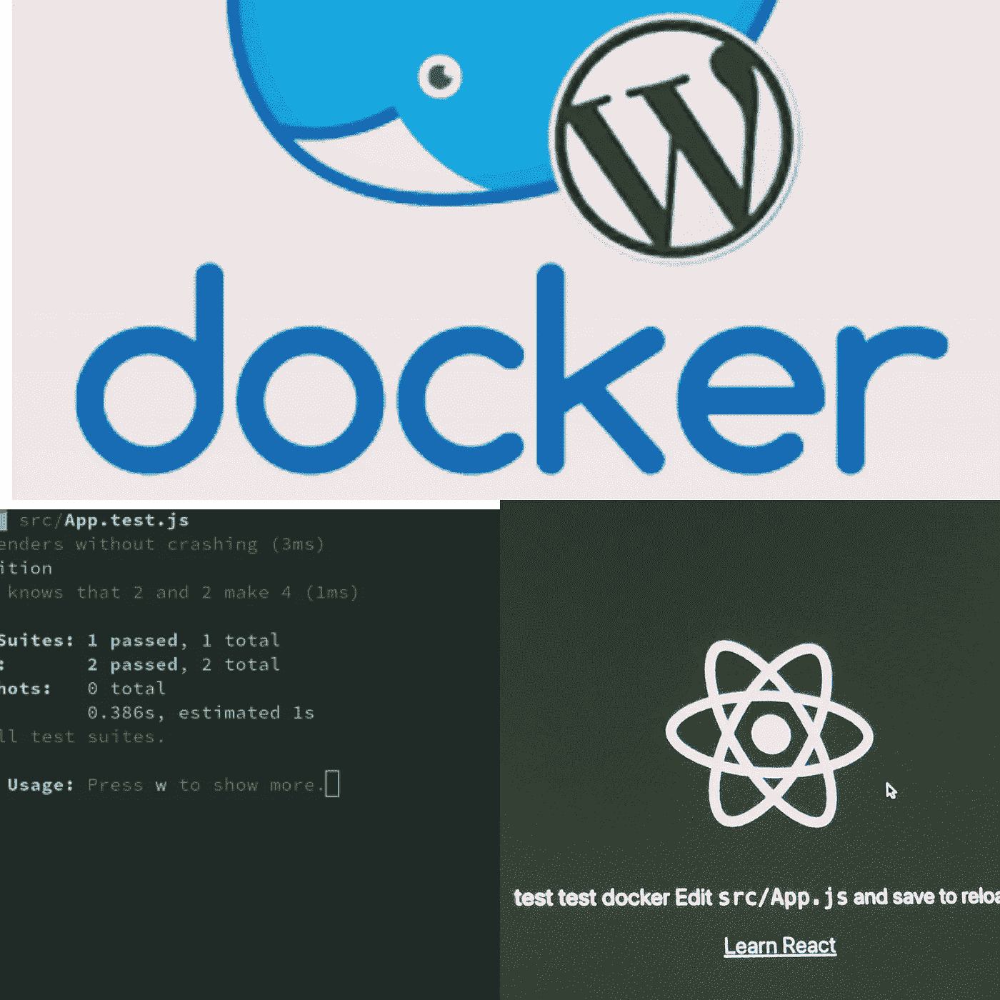

# 如何添加 Docker 来创建 React 应用程序(CRA) +运行单元测试

> 原文：<https://medium.com/geekculture/how-to-add-docker-to-create-react-app-cra-run-unit-tests-439b3b25bd2c?source=collection_archive---------5----------------------->

## 在本教程中，我们将学习如何添加一个 docker 来创建-反应应用程序并运行单元测试。

# 在我们开始之前，请找到以下重要技术的定义。

# **1。Docker —**