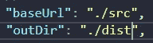
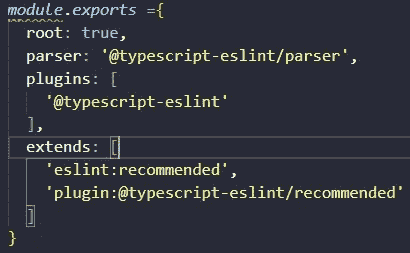
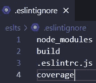
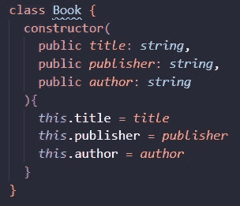
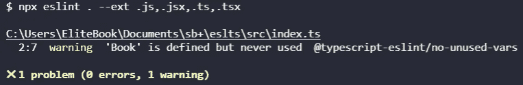
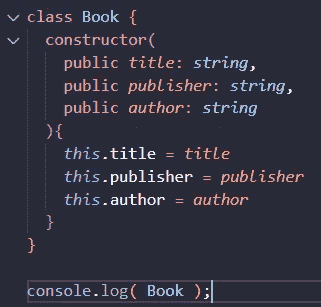
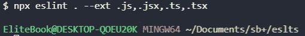

# 如何将 ESLint 添加到 TypeScript 项目中

> 原文：<https://medium.com/geekculture/how-to-add-eslint-to-your-typescript-project-edd5a464b6ed?source=collection_archive---------8----------------------->


我想知道我是否能在我的 TypeScript 项目中使用 ESLint，作为一个小步骤，为了继续学习，我说让我们试一试，有一些高级配置可以帮助你完成项目，如删除分号(因为 JavaScript 不需要它)，这个列表还可以继续下去。

# 埃斯林特

ESLint 是一个帮助你发现问题的分析器，你可以设置来适应你自己的编码风格，真的很方便！

# 装置

创建一个目录
添加 NPM 命令来启动你的包 JSON

```
$ npm init -y
```

安装 TypeScript 并运行命令以创建 tsconfig 文件并添加您的 TypeScript 公共配置我将只添加 baseUrl 并添加 src 文件夹和输出文件夹

```
$ npm i typescript$ tsc --init
```



Example adding baseUrl to the tsconfig.json

安装 ESLint(解析器、插件)

```
$ npm i --save-dev eslint typescript @typescript-eslint/parser @typescript-eslint/eslint-plugin
```

创建 ESLint 文件配置 eslintcr.js 这是一个非常基本的结构，您可以为自己添加或设置最佳配置



configuration for .eslintcr.js

```
*module*.*exports* ={
root: true,
parser: '@typescript-eslint/parser',
plugins: [
'@typescript-eslint'
],
extends: [
'eslint:recommended',
'plugin:@typescript-eslint/recommended'
]}
```

创建一个 ESLint 忽略文件，这些目录不会被 ESLint 分析



Example eslintignore file

创建我们的 TypeScript 文件和 tsc 命令



Example class Book TypeScript

我们要像这样的东西


The Whole directory

然后运行 Eslint 命令，这将检查所有代码，分析是否有错误，并在控制台上显示出来

```
$ npx eslint . --ext .js,.jsx,.ts,.tsx
```



Example errors output

我们需要修复它



Example fixing error on output



Example No more problems

# 结论

这是 webpack 帮助我们分析我们的 TypeScript 文件的一小步，但是我们可以设置更多的东西，它将帮助我们处理大型项目，并使我们的代码更有效，并具有最佳实践。

# 来源

[](https://github.com/typescript-eslint/typescript-eslint/blob/master/docs/getting-started/README.md) [## 主 typescript-eslint/typescript-eslint 上的 typescript-eslint/README.md

### 对于一个新用户来说，处理这样一个 monorepo 项目可能相当令人生畏，很难操作。这些的目标是…

github.com](https://github.com/typescript-eslint/typescript-eslint/blob/master/docs/getting-started/README.md) [](https://eslint.org/blog/2019/01/future-typescript-eslint#the-future-of-typescript-on-eslint) [## ESLint 上 TypeScript 的未来

### 一个可插入和可配置的 linter 工具，用于识别和报告 JavaScript 中的模式。维护您的代码…

eslint.org](https://eslint.org/blog/2019/01/future-typescript-eslint#the-future-of-typescript-on-eslint)