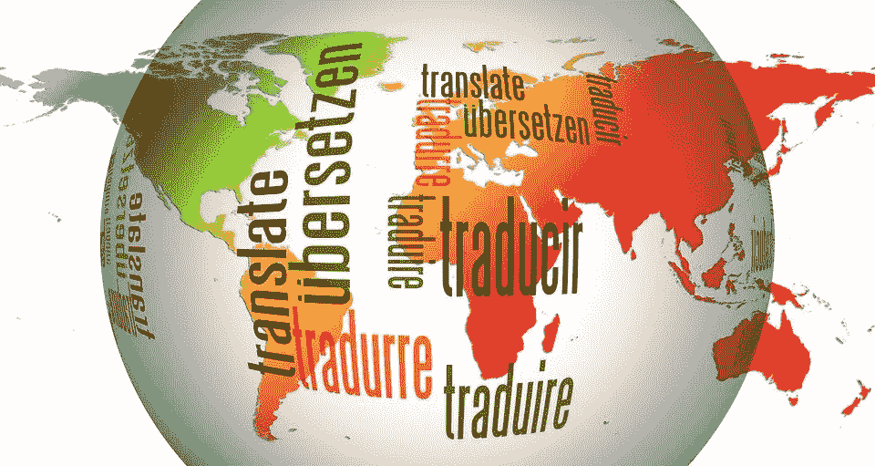

# 如何在 Angular-Basics 中添加国际化(翻译)

> 原文：<https://medium.com/geekculture/how-to-add-internationalization-translations-in-angular-basics-d9fed161d572?source=collection_archive---------5----------------------->

## 使用 ngx-translate 为您的 Angular 项目添加国际化元素

[Image by geralt in Pixabay](https://pixabay.com/illustrations/globe-world-languages-translate-110775/)

使用 Angular 内置的 i18n 功能向 Angular 项目添加翻译很麻烦，因为您需要管理多个`messages.xlf`文件并向每个文件添加翻译，这很难维护。在…