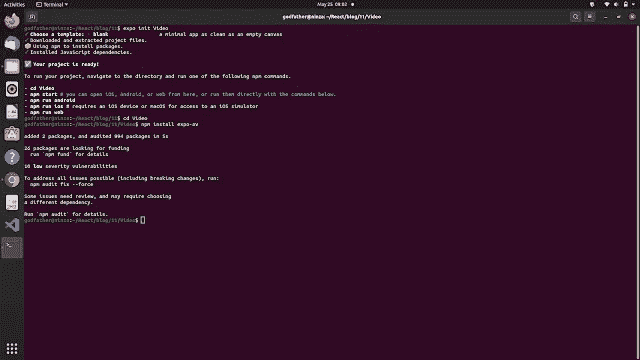
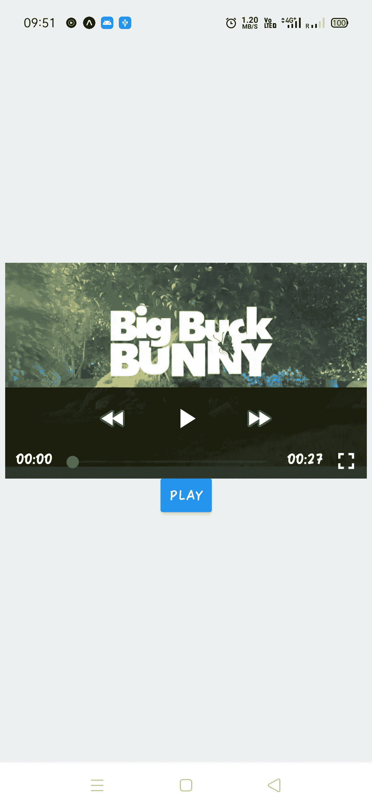

# 如何在 React Native Expo 应用程序中添加或播放视频

> 原文：<https://medium.com/geekculture/how-to-add-or-play-video-in-react-native-application-javascript-49ea952f1919?source=collection_archive---------22----------------------->

## 在 React Native Expo 应用程序中播放视频

您好，React 原生开发者..！！

让我们假设您正在制作一个电子商务移动应用程序，您想在其中显示产品的视频描述。在另一种情况下，您正在构建任何类型的移动应用程序，希望在您的平台上显示视频。那么你必须知道如何实现它。无论你是在为 IOS 设备还是 Android 设备工作，React Native Expo 都将帮助你轻松实现这一点。因此，让我们制作一个移动应用程序，您可以在其中使用 React Native Expo 显示、播放/暂停视频。抓住你的座位，喝杯咖啡，让我们开始吧。


Photo by [Lala Azizli](https://unsplash.com/@lazizli?utm_source=medium&utm_medium=referral) on [Unsplash](https://unsplash.com?utm_source=medium&utm_medium=referral)

# 设置和安装

> 1.创建一个目录并导航到它。
> 2。打开终端或命令提示符窗口，运行命令:**Expo init Video**3。选择空白模板并继续下载
> 4。下载完成后，导航至“视频”目录
> 5。使用命令安装软件包: **npm install expo-av**



完成上述所有 5 个步骤后。您将在终端的命令提示符窗口中看到类似这样的内容。我们已经完成了安装部分，所以让我们切换到代码部分

# 使用 React Native Expo 显示视频的代码

在您喜欢的文本编辑器中打开这个项目，并验证“package.json”文件中所有已安装的包。之后打开 App.js

**App.js**

```
import * as React from 'react';
import { View, StyleSheet, Button } from 'react-native';
import { Video } from 'expo-av';export default function App() {
  const video = React.useRef(null);
  const [status, setStatus] = React.useState({});
  return (
    <View style={styles.container}>
      <Video
        ref={video}
        style={styles.video}
        source={{
          uri: '[http://d23dyxeqlo5psv.cloudfront.net/big_buck_bunny.mp4'](http://d23dyxeqlo5psv.cloudfront.net/big_buck_bunny.mp4'),
        }}
        useNativeControls
        resizeMode="contain"
        isLooping
        onPlaybackStatusUpdate={status => setStatus(() => status)}
      />
      <View style={styles.buttons}>
        <Button
          title={status.isPlaying ? 'Pause' : 'Play'}
          onPress={() =>
            status.isPlaying ? video.current.pauseAsync() : video.current.playAsync()
          }
        />
      </View>
    </View>
  );
}
```

首先，从库中导入所有需要的包。虽然我们只需要几个。这里我们使用 react hooks 概念，这就是为什么我们使用常量[status，setStatus]。现在只需根据所需的 UI 返回 App 功能和代码。我保持简单。您需要一个视频源，但请记住，只有正确的扩展视频才会播放。你不能复制一些 youtube 链接并开始播放视频，因为 youtube 链接没有任何类型的视频扩展。接下来，我们用来调整视频特征的大小。最后，我们在视频内容的底部添加了播放暂停按钮。现在根据你的选择，添加一点造型。

```
const styles = StyleSheet.create({
  container: {
    flex: 1,
    justifyContent: 'center',
    backgroundColor: '#ecf0f1',
  },
  video: {
    alignSelf: 'center',
    width: 350,
    height: 220,
  },
  buttons: {
    flexDirection: 'row',
    justifyContent: 'center',
    alignItems: 'center',
  },
});
```

好了，现在我们完成了代码部分。对于测试，在本地服务器上运行此项目。
打开视频目录下的终端或命令提示符窗口，运行命令:npm start
用你的 IOS 或 Android 设备扫描窗口上出现的二维码，在 expo 应用中运行这个项目。javascript 依赖项构建完成后。你会看到这样的东西。



我希望你今天能学到一些新东西。如果你面临任何与这个项目相关的困难，请在评论区告诉我。

谢谢你。