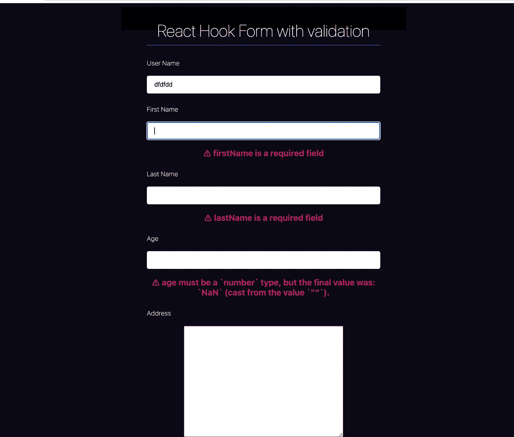

# 如何用 Typescript 添加 React Hook 窗体到 React Js 应用初学者指南

> 原文：<https://medium.com/geekculture/how-to-add-react-hook-form-with-typescript-to-react-js-application-beginner-guide-4115b5525b0f?source=collection_archive---------1----------------------->

# 在这篇文章中，我将讨论如何用 Typescript 添加 React Hook 表单到 React Js 应用初学者指南:)

**在我们开始之前，请用 react hook 表格**找到下面的重要包