# 如何在 Android 中添加阴影

> 原文：<https://medium.com/geekculture/how-to-add-shadows-in-android-7a3b7c9eb81b?source=collection_archive---------0----------------------->

## 当谈到在 Android 中创建阴影时，你会立即面临几个问题。为什么需要它们？为什么不能只使用系统阴影，从此幸福地生活下去呢？b:如果不能使用系统阴影，你如何实现自定义阴影？

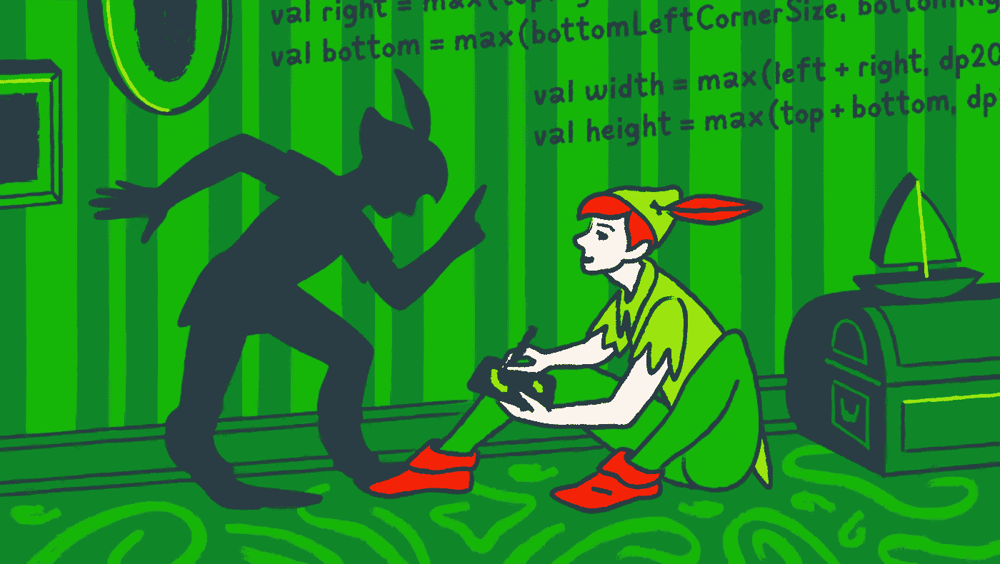

第一个问题将由设计师来回答。您可能会试图通过指出系统阴影几乎是免费的，只需最少的劳动，就能获得最高的性能来说服他们。也许你会把你的论点建立在遵守物质准则的需要上。

我真诚地希望你的坚韧和说服力能让你继续使用仰角渲染阴影。如果不是，你将不得不去寻找第二个问题的答案。

这里应该提到的是，最初，我试图为系统阴影找到正确的值。在 Android 中，从 API 21 开始，可供使用的主题属性包括[ambientshaodalpha](https://developer.android.com/reference/android/R.attr#ambientShadowAlpha)和[spotshaodalpha](https://developer.android.com/reference/android/R.attr#spotShadowAlpha)。您可以使用它们来调整全局阴影透明度设置。

随后，在 API 28 中，他们添加了一个定制阴影颜色的功能，既可以通过[outlineambientshaodcolor](https://developer.android.com/reference/android/R.attr#outlineAmbientShadowColor)和[outlinespotshaodcolor](https://developer.android.com/reference/android/R.attr#outlineSpotShadowColor)主题属性，也可以通过视图属性—[outlineambientshaodcolor](https://developer.android.com/reference/android/view/View.html#attr_android:outlineAmbientShadowColor)和[outlinespotshaodcolor](https://developer.android.com/reference/android/view/View.html#attr_android:outlineSpotShadowColor)。

# 海拔

让我们试着找到正确的高度和阴影透明度设置，看看会有什么结果。

我们在设计中有三种阴影(如下图所示):

*   s-尺寸为 12dp。
*   m-尺寸 20dp。
*   L —尺寸为 32dp。

每个阴影都有自己的透明度和 Y 偏移设置。我们不能调整偏移量，但至少让我们试着算出需要哪些透明度值。困难在于，在 API 28 之前，这些值在主题中是全局的。我们不能像在设计工具中那样为不同风格的阴影设置不同的透明度。此外，设计中的阴影颜色不是黑色，因为它在默认的 Android 中。无论如何，让我们试着至少达到一个近似的相似。

我们将会花很长的时间努力去寻找同时适合所有三种阴影的价值观。

```
// theme
<item name="android:ambientShadowAlpha">0.01</item>
<item name="android:spotShadowAlpha">0.08</item>

// elevation settings
<dimen name="elevation_s">12dp</dimen>
<dimen name="elevation_m">24dp</dimen>
<dimen name="elevation_l">30dp</dimen>
```

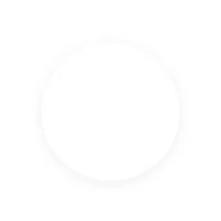

Shadow S — design

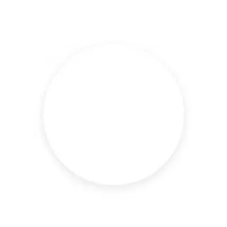

Shadow S — elevation 8dp

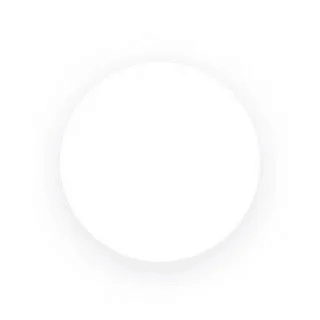

Shadow M — design

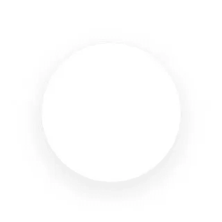

Shadow M — elevation 24dp

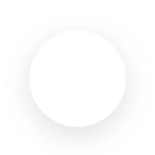

Shadow L — design

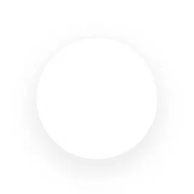

Shadow L — elevation 30dp

这看起来效果不错。影子 S 看起来略有不同，但其他两个看起来都没问题。

你不太可能通过一般的透明度设置来更精确地设置它，但是从 API 28 开始你可以得到一个非常接近的匹配。

看起来问题已经解决了，你可以试着通过指出 S 阴影与设计规格只会略有不同来说服设计师。毕竟，用户不太可能注意到这一点，哪个 Android 用户会注意这样的小事呢？

然而，实践表明，事情并不像看上去那么简单。Android 有两个光源:向各个方向照射的环境光和向前照射的按键光。如果你们中的任何人感兴趣，请查看这篇文章，因为它很好地涵盖了这个主题，并提供了相关图片。

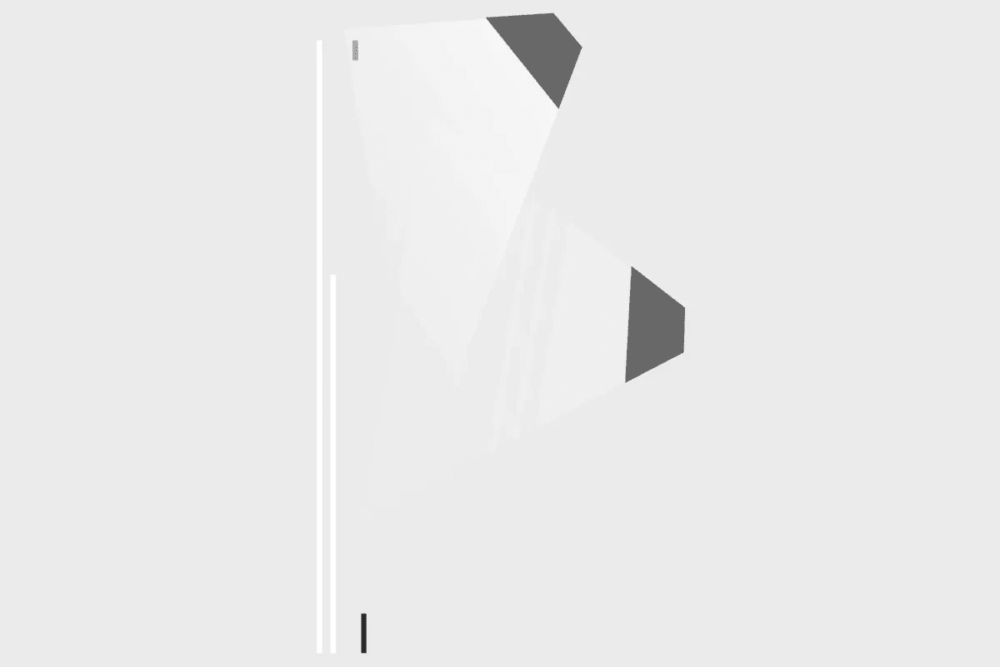

Light sources in Android.

主光是从上方以一定角度照射的光。它在对象的底部创建一个明显的阴影。这是当我们远离屏幕顶部时，阴影发生的变化，尤其是在大仰角时。


Shadow L — element at the top of the screen

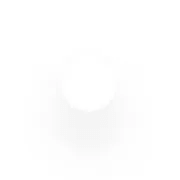

Shadow L — element at the bottom of the screen

就像现实生活中一样:物体离光源越远，它投下的影子就越长。我们能对此有所影响吗？[这篇文章](https://blog.sebastiano.dev/playing-with-elevation-in-android-part-2/)在这里，在标题下的部分，*不要在家里尝试这个，*声明我们可以，但是我不能这样做。即使那对我有效，并且代码评审对这个明显的漏洞视而不见，也不能完全解决问题。无论光源放在哪里，阴影都是不均匀的。这样做的原因是为了达到预期的效果，需要较高的仰角值。

感到相当沮丧，让我们转向 B 计划，即通过自己的努力渲染阴影。

# MaterialShapeDrawable

由于这不适用于 elevation，让我们尝试另一种免费的方法。应该记住，素材库也支持古董设备上的阴影。我们来看看实现过程。

让我们来一窥 [MaterialShapeDrawable](https://developer.android.com/reference/com/google/android/material/shape/MaterialShapeDrawable) 的内幕；我们会看到他们正在和一个叫做[阴影渲染器](https://github.com/material-components/material-components-android/blob/master/lib/java/com/google/android/material/shadow/ShadowRenderer.java)的东西一起做有趣的事情。基于输入的形状参数，使用[线性梯度](https://developer.android.com/reference/android/graphics/LinearGradient)和[径向梯度](https://developer.android.com/reference/android/graphics/RadialGradient)着色器渲染阴影。换句话说，阴影是形状周围的渐变。

这个想法似乎很有趣，所以让我们在真实世界的条件下测试一下。为此，让我们用这个内容创建一个简单的定制视图，看看接下来会发生什么。

```
val shape = ShapeAppearanceModel.builder()
  .setAllCornerSizes(16.toPx())
  .build()
val drawable = MaterialShapeDrawable(shape)
drawable.fillColor = ColorStateList.valueOf(Color.WHITE)
drawable.shadowVerticalOffset = 8.toPx()
drawable.shadowRadius = 32.toPx()
drawable.shadowCompatibilityMode = MaterialShapeDrawable.SHADOW_COMPAT_MODE_ALWAYS

background = drawable
```

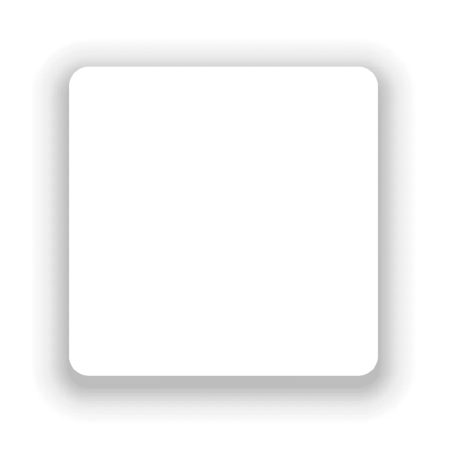

The MaterialShapeDrawable shadow

它似乎工作得很好，但有几个缺点要考虑。首先，渐变的透明度设置被硬连线到 [ShadowRenderer](https://github.com/material-components/material-components-android/blob/master/lib/java/com/google/android/material/shadow/ShadowRenderer.java) 中。要创建一个基于你自己参数的阴影，你必须收集分散在几个类中的代码，并将其复制到项目中。

其次，该解决方案的性能还有许多不足之处。出于兴趣，决定在视图上放置一个改变大小的动画，并检查渲染是如何工作的。正如 Systrace 所证实的，即使在发布版本中，滞后也是肉眼可见的。

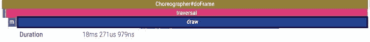

Frame rendering time: 18 milliseconds

每帧的渲染时间:18 毫秒，这个绘制只是针对屏幕上的单个视图。draw 是一个相当常见的操作🙂

我想我们最好寻找一些其他的解决办法。但是值得指出的是，正是在这里，我想出了一个关于在视图边界之外绘制和渲染阴影的想法。

# 绘制阴影的其他方法

为了找到这个问题的答案，除了上面提到的，我还想到了另外三个选择。

1.  [Paint.setShadowLayer](https://developer.android.com/reference/android/graphics/Paint#setShadowLayer(float,%20float,%20float,%20int)) 是最简单最容易理解的一个；它包含最少的代码，并且与硬件加速(这是现代设备的标准特性)配合良好。
2.  [BlurMaskFilter](https://developer.android.com/reference/android/graphics/BlurMaskFilter) 是第二简单的选项。它包含更多一点的代码，工作起来也一样好。
3.  [ScriptIntrinsicBlur](https://developer.android.com/reference/android/renderscript/ScriptIntrinsicBlur) 可能更复杂；其他问题包括过时的状态和[迁移建议](https://developer.android.com/guide/topics/renderscript/migrate)。

除此之外，还有一个[奇特的技术](https://github.com/harjot-oberai/MaterialShadows)要看，但是我没有成功地让它运行起来，也从来没有完全理解它是如何工作的。如果你有更好的运气，并设法弄清楚它是如何工作的，请在评论中告诉我。

我认为阐述这些观点没有太大的意义，因为有大量的文章用例子涵盖了这个主题，尤其是[这篇](/@yuriyskul/different-ways-to-create-glowing-shapes-in-android-canvas-8b73010411fe)。就我个人而言，我选择使用最简单的技术。如果事情出错了，你可以尝试下一个。

# 需求分析

让我们假设我们已经决定了要使用的技术。现在让我们定义一下我们最终想要达到的结果。在理想情况下，这应该和指定高程一样是用户友好的操作。

阴影的大小应该对屏幕上视图的大小和位置没有影响。你能想象调整缩进或使视图居中是什么感觉吗？视图的尺寸受到它投射的阴影的影响。阴影的存在不能影响现有屏幕的布局。

此外，您应该能够在 XML 中(在布局或样式中)指定阴影参数，更重要的是，可以在 Android Studio 预览中看到结果。

您还需要能够渲染任何视图的阴影，不管它是否有背景或立面。如果渲染时间不占用整个帧，那就再好不过了。

让我们假设在我们的情况下只有简单的形状会投下阴影:长方形(有或没有圆角)，椭圆形，也许还有时髦的[松鼠](https://en.wikipedia.org/wiki/Squircle)，除非我们能说服设计师不要这样做。

总的来说，所有这些听起来像是需要从适当的视图继承一些东西并扩展它们的功能。在这种情况下，构建和渲染阴影的逻辑可以移到一个通用的辅助类中。这样，在组件中实现影子将成为一项琐碎的任务。

规划解决方案:

*   我们创建了一个 Drawable，可以画出某种形状的阴影。
*   让我们写一个使用这个 Drawable 的视图。
*   现在让我们来衡量解决方案的性能。

# ninetpatchdrawable

在这篇关于 Android 上阴影的[伟大文章](https://habr.com/ru/company/citymobil/blog/652955/)中，这个想法被否决了。这篇文章真的很棒，但是由于一些未知的原因，当我寻找解决方案时，我从来没有注意到它。

那么，什么是 9 补丁，我们为什么需要 9 补丁呢？在这一点上，作为一个老的 [Macromedia Flash](https://en.wikipedia.org/wiki/Macromedia_Flash) 游戏开发者(上帝让它的灵魂安息，还有史蒂夫的)，我需要擦去一滴怀旧的眼泪。我在那里第一次接触到这种技术，根据[维基百科](https://en.wikipedia.org/wiki/9-slice_scaling)的说法，这是它第一次被想到的地方。

这种方法背后的思想是将光栅图像分成 9 个部分，并且在调整大小时，拉伸除了角以外的所有区域。这样，一个非常小的源图像可以被拉伸到任何大小，而不会失真或损失质量。

这既节省了内存(位图大小最小)又节省了 CPU 时间(渲染位图几乎不花费任何成本)。而位图渲染任务正是 GPU 所擅长的。

幸运的是，Android 允许开发者以基于程序的方式创建 [NinePatchDrawable](https://developer.android.com/reference/android/graphics/drawable/NinePatchDrawable) 。

因为图形的形状和阴影的参数都是已知的，任务是微不足道的。

# 履行

让我们算出阴影的参数和形状:

```
data class ShadowSpec(
  @ColorInt val shadowColor: Int = Color.TRANSPARENT,
  @Px val shadowOffsetX: Float = 0f,
  @Px val shadowOffsetY: Float = 0f,
  @Px val shadowSize: Float = 0f,
  val cornerSize: CornerSize? = null,
  val cornerSizeTopLeft: CornerSize? = null,
  val cornerSizeTopRight: CornerSize? = null,
  val cornerSizeBottomLeft: CornerSize? = null,
  val cornerSizeBottomRight: CornerSize? = null
)
```

决定使用 [ShapeAppearanceModel](https://developer.android.com/reference/com/google/android/material/shape/ShapeAppearanceModel) 来构建形状，还使用[ShapeAppearancePathProvider](https://developer.android.com/reference/com/google/android/material/shape/ShapeAppearancePathProvider)来构建用于基于该模型的最终渲染的[路径](https://developer.android.com/reference/android/graphics/Path)。

在代码中，它看起来像这样:

```
// building the form - thanks to the source Material used
val path = Path()
val provider = ShapeAppearancePathProvider()
val model = ShapeAppearanceModel.Builder()
  .setTopLeftCorner(CornerFamily.ROUNDED, topLeftCornerSize)
  .setTopRightCorner(CornerFamily.ROUNDED, topRightCornerSize)
  .setBottomLeftCorner(CornerFamily.ROUNDED, bottomLeftCornerSize)
  .setBottomRightCorner(CornerFamily.ROUNDED, bottomRightCornerSize)
  .build()

provider.calculatePath(model, 1f, RectF(0f, 0f, width, height), path)
```

现在我们已经得到了形状，让我们来计算阴影的大小——阴影的半径加上偏移量。SHADOW_SPREAD_MULTIPLIER 使区域稍微变大，以确保所有不透明像素适合最终位图，这是另一个要考虑的参数。

```
// the approximate size of the shadow should be determined during blurring in such a way
// that all the opaque pixels are rendered in the resulting area.
with(spec) {
  val spreadOffset = shadowSize * SHADOW_SPREAD_MULTIPLIER
  spreadBounds.set(
    (spreadOffset - shadowOffsetX).coerceAtLeast(0f),
    (spreadOffset - shadowOffsetY).coerceAtLeast(0f),
    (spreadOffset + shadowOffsetX).coerceAtLeast(0f),
    (spreadOffset + shadowOffsetY).coerceAtLeast(0f)
)
}
```

所需的最小位图大小计算为形状圆角的半径加上阴影本身的大小。确定 9 .补丁边界也很容易。

```
// establishing the bounds of the corners
val left = max(topLeftCornerSize, bottomLeftCornerSize)
val top = max(topLeftCornerSize, topRightCornerSize)
val right = max(topRightCornerSize, bottomRightCornerSize)
val bottom = max(bottomLeftCornerSize, bottomRightCornerSize)

// minimum size based on the shape used, with something to spare
val width = max(left + right, dp20) + 2 * dp1
val height = max(top + bottom, dp20) + 2 * dp1

// Bitmap size
val bitmapWidth = width + spreadBounds.left + spreadBounds.right
val bitmapHeight = height + spreadBounds.top + spreadBounds.bottom

// areas for the 9.patch
val leftChunk = left + spreadBounds.left
val topChunk = top + spreadBounds.top
val rightChunk = bitmapWidth - right - spreadBounds.right
val bottomChunk = bitmapHeight - bottom - spreadBounds.bottom
```

让我们继续渲染过程。我们使用 [Paint.setShadowLayer](https://developer.android.com/reference/android/graphics/Paint#setShadowLayer(float,%20float,%20float,%20int)) 然后剪切出形状，只在地上留下一个阴影，以防有阴影的元素变成半透明。

```
// Preparing tools for the rendering
val paint = Paint(Paint.ANTI_ALIAS_FLAG).apply {
  color = spec.shadowColor
  setShadowLayer(spec.shadowSize, spec.shadowOffsetX, spec.shadowOffsetY, spec.shadowColor)
}

val clearPaint = Paint(Paint.ANTI_ALIAS_FLAG).apply {
  xfermode = PorterDuffXfermode(PorterDuff.Mode.CLEAR)
}

val matrix = Matrix()
matrix.postTranslate(spreadBounds.left, spreadBounds.top)
path.transform(matrix)

// rendering the shape with the shadow and cutting out the shape
canvas.drawPath(path, paint)
canvas.drawPath(path, clearPaint)
```

输出是这张整洁的图片。其中的绿线显示了用于拉伸的网格。这个位图可以用来渲染任何大小的形状，阴影为 S，角度为 16dp。

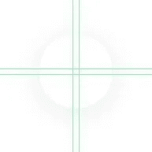

Bitmap for the NinePatchDrawable

现在唯一要做的就是将它“密封”到 NinePatchDrawable 中。API 不是最容易使用的东西，但是 [StackOverflow](https://stackoverflow.com/a/16676419) 就在你身边，不会让你陷入困境。

```
// building a drawable
drawable = NinePatchDrawable(
  context.resources,
  NinePatchUtils.getNinePatch(
    bitmap = bitmap,
    left = leftChunk.roundToInt(),
    top = topChunk.roundToInt(),
    right = rightChink.roundToInt(),
    bottom = bottomChunk.roundToInt()
)
)
```

# 实际应用

通过将整个实现放到一个 200 行的 ShadowRenderer 类中，我们可以创建一个 ShadowView 并在现场测试它。这里有三点需要注意。

首先，您必须禁用 outlineProvider，以便移除高程投射的本机阴影。重要的是，出于显而易见的原因，我们希望保持海拔。此外，如果突然启用 clipToOutline，outlineProvider 将不允许我们在 ShadowView 的边界之外绘制阴影。

其次，您需要在父容器中禁用 clipChildren，因为我们希望阴影在视图的外部，而不是在视图的边界内。

第三点出现在我尝试对阴影视图应用半透明时(为了更清晰，我将阴影设为红色)。

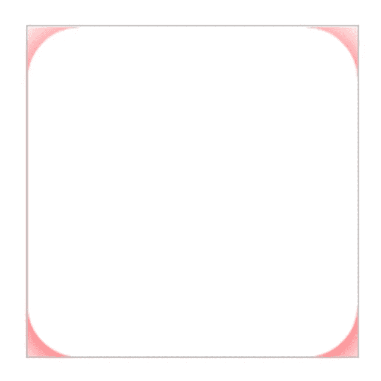

The shadow is clipped along the bounds of the View

事实证明，当 alpha 小于 1 时，视图的裁剪功能会自动打开，并裁剪掉阴影。但是我很轻松地离开了这里，只受了一点惊吓。我所要做的就是阅读[视图的文档，让我放心。](https://developer.android.com/reference/android/view/View#setAlpha(float))

从构建开始。版本代码。m，设置半透明 alpha 值会将视图裁剪到其边界，除非视图从 hasOverlappingRendering()返回 false。

让我们看看我们的阴影部分。如果我们去掉配置，我们有三种方法可以选择。

```
override fun hasOverlappingRendering(): Boolean {
  // By default, View doesn't draw outside its boundaries,
  // if the alpha < 1 (see setAlpha)
  // override this behavior if there is a visible shadow
  return !shadowSpec.isShadowVisible
}

override fun onSizeChanged(w: Int, h: Int, oldw: Int, oldh: Int) {
  super.onSizeChanged(w, h, oldw, oldh)
  shadowRenderer.setSize(w, h)
}

override fun draw(canvas: Canvas) {
  shadowRenderer.draw(canvas)
  super.draw(canvas)
}
```

显然，有更多的方法可供参考。除此之外，还有其他功能，如自动禁用容器中的 chipChildren，禁用 outlineProvider，以基于程序的方式从 style/设置阴影参数，即所有您和我喜欢在自定义视图中编写的内容。然而实际上，创建一个带阴影的组件的过程看起来非常简单。

# 表演

出于上述原因，我觉得这方面肯定没有问题。这就是事实。

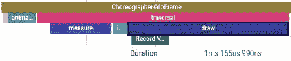

Frame rendering time: 1ms.

场景与 MaterialShapeDrawable 相同:屏幕上有一个阴影视图，动画师会调整它的大小。

很自然，创建位图的过程也不是免费的，但是我无法在视觉上找到它，因为所有的帧都像你希望的那样短而平滑。我觉得自己太懒了，懒得在代码中为跟踪插入一个标签，也懒得找出精确的毫秒数。

然而，美中不足的是。由于圆形对象具有基于宽度或高度的圆角，调整大小需要重新创建位图和 NinePatchDrawable。然后画面明显变差，大约每帧 20 毫秒。

这里有两个解决方案。第一种是跳过位图生成，直接在每个 draw 调用中用 Paint 在画布上绘制阴影。第二种方法是为拐角半径指定足够大的值，以呈现一个椭圆。这样，我们得到了一个大的初始位图，但是渲染仍然是即时的。

您可以通过使用 [LruCache](https://developer.android.com/reference/android/util/LruCache) 来进一步提高性能。我们只有三种阴影可供选择，形状的选择也很有限。因此，存储和重用已经生成的位图非常容易。不过，我还没来得及做这个。此外，也没有太大的必要。

# 结论

这真的值得努力吗？绝对是。阴影现在看起来比你的标准高度好多了。

可以用标准标高吗？答案还是肯定的，但是最好避免大值。适当的透明度设置可以确保良好的效果。

有这么多库可以选择，还需要自己写解决方案吗？我想你知道。这样，你就会得到你想要的东西。此外，使用 Android，您几乎可以开箱即用，因此解决方案将会很紧凑。

作曲呢？有了缀，一切都会很快好起来，[很快](https://issuetracker.google.com/issues/160665122)。