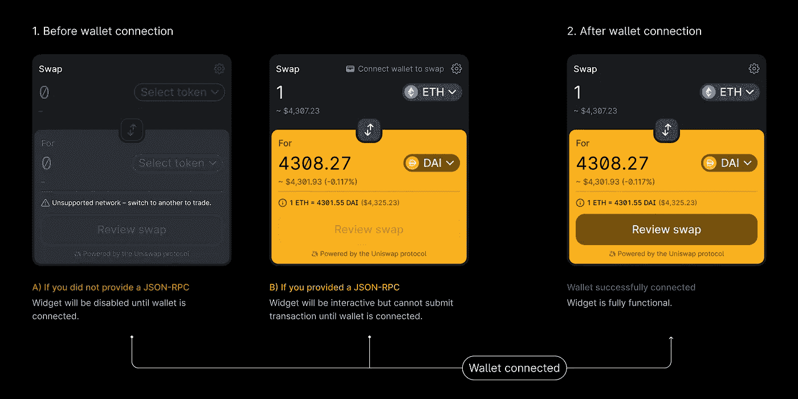
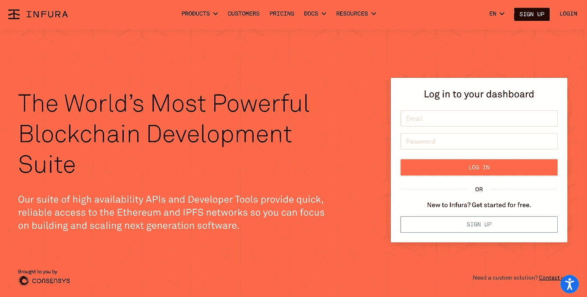
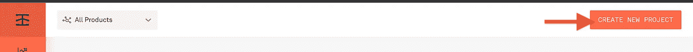
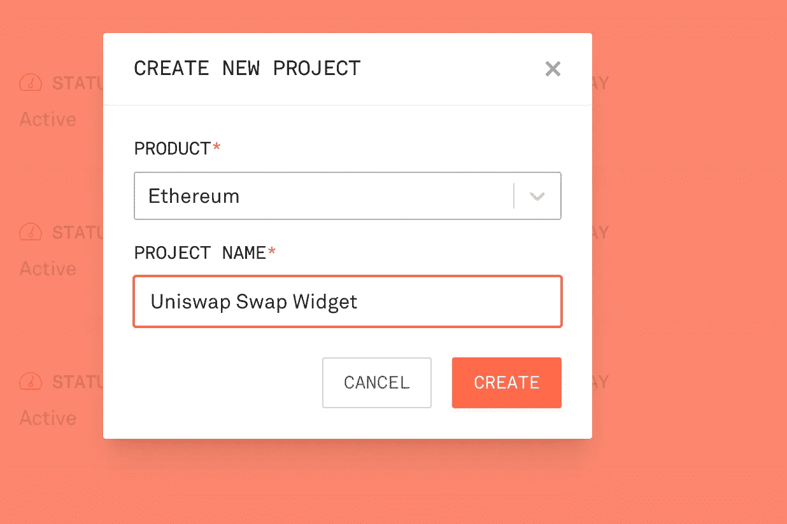
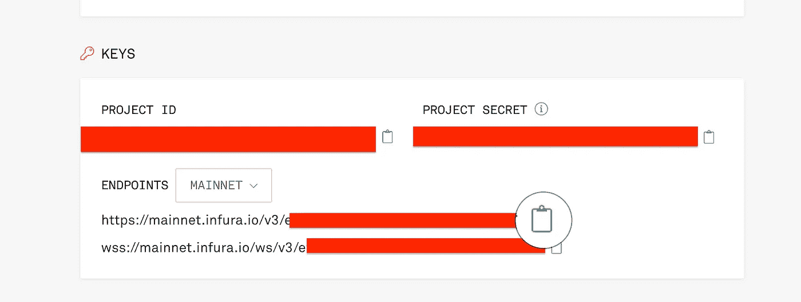
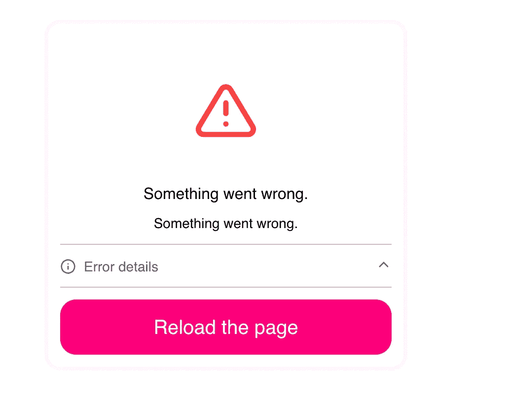

# 如何将 Uniswap 交换小部件添加到 React dApp

> 原文：<https://medium.com/geekculture/how-to-add-the-uniswap-swap-widget-to-your-react-dapp-9be353e2bd46?source=collection_archive---------3----------------------->



[Swap widget state](https://docs.uniswap.org/sdk/widgets/swap-widget)

几周前，我参加了 Polygon Guild Lagos 的活动，会上 [Teju](https://twitter.com/TejuAdeyinka) 发表了一个关于**人与协议**的演讲，以及我们如何通过预测用户需求来改善 Web3 的用户体验。

她讲述了自己试图在 dApp 上下注的经历，但她没能这么做，因为她没有所需的令牌。除了表达她的不满，她还谈到了我们如何通过让用户轻松访问所需的应用内令牌来改善这种体验。

这一点一直困扰着我，从那以后，我在构建任何 web3 产品时都要考虑令牌可访问性。因此，我决定在 Uniswap Labs Swap 小部件上试一试，这样用户就可以在 uni WAP 协议上交换令牌，而不用离开我的 dApp。

在进行这项工作时，我遇到了一些小障碍，也了解了其他人在梳理 Uniswap discord 服务器时面临的常见问题。所以我决定写一本对初学者友好的指南，这样你就不必面对我们所面临的同样的问题。

# 交换部件

如果您需要您的用户使用本地令牌(例如`ENS`)进行交易，您需要让他们无需离开您的 dApp 就能轻松获得令牌。这样做将有助于改善您的用户体验，并减少由于本机令牌的不可访问性而导致的掉线。

将交换小部件添加到 dApp 非常简单，只需几行代码就可以完成。但是在我们开始实现之前，这里有一些你需要开始做的事情。

## JSON-RPC 端点

JSON-RPC 端点需要获取链上数据和提交事务。如果您的 DApp 中已经有一个，您可以跳过这一步。但是如果你没有，你可以在像 [Infura](http://infura.io) 或 [Alchemy](http://alchemy.com) 这样的服务上轻松创建一个。

这里有一个简单的指南，告诉你如何在 Infura 上创建一个:

**第一步:**访问 Infura 网站，然后注册或登录您的帐户(如果您已经有一个)。



**第 2 步:**导航至您的仪表盘，点击`CREATE NEW PROJECT`



**第三步:**选择一个适用的产品，为您的项目命名，然后点击`CREATE`。



**步骤 4:** 向下滚动到**键**并复制您的端点 URL 或项目 ID。



干得好！您已经成功地生成了一个 JSON-RPC 端点。

**Web3 提供商**

Swap 小部件还需要一个 web3 提供者来获取余额，并通过用户连接的钱包提交交易。如果你正在创建一个 DApp，那么你将需要一个 web3 提供商。

有各种各样的供应商可供你选择。但在本文中，我们将使用[醚类](https://docs.ethers.io/v5/api/providers/)。

```
//install the ethers librarynpm install --save ethers
```

## **钱包连接流程**

您的应用程序中还需要一个钱包连接流，以便用户可以连接他们的钱包来执行交易。您可以使用各种库(例如 web3-react、wagmi 等。).为简单起见，我们将连接到用户安装的浏览器钱包，如 metamask。

但是，我们只能在用户安装了钱包的情况下这样做。因此，我们将使用 metamask 的`detect-provider`库检查 wallet 安装。

```
//install metamask detect-providernpm install --save @metamask/detect-provider
```

现在我们已经准备好了我们的需求，让我们开始吧。

# 添加小部件库

首先，安装小部件库和`react-redux`(如果你还没有安装的话)。

```
//install the swap widgetnpm install --save @uniswap/widgets react-redux oryarn add @uniswap/widgets react-redux
```

## 导入应用依赖项

```
//Store some state variables.
import { useState } from 'react';//connect to our infura endpoint
import { providers, ethers } from 'ethers';//check if metamask is installed in the browser.
import detectEthereumProvider from '@metamask/detect-provider';//uniswap widgets library
import { SwapWidget } from '@uniswap/widgets';
```

## 定义常数

```
const infuraId = process.env.REACT_APP_INFURA_ID;
const jsonRpcEndpoint = `https://mainnet.infura.io/v3/${infuraId}`;
const jsonRpcProvider = new providers.JsonRpcProvider(jsonRpcEndpoint);
const provider = new ethers.providers.Web3Provider(jsonRpcProvider);
```

## 定义状态变量

```
function App() { const [account, setAccount] = useState({
      address: '',
      provider: provider,
  })
```

## 创建 connectWallet 功能

```
async function connectWallet() {//check if Metamask is installed in the browser
const ethereumProvider = await detectEthereumProvider(); if (ethereumProvider) { //prompt user to connect their wallet
  const accounts = await window.ethereum.request({
        method: 'eth_requestAccounts',
      }) const address = accounts[0]; setAccount({
        address: address,
        provider: ethereumProvider
     })
  }
}
```

你可能想知道为什么我们添加了一个提供者，无论如何它都将被更新。原因如下👇



如果我们没有从一开始就定义一个提供者，那么当我们加载应用程序时，我们的小部件就会以这种方式出现。

## 添加返回元素

最后，我们添加返回元素。这里可以看到“连接钱包”按钮调用 onClick 的 Connect wallet 函数。SwapWidget 也接受两个参数；提供者和 JsonRpcEndpoint。

```
return (
  <div className="App">
    <div>
      <button onClick={connectWallet}>Connect Wallet</button>
    </div> <div className="Uniswap">
      <SwapWidget
        provider={account.provider}
        JsonRpcEndpoint={jsonRpcEndpoint} />
    </div>
  </div>
  );
}
```

干得好！您已成功将交换小部件添加到您的 dApp。现在，你可以运行`npm start`来查看你的 dApp。

你可以在 [GitHub](https://github.com/jelilat/uniswap-widget) 上查看完整代码。