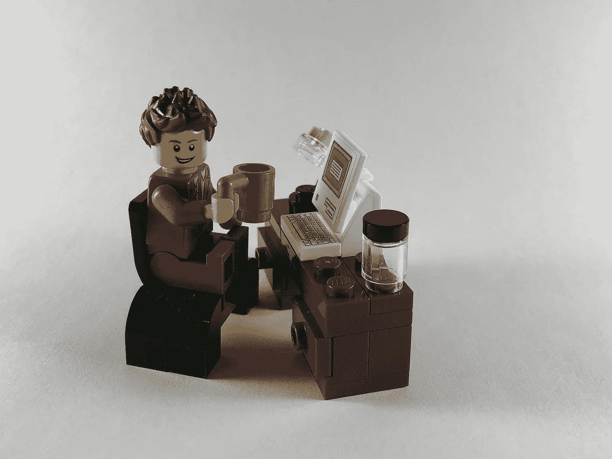

# 如何将 Vue(或另一个框架)添加到 React 微前端

> 原文：<https://medium.com/geekculture/how-to-add-vue-or-another-framework-to-your-react-micro-frontend-1d1a7cddc198?source=collection_archive---------6----------------------->

Image by [Stu G](https://pixabay.com/users/capsandcapital-11428599/?utm_source=link-attribution&utm_medium=referral&utm_campaign=image&utm_content=4250499) from [Pixabay](https://pixabay.com/?utm_source=link-attribution&utm_medium=referral&utm_campaign=image&utm_content=4250499)

在我的上一篇文章中，我向您介绍了如何创建一个基本的 hello-world 微前端应用程序，它利用 webpack 和 React 在运行时集成组件。