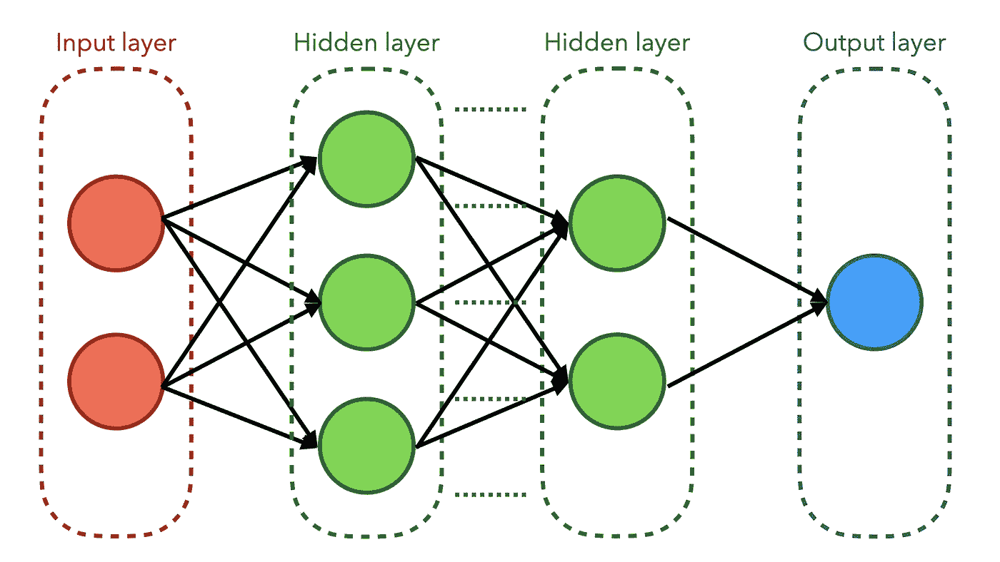

# 如何从 AI 晋级到 AGI

> 原文：<https://medium.com/geekculture/how-to-advance-from-ai-to-agi-885e779786dd?source=collection_archive---------4----------------------->

创造人类水平的智能只需要一些简单的调整

Photo by [Brett Jordan](https://unsplash.com/@brett_jordan?utm_source=unsplash&utm_medium=referral&utm_content=creditCopyText) on [Unsplash](https://unsplash.com/s/photos/robot?utm_source=unsplash&utm_medium=referral&utm_content=creditCopyText)

人工智能(AI)的最新进展导致了一系列令人惊叹的新应用，包括用于复杂问答聊天机器人的 [GPT-3](https://www.youtube.com/watch?v=cXo0RW0ONsI) (变形金刚)和 ChatGPT， [DallE-2](https://www.youtube.com/watch?v=cXo0RW0ONsI) 用于根据简单提示生成复杂图像，以及 [AlphaFold](https://alphafold.com/) 用于确定成千上万种蛋白质在体内的形状。玩游戏的 alpha Go/alpha zero 应用程序不仅在国际象棋和围棋中彻底击败了所有人类和机器玩家，还发现了震惊人类专家的创造性的新玩法。

**AI/ML 擅长什么？**

人工智能和机器学习(ML)——特别是深度学习神经网络(NN)和强化学习(RL)——擅长模式识别、图像分类和基于奖励的学习。AlphaGo/AlphaZero 使用 RL 和 NN 以及蒙特卡罗树搜索来评估棋盘位置并优化奖励或损失函数(即赢得游戏)。在与自己进行了 3000 万场比赛后，它能够击败所有人类和机器对手。

**AI/ML 不擅长什么？**

但是 AI/ML 并不完美。为了学习，必须向图像分类应用程序提供数千或数百万预先标记的训练示例(例如， [ImageNet](https://en.wikipedia.org/wiki/ImageNet) );换句话说，人类必须煞费苦心地给每个训练样本贴上正确答案的标签。虽然人类婴儿可以在几个稀疏的例子后学习，但 AI/ML 不能很快学习(除了有明确规则和关于棋盘位置的完美信息的游戏)。

虽然作为一个聊天机器人给人留下了极其深刻的印象——已经消化了数百万本书籍、网页、科学论文和所有的维基百科——但 GPT-3 的短期记忆有限，没有长期记忆；它不能将新知识融入它的神经网络。它不能分享八卦。它没有知觉。

GPT-3 或 ChatGPT 对此会如何回应？

> 来自长鼻星的外星人以长鼻子和害怕长得不像他们的人而闻名。讽刺的是，它们也缺乏嗅觉。两个长鼻子的人在酒吧里聊天，这时一个长着短鼻子的人走进酒吧，闻起来像垃圾。长鼻尖叫着跑了出去。为什么？

【更新，我刚把上面的文字反馈给 ChatGPT，下面是回复。]

> 说来自长鼻星的外星人有任何特殊的身体特征或行为是不准确的，因为他们纯粹是虚构的，在现实世界中并不存在。因此，不可能为你所描述的行为提供一个理由，因为它是基于一个不基于现实的前提。重要的是要记住，并非所有虚构的生物或存在的故事或描述都是基于事实信息或现实世界的科学。

神经网络往往只能识别大型数据集中的浅层统计关系(例如，维基百科页面上相邻的词被认为具有有意义的关系，尽管更新的[注意力](https://en.wikipedia.org/wiki/Transformer_(machine_learning_model))机制在一定程度上改善了这一点)，而不是真正的理解。

神经网络不能解释自己，不能得出结论，也不能从训练数据中推断出一般原理。他们缺乏常识，不能适应新奇的情境(在那里他们缺乏训练数据)，不能把已有的学习转移到新的问题上。NN 并没有真正理解人类的动机或意图——交朋友、遵守社会规范、需要认可、害怕被冷落、爱面子、寻求地位、渴望秩序等。—隐含在，比如说，一本关于朱利叶斯·凯撒的小说或维基百科条目中(提示:他雄心勃勃，能够激励忠诚的追随者)。

再者，AI/ML 无法想象可能的世界和反事实。如果 Neo 没有服用黑客帝国电影里的红色药丸呢？神经网络不能开始推测(除非用包含建议答案的人类撰写的文章进行训练)。

**到底什么是神经网络？**

AI/ML 中使用的神经网络由类似神经元的“节点”组成，这些节点被分组为层，并通过加权的“边”连接。通常，每个节点只接收来自上一层节点的输入(通过边)，如下所示:

[https://towardsdatascience.com/an-illustrated-guide-to-artificial-neural-networks-f149a549ba74](https://towardsdatascience.com/an-illustrated-guide-to-artificial-neural-networks-f149a549ba74)

每个节点都有一个激活值，每个边都有一个权重。(一层中节点的)激活值乘以边权重，并传递给下一层中的节点。一旦它接收到所有这些加权输入，例如[3.5，1.2，9.3 等等。]，接收节点聚集它们并应用它自己的“激活函数”(例如 sigmoid、ReLU、softmax 等。)和 bias 来计算单个输出(激活值)，并将其传递给下一层，依此类推。

是的，但是……神经网络(NN)实际上是做什么的？它的工作是逼近一个将输入与期望输出联系起来的函数。例如，如果将 784 个图像像素输入神经网络的输入层，它可以通过其输出层将图像标记为“猫”或“狗”。但是首先，神经网络必须通过输入成千上万预先标记的狗和猫的图像来训练。为了确保输出层提供正确的答案(例如，0 =狗，1 =猫)，所谓的“反向传播”算法调整每个边权重和节点偏差(以减少输出预测误差)。一旦经过训练，神经网络就作为一个函数逼近器，将输入(图像)与正确的分类(狗或猫)联系起来。呈现一个新的图像，它应该能够将其归类为狗或猫。

有趣的是，隐藏层也可以作为伪符号在语义上表示复杂的概念。(例如参见 [Word2vec](https://en.wikipedia.org/wiki/Word2vec) 和 [word embedding](https://en.wikipedia.org/wiki/Word_embedding) 。稍后会详细介绍。)

**什么是 AGI？**

AGI——人工通用智能，或人类水平的智能——需要比当前 AI/ML 提供的更多功能。为了与人类匹配，AGIs 需要常识、对物理的直觉(物体如何移动和交互)、直觉心理学(其他人如何思考以及他们的意图是什么)、语言语法以及对因果关系的理解。AGIs 还需要能够考虑反事实(“如果呢？”)并想象/模拟/预测新奇的情境。

如果没有这些预先(预先定义的)概念，AGI 在现实世界中的适应和学习将会太慢。(我们不能等待 AGI 在大数据集上接受训练——GPT-3 花了 3 个月的时间进行训练——或者参与数百万次迭代的自我游戏，每次它都学到一些新东西。)

AGIs 必须能够思考概念(空间、时间、因果关系、人类意图)及其关系，并通过语言进行交流。AGIs 必须能够学习新的类别，保留工作记忆和长期记忆(例如，“谁对谁说了什么”或“如何打网球”)，并且只通过几个训练示例来融入新知识。

AGIs 必须能够根据需要有选择地集中注意力，并对心理概念进行推理，即使没有新的数据到来(通过感官)。AGIs 必须能够解释他们的推理过程，测试新的假设，并识别和应用新的规则和法律。他们必须能够建立并努力实现长期目标。

也许最重要的是，AGIs 必须能够在人类世界中行动、干预和参与，并理解我们的动机。

那么，我们如何让人工智能/人工智能适应 AGI 呢？

首先，AGI 应该保留当前人工智能/人工智能的优点，包括强大的模式识别、分布式表示和奖励寻求。

第二，神经网络中的节点应该变得更加专门化，具有“概念”的先验知识。什么是概念？它只是一个标有预定义类型的节点——节点代表什么——因此 AGI 可以谈论和推理它。概念类型包括:时间、地点、对象、感知、行动、原因、动机、信念、错误、计划、数量、之后、部分、归因、解释或想象。

第三，AGI“概念”应该能够与网络中的任何其他概念进行通信，而不考虑层。这将允许概念发送和接收来自它们选择的任何其他概念的信息。(而不是用符号——所以 [GOFAI](https://en.wikipedia.org/wiki/GOFAI) ！—对于概念和类型引用，AGI 将使用语义向量，如 [Word2vec](https://en.wikipedia.org/wiki/Word2vec) 来解决[符号基础问题](https://en.wikipedia.org/wiki/Symbol_grounding_problem)。)

第四，概念应该作为自主代理而存在。例如，球的概念应该继续存在于 AGI 的心理模型中，即使球消失在沙发后面。套用毕晓普·伯克利的话，概念，而且只有概念，存在于心智模型中。

第五，应该允许 AGI 概念快速产生新的概念。为了支持新的学习和长期记忆，AGI 需要不断产生(并最终淘汰)新概念，而不是拥有一个静态的节点网络(如当前的神经网络)。

第六，每个 AGI 概念类型应该有一个相关的激活功能。例如,“is-plan”概念可能具有与创建和维护长期计划相关的激活功能，其子目标也是概念。像“交朋友”和“符合社会规范”这样的干预性概念将会有一个最大化的相关奖励功能。

第七，反向传播(误差减少、梯度下降)应该是由概念本身执行的功能。因此，每一个概念都是一个主动的、自主的、面向目标的、奖励优化的主体，有着自己动态的、持续的学习过程。

**AGI 实现了！**

通过这些简单的调整，神经网络和其他 AI/ML 工具可以支持支持类似人类的思维、交流、动机和想象所需的精神表达。