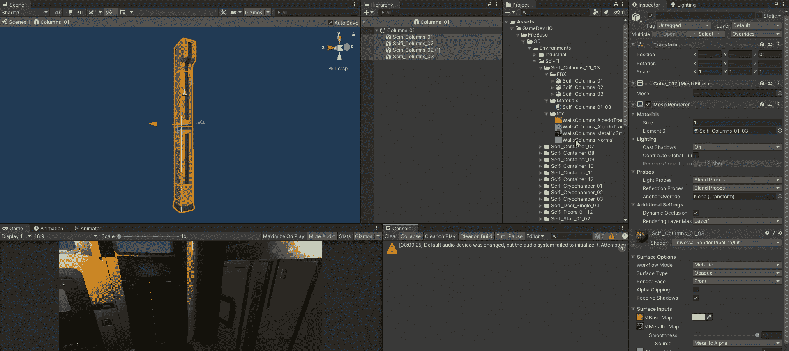
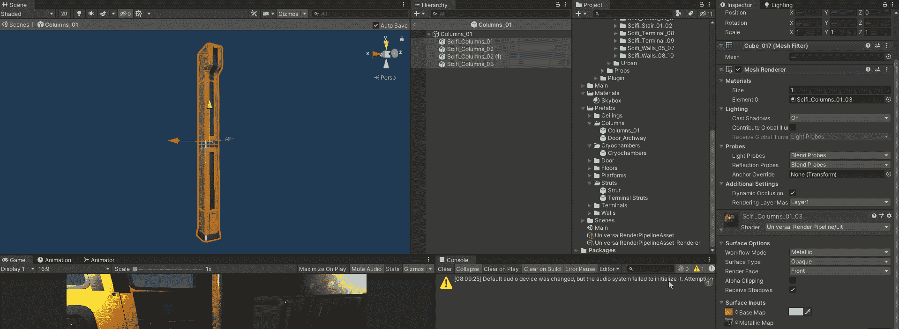
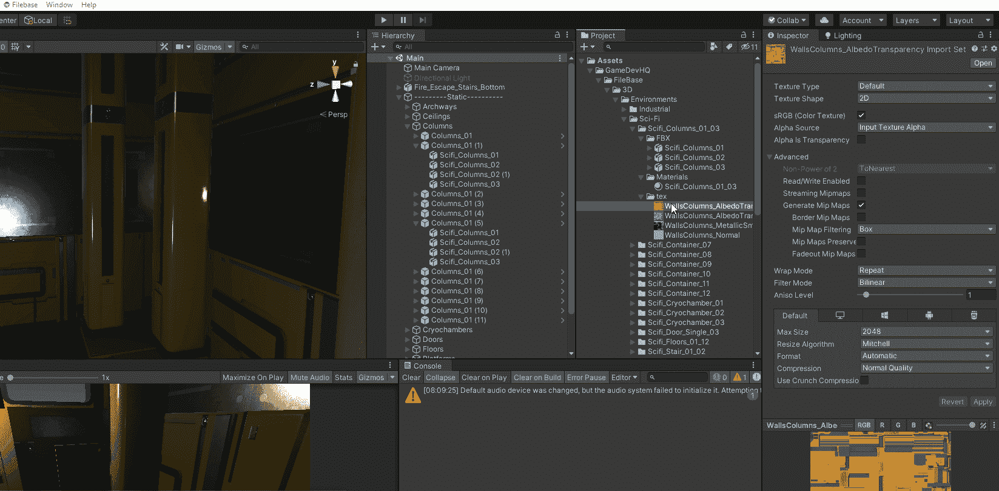
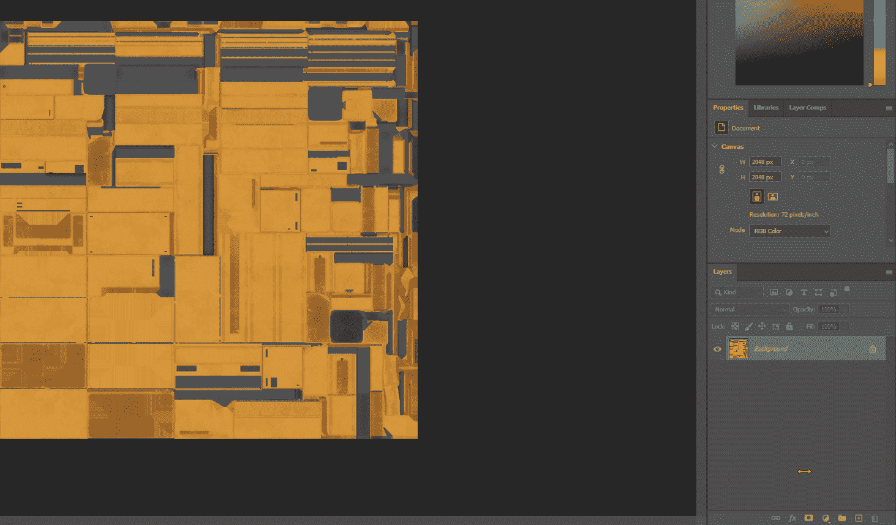
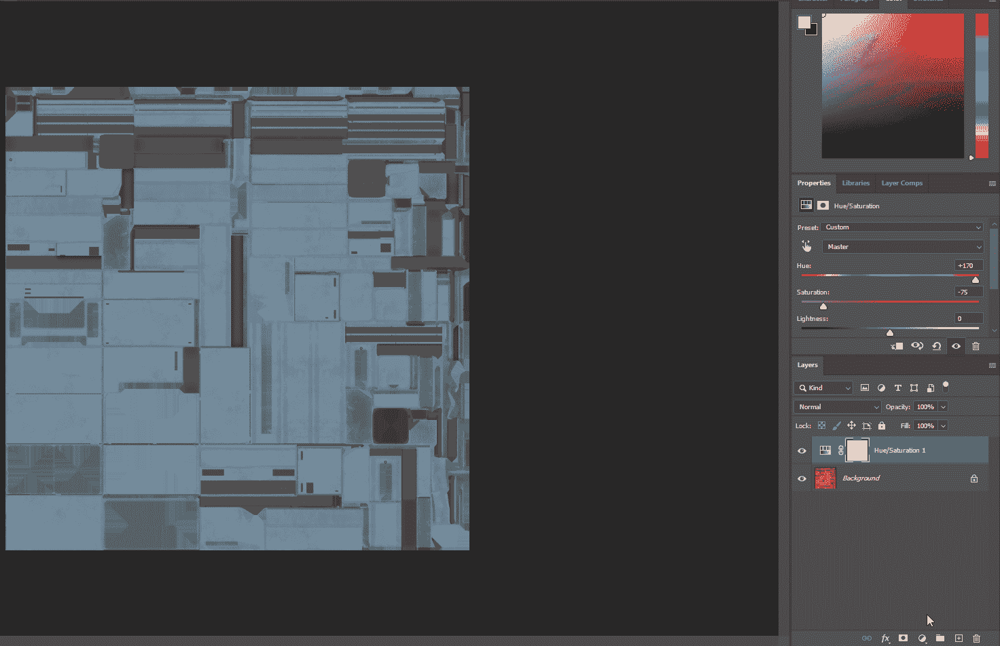
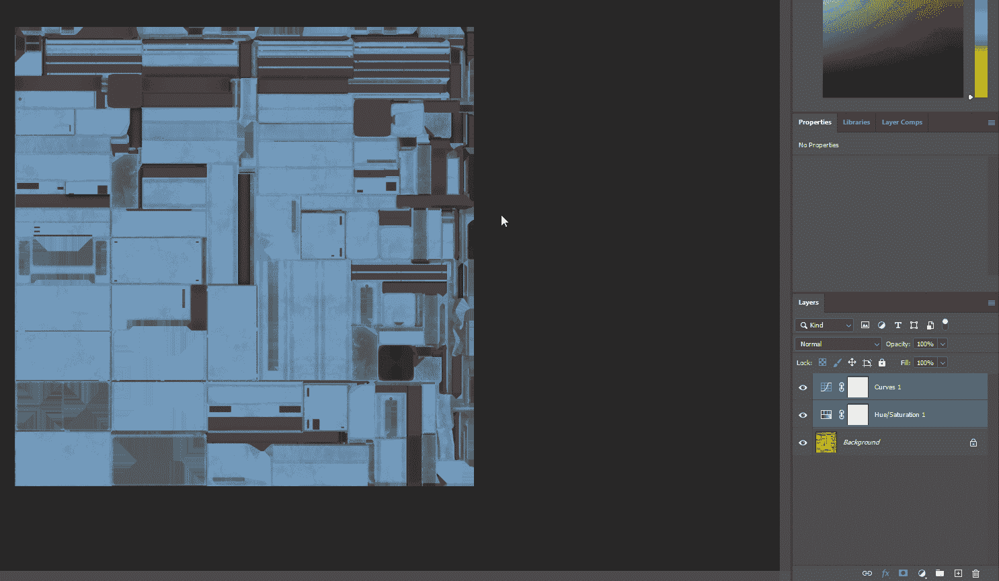

# 如何在 Unity 中改变你预先构建的纹理贴图

> 原文：<https://medium.com/geekculture/how-to-alter-your-prebuilt-texture-maps-in-unity-312ca9c819a4?source=collection_archive---------11----------------------->

**目的**:解释如何在 **Unity** 中**改变**你的**已有的纹理贴图**。

这篇文章将介绍如何在一个 Unity 项目中改变现有的纹理贴图，这样我们就不需要在 UV 贴图上浪费时间了。一种选择是进入**游戏对象**的**底图****，然后**调整**的**颜色**。但是如果我们想把**的纹理**改变成漂亮的**钢蓝色/灰色**的话，我们就有一个**的问题**，那就是我们已经有一个**现有的黄色** **颜色嵌入在**列**游戏对象上。当我们试图以这种方式改变颜色时，它不允许我们将它变成**灰色** ( *如下图*):****

****

## **使用 Photoshop 或 GIMP 更改纹理贴图**

**第一步是在 **Unity** 中找到你想要**调整**的**纹理贴图**，你要在中打开它们，像 **Photoshop** 或 **GIMP** 这样的软件。右击**Unity**→’**中的纹理，在浏览器**中显示。现在打开**文件**进入 **Photoshop/GIMP** 。为了这篇文章的目的，我将使用 **Photoshop** 。**

****

**我们现在要去我们的调整层，并选择'**色调/饱和度**'。让我们降低**饱和度**一点点(*大约。-75* 和**将**的**色调**增加到*左右。170* 。然后我们可以将**亮度**稍微调整到我们想要的程度:**

****

**现在，我们使用**曲线**，调整曲线的中间，使其更高，增加对比度:**

****

**现在让我们将“**另存为**”→**PNG**文件保存到**相同的目录**中，并给文件一个新的扩展名(*蓝色*)。现在，这个文件应该保存在您的 **Unity** 项目中(*并且您应该不需要导入*)，就在我们打开的文件旁边。**

**现在**拖动**蓝色**纹理**到“**底图**区域来替换**颜色纹理**，我们不用担心搞乱我们的 **UV 贴图**。**

****

**如果还是不太合你的意，你可以简单地回到 **Photoshop** ( *处理同一个文件*)进行任何必要的**调整**和**保存**覆盖**同一个文件**。现在**将自动**被**更新为 **Unity** 中的**。**

**现在我们已经为我们的**纹理**选择了正确的颜色，不要手动去改变你的下一个游戏对象的曲线，因为这会非常耗时。让我们使用**列纹理**中的**相同图层**。首先让我们**拖动**新的纹理到 **Photoshop** 中作为一个新的标签(在我的例子中*将是我的地面/墙壁纹理*)。**高亮显示**列纹理**中的**和**图层**，右键点击→’**复制图层**’→’**文档**’→’**Grounds.png**。现在**救**另一个**。png 文件**为**地面贴图**和类似上面的步骤头回 **Unity** 和**拖动**新的**地面贴图**到**底图**。**

****

**这是一个节省时间和对场景进行大规模修改的好方法，而且不用摆弄 UV 贴图！**