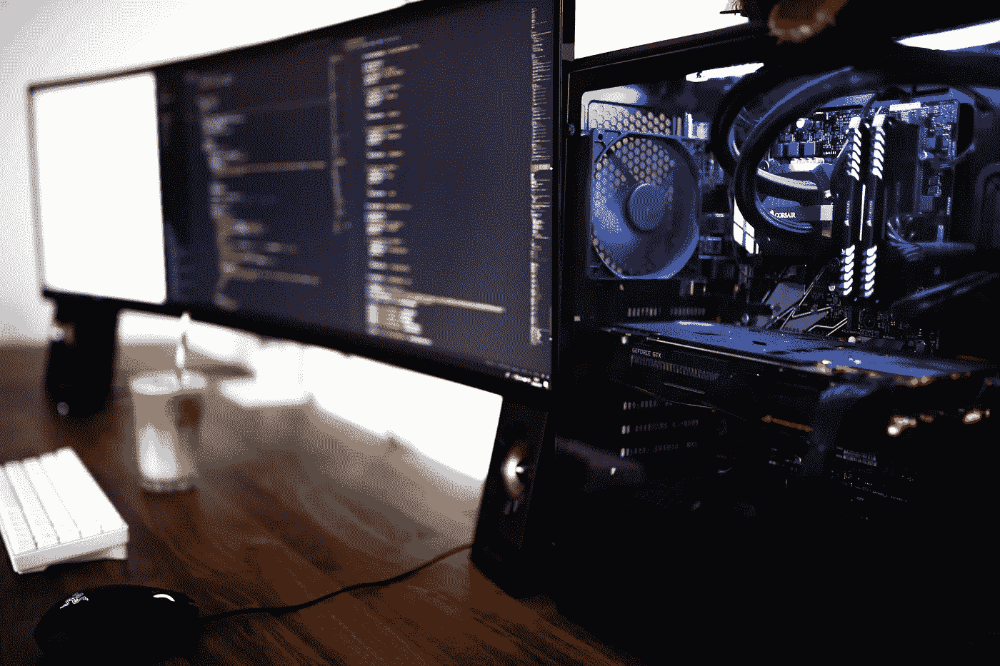

# 如何总是知道你的 IP 进行远程连接

> 原文：<https://medium.com/geekculture/how-to-always-know-your-ip-for-remote-connection-223c01912573?source=collection_archive---------31----------------------->

## 跟踪您的 IP 地址，轻松连接到您家中的桌面。

Photo by [casparrubin](https://unsplash.com/@casparrubin) on [unsplash](https://unsplash.com/?utm_source=medium&utm_medium=referral)

在当今的疫情时代，我不是地球上唯一一个远程工作的人。我过去有时在家工作，但不是经常性的，但我可以说我喜欢这样。最令人愉快的部分是，远程工作允许你在家工作，在你的小屋，在你父母的……你想去的任何地方！唯一的条件是，你有一台笔记本电脑和良好的连接。

然而，作为一名数据科学家，我的双 GPU 平台不如我的笔记本电脑运行得好，但它的功能要强大得多。当然，我可以设置相当的基于云的虚拟机，但是，嘿，我怎么能游戏呢？！

所以，简单的解决办法就是带着我的笔记本电脑旅行，把我的台式机放在家里。当我不在家时，编码部分在我的笔记本电脑上完成，让繁重的过程在我的台式机上进行。我所需要的就是用一个安全的 SSH 连接来连接到我的桌面。甚至 VSCode 允许您直接在 IDE 中打开 SSH 连接，这甚至更容易。谢谢 MSFT！

发生这种情况的唯一问题是总是知道你的公共 IP。除非你为一个固定的 IP 付费，否则它可能会随着时间的推移而改变，但不会太频繁，因为你的互联网提供商会尽力给你相同的 IP。所以你必须跟踪你的公共 IP，并有一个地方来记录它。

我找到的解决方案是简单地制作一个服务，定期检查我的公共 IP，并检测其中的任何变化。如果我的 IP 地址改变了，就会有一封电子邮件发送到我的收件箱(我使用 gmail)。为此，我使用了我最喜欢的语言 python 和 [Google API](https://developers.google.com/gmail/api/quickstart/python) (文档写得非常好):

还不错！只需几行代码，就大功告成了。现在，您所要做的就是通过`systemd`服务实现流程自动化:

并通过定义计时器每小时运行一次该服务:

瞧啊。现在，您可以使用 linux 服务跟踪您的公共 IP，当您的 IP 发生变化时，该服务会向您发送一封电子邮件，这样，您就可以将桌面放在家里，随时随地享受工作的乐趣！