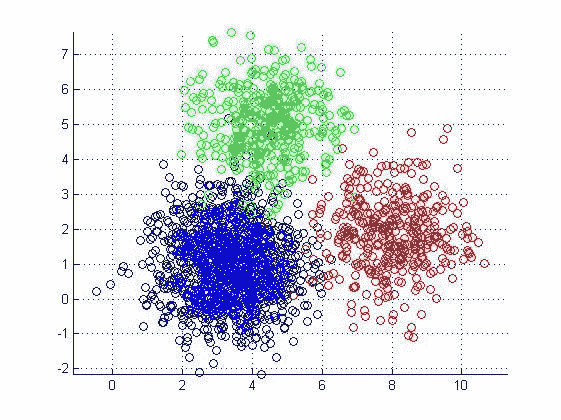
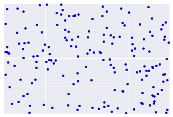

# 运行 ML 模型后，如何分析和使用买方角色的结果

> 原文：<https://medium.com/geekculture/how-to-analyze-and-use-your-buyer-personas-results-after-running-an-ml-model-18b211882b0?source=collection_archive---------26----------------------->

几个月前，我们分享了一个帖子，帮助你[用非传统数据找到你的买家角色](https://blog.datagran.io/posts/find-your-buyer-persona-with-machine-learning)。如果您读过它，您就会知道我们从一个航空公司用例中提取了客户服务机票数据，其中包含诸如机票号、机票类型、呼叫原因等信息。和客户数据，如姓名、电子邮件地址、电话号码，以建立一个渠道，帮助我们了解谁是他们的买家角色。传统上，寻找买家角色是通过市场研究从定性和定量数据中获得的，这是相当昂贵的。公司现在能够收集与人口统计信息一样有价值的其他类型的数据，例如前面提到的数据类型。所以不使用它就像戴着眼罩走在一片金色的土地上。

# 当这些模型被执行时发生的事情是可悲的。一份 [GARTNER](https://www.gartner.com/en) 的研究称，近 85%的数据项目失败是因为缺乏操作它们的知识。只有 4%的公司表现出这样的能力。

数据科学家发现很难向非技术利益相关者解释机器学习的结果。为了便于理解和产生影响，数据通常需要以图形或图表的形式直观呈现。虽然这些工具非常有用，但是手工构建它们很困难。花时间从多个领域提取信息并将其放入报告工具是令人沮丧且耗时的。不仅如此，如果我们在谈论寻找你的买家角色，我们还会遇到在完美世界中看起来像这样的图表:

来源: [KDnuggets](https://www.kdnuggets.com/2019/09/hierarchical-clustering.html)

但不幸的是，它们看起来更像这样:

来源:[谷歌](https://developers.google.com/machine-learning/clustering/interpret)

因为聚类是无监督的，所以没有“真理”可用于验证结果。真相的缺失使得质量评估变得复杂。谷歌推荐了一种方法，可以帮助你解释结果并调整聚类。下面是应该做些什么的简要分类:

第一步:[聚类质量](https://developers.google.com/machine-learning/clustering/interpret#step-one:-quality-of-clustering)

目视检查以确定群集是否符合预期。

第二步:[相似性度量的执行](https://developers.google.com/machine-learning/clustering/interpret#step-two:-performance-of-the-similarity-measure)

找出已知与其他例子或多或少相似的例子对。然后，计算每对示例的相似性度量。确保更相似示例的相似性度量高于不太相似示例的相似性度量。

第三步:[最佳聚类数](https://developers.google.com/machine-learning/clustering/interpret#step-three:-optimum-number-of-clusters)

k-means 要求你事先决定聚类数。你如何确定最佳值？尝试运行增加的算法，并注意集群数量的总和。随着增大，簇变得更小，总距离也减小。绘制该距离与聚类数的关系图。

# 幸运的是，有一个更简单的方法，在这篇文章中，我们将解释如何分析和浏览买家角色模型的结果。

使用从[买家角色博客帖子](https://blog.datagran.io/posts/find-your-buyer-persona-with-machine-learning)中收集的相同用例数据，我们知道有两个数据集，称为:

*   新桌面数据:该数据集包含来自客户服务票据的信息。它的大多数特征是绝对的。数字特征来自时间戳日期，为了匹配正确的格式，使用 SQL 操作符将时间戳日期转换为小时单位。

**提示:**如果使用 Datagran 构建一个管道，您不需要将数据组织在一个仓库中。数据可以是 CSV 文件，甚至是原始数据。换句话说，任何处于成熟状态的公司都可以运行一个模型。管道中可用的操作符之一是 SQL，它允许您处理数据，使其符合您需要的格式。

*   乘客声明:包含与乘客相关的信息，如他们的姓名、参考联系人和航班号。这是模型分类变量的乘客信息。其中仅有的是奖励计划状态、[城市对连接](https://www.gsa.gov/travel/plan-book/transportation-airfare-pov-etc/city-pair-program-cpp)(非常少的数据)、[票价等级](https://thepointsguy.com/guide/airline-fare-classes/)、[乘客类型](https://en.wikipedia.org/wiki/Passenger)和航班号。

因为某些数据具有 null 或空字段，所以决定使用至少 70%的完整数据(非 NULL)进行训练。

运行模型后，结果包括三个集群。

# 群组 1

与其他两个分类相比，这个分类的记录数量最多，但是它并没有超过分类 2 太多(3820 → 44.9%)。在这个集群中，我们可以找到:

1.  请求的状态集中在“未完成”和“待处理”
2.  在与请求相关联的前 5 名代理中，有 4 名代理属于其他集群的前 5 名，除了该集群之外，还有 6 名代理专门属于该集群。
3.  尽管大多数高优先级集群都集中在这里，但是在所有集群中，优先级大多较低。
4.  所有集群、反馈部件和电子邮件的来源都是相同的。
5.  所有集群、预订和采购管理的申请类型都是一样的，只有退款。
6.  所有集群的客户服务票证类型都相同。
7.  该集群完全由不具有与解决状态相关联的信息的记录组成。
8.  所有集群中的组都相同。
9.  它主要包括等于 0 的代理交互评级。
10.  所有集群的客户交互都是一样的。
11.  最高记录的航班号是 5764、5765 和 5587。总之，对于这个集群，有 17 个专属航班。
12.  在这个集群中，LiftStatus 变量主要由“No show”状态和大量“Boarded”记录组成。
13.  平均 57 小时(2.4 天)的到期记录，仅在群集之间更改第 3 季度。

**概要:**

可以这样概括这个集群:这些是大多数没有登机的乘客的请求(可能是因为航班被取消)，或者他们的请求是开放的和待定的，因此他们没有解决时间和解决状态，此外，他们是具有最长到期日期的乘客，他们的请求类型包括所有报销，前两个数量的航班可以与往返航班相关联，因此可以说这些航班存在某种问题，并且很少或没有代理交互。这个集群只有 17 个航班。

# 群组 2

该分类拥有第二多的记录，仅次于分类 1 (3155 → 43.8%)。在这个集群中，我们可以发现:

1.  请求状态集中在“已关闭”中。
2.  在与请求相关联的前 5 名代理中，有 2 名代理属于群集 1 的前 5 名，除了该群集之外，还有 4 名代理专门属于该群集。
3.  在所有集群中，优先级通常较低。
4.  所有集群、反馈部件和电子邮件的来源都是相同的。出站电子邮件源也包括在该群集中。
5.  所有群、预订和采购管理的请求类型都是相同的，只有路线信息除外。
6.  客户服务票据类型，对所有集群都一样。
7.  该群的解决状态记录主要由“违反服务级别协议”和“在服务级别协议范围内”组成。
8.  所有集群中的组都相同。
9.  它主要包括等于 1 的代理交互评级。
10.  所有集群的客户交互都是一样的。
11.  最高记录的航班号是 5764、5586 和 5587，对于该集群有 7 个专属航班。
12.  在这个集群中，LiftStatus 变量主要由“已登机”状态和大量“未显示”记录组成
13.  解决时间的记录集中在平均 77 小时(<100) (3.2 days)

expiration records with an average of 56 hours (2.3 days), changing only the Q3 between the clusters.

**摘要:**

可以通过说他们是大多数登上他们的航班的乘客，他们的案例被关闭并且解决时间在前 4 天之间，这些乘客的客户服务票被划分为符合和不符合服务水平协议的乘客，更高的是不符合服务水平协议的乘客，请求类型包括路线新闻的请求类型，他们大多数与代理有最小的交互， 他们的解决时间大约是 3 天，在这个群的顶部 3 有一个往返航班，可以推断这个航班的某种问题，如延误或取消。 它只有 7 个航班。

# 第 3 组

与其他两个分类相比，该分类的记录数量最少(1031 → 11.3%)。在这个集群中，我们可以发现:

1.  请求的状态集中在“已关闭”
2.  在与请求相关联的前 5 名代理中，有 5 名代理属于集群 1 和集群 2 之间的前 5 名代理，此外还有该集群 1 代理专门属于它。
3.  在所有集群中，优先级通常较低。
4.  所有集群、反馈小工具和电子邮件的来源都是相同的。
5.  对于所有集群、预订和购买管理，请求的类型是相同的，只有补充服务。
6.  客户服务票证的类型，对所有集群都一样，只是这里没有祝贺。
7.  该群集的解决状态记录仅包括“违反服务级别协议”。
8.  所有集群中的组都相同。
9.  它主要包括等于 1 的代理交互评级，并包含每个代理的最高交互值。
10.  所有集群的客户互动都是一样的，包括互动最多的集群。
11.  具有最高记录的航班号是 5793、5716 和 5733，对于该集群有 9 个专属航班。
12.  在这个集群中，LiftStatus 变量主要由“已登机”状态和“未显示”记录组成，这是唯一没有签入的记录。
13.  解决时间的记录集中在平均 1259 (> 1000) (52.5 天)
14.  平均 51 小时(2.1 天)的到期记录，仅在群集之间更改 Q3。

可以通过说该集群与其他两个集群相比是最小的，并且包括通常已经登机的乘客，他们各自的 PQRS 处于关闭状态，并且他们的整个解决状态不符合服务水平协议，已经与具有 2 次交互趋势的代理进行了至少一次交互，并且解决时间包括最高值，大约 53 天，但是与其余集群相比具有更短的到期时间。它只有 9 个航班。

# 寻找你的理想客户

当运行购买者角色模型时，具有上述特征的集群是得出结果和获得扩展见解的关键。

第一步是分解每个集群，以了解还剩下哪些特征，然后您可以命名每个代表其行为的角色。你必须根据你的发现提出几个你想回答的问题:

*   你的客户是谁？
*   他们表现如何？
*   他们对什么感兴趣？
*   他们面临怎样的挑战？

根据聚类结果，我们可以为每个角色收集以下亮点和名称:

# 第 1 类:未出现的客户

大多数没有登机的乘客

要求退款

# 群组 2:买家角色

大多数登上航班的乘客

他们的客户服务票在前 4 天就被关闭了

请求的类型包括路线信息

他们与代理人的互动很少

# 集群 3:不满意的客户

登上航班的乘客

他们各自的客户服务票证处于关闭状态，并且他们的整个解决状态不符合服务级别协议。

他们至少与一个有 2 次交互倾向的代理有过一次交互，解决时间包括最高值，平均为 53 天。

现在我们可以挖得更深。例如，可以对每个聚类进行分析，以收集终生客户价值或客户获取成本。

**LTV:** 衡量客户终身价值最简单的公式就是平均订单总额乘以一年内的平均购买次数再乘以平均保留年限。

使用此公式来了解每个集群在特定时间段内产生的收入。这将有助于您为未来的营销、销售和客户服务工作制定准确的预算。

**CAC:** CAC 的计算方法是将获得更多客户所花费的成本(营销费用)除以在花费这些钱的期间所获得的客户数量。在这种情况下，计算为每位乘客提供服务的成本，并确定你的营销努力是否有回报，或者是否有所欠缺。

一旦你确定了你的 LTV 和 CAC，通过运行额外的模型更进一步，如[推荐产品](https://blog.datagran.io/posts/master-the-recommended-product-operator)——一个预测你的客户最有可能购买的产品的模型，和[RFM](https://blog.datagran.io/posts/rfm-analysis-build-an-ml-model-and-learn-more-about-your-customers-with-rfm-analysis-and-segmentation)——一个预测谁是你最好和最差客户的细分模型。可能性是无限的，但前提是与你的客户建立更个性化的联系，并随之增加收入。有了这些行动，你的团队可以联系你最好的客户，让他们提出更个性化的要求，比如他们最有可能做出反应的促销活动。这方面的例子有:

*   折扣票价
*   打折目的地
*   奖励专享目的地的现金

此外，在财务中使用这些结果可以帮助您的公司定义跨多个部门的投资。例如，分类结果可用于根据所需的人力和使用的策略来预测销售工作。

可以通过开展个性化活动来重新审视营销工作，确保与每个客户建立更深层次的联系，以解决公开的争议、投诉和不满。

例如，在运营中，集群化可以帮助您根据表现为不满意或满意的客户建立客户服务代理组。

准备好运行聚类算法了吗？使用您的最新模型结果尝试这种方法，并与我们分享您如何使您的数据具有可操作性。

总之，传统的寻找买家角色的方法既费时又费钱，而且充满了人的偏见。有了 ML，你可以准确地对你的客户进行聚类，然后以一种更科学的方式建立你的买家角色。虽然 ML 可能感觉很复杂，但是基于它的输出来解释和设计购买者角色并不复杂。与您的 BI 或分析团队合作构建一个协作平台，业务和分析视角将为组织带来巨大成果，您将开始为成为更加以数据为中心的专业人士铺平道路。