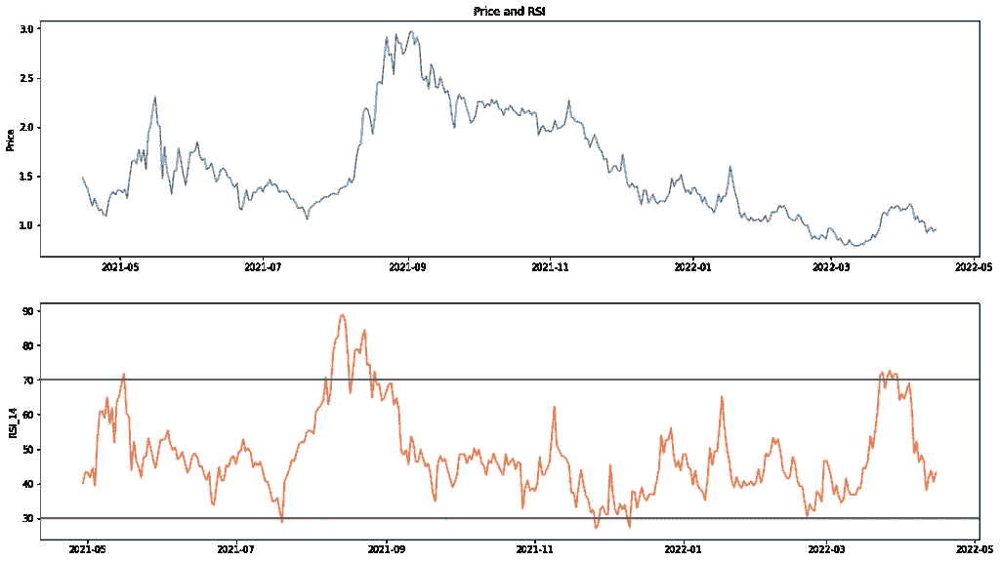

# 如何将重复性劳损交易策略应用于您的密码

> 原文：<https://medium.com/geekculture/how-to-apply-an-rsi-trading-strategy-to-your-cryptos-211406675d08?source=collection_archive---------4----------------------->

## 使用北海巨妖 API 和 Python 的 RSI 交易教程

 [## 加入媒体与我的推荐链接-乔治皮皮斯

### 阅读乔治·皮皮斯(以及其他成千上万的媒体作家)的每一个故事。您的会员费直接支持…

jorgepit-14189.medium.com](https://jorgepit-14189.medium.com/membership)