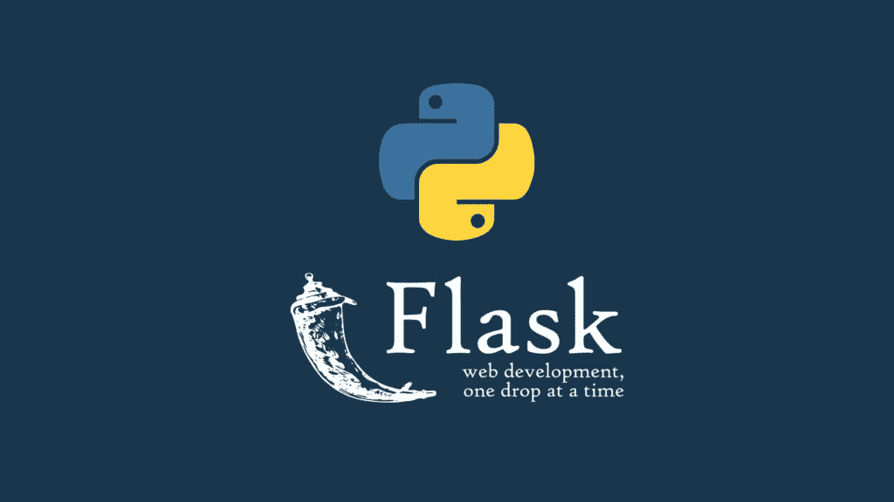
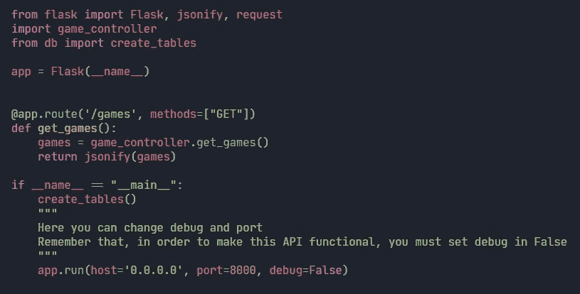

# 如何构建你的 Flask Rest API？

> 原文：<https://medium.com/geekculture/how-to-architect-your-flask-rest-api-abf95637d9f5?source=collection_archive---------3----------------------->



在这篇文章中，我将向你展示如何构建你的 Flask REST API。没有别的事了，让我们开始吧。

用 Flask 构建传统的 REST API 是什么样子？



通常我们所做的是把所有的内容(路线、数据模型、验证器类等等...)在一个名为 App.py 的文件中，但是当涉及到架构代码时，我们需要一个适当的文件夹结构，将我们的逻辑分成这些文件夹，然后导入到我们的主 App.py 中

**在我们的代码库中拥有一个好的架构有什么好处？**

1.  更容易维护。
2.  其他开发者更容易理解。
3.  避免代码重复，降低成本。
4.  可以非常快速地对现有代码库进行升级/更改。
5.  更多…

**文件夹结构**

1.  **api** —包含应用程序所有路径/端点的文件夹。这些路由/端点仅用于接受请求。此路由/端点的逻辑在不同的文件夹中实现。

2.**模型** —包含所有带约束的数据库模型类的文件夹

3.**服务** —所有路由/端点的逻辑都在这里实现

4. **utils** —这是我们将要添加其他函数和类的文件夹，例如 JWT 令牌生成器函数、JWT 令牌验证函数、密码加密函数等

# API 层

在这个文件夹/层中，我们可以将所有的端点写在单独的文件中。例如，我们可以拥有 User.py，它包含与用户相关的所有路由。我们可以拥有 Product.py，它包含与产品相关的所有路线。像 wise 一样，我们可以将这一层的所有端点写在不同的文件中。

但是我们如何在 app.py 中使用这些端点呢？

为了在我们的主 app.js 中使用这些端点，我们必须使用 Flask 提供的 Blueprint。使用 blueprint，我们可以注册我们的端点，并在 app.py 中使用该端点

```
in our route filefrom flask import Blueprint, request@product_route.route("/stock/add", methods=['POST'])
def stock_add():            
...-----------------in app.pyfrom api.stock import stock_routeapp.register_blueprint(stock_route)
```

# 模型层

在这一层，我们可以定义所有的模型类。如果我们使用类似 sql alchemy 或 mongo engine 的东西，我们可以在这里定义这些模型类。

# 服务层

正如你在 API 层看到的，我们只接受用户的请求。但是我们没有在那里执行任何逻辑。我们使用服务层来编写端点逻辑。例如，假设您有一个端点来获取产品数据。所以在 API 层你可以写端点。但是为了获得数据，你需要对数据库或文件编写查询。所以逻辑要写在这一层。

# 实用程序层

我们可以将其他函数或类放在这一层。例如，您有一个加密文本(更具体地说是密码)的函数。这些功能很可能依赖于一些第三方软件包。所以如果你把这些放在这里，当你面对一个包的问题时，你唯一要做的就是改变这一层。它不会影响其他层。

你可以在[这里](https://github.com/Shihara-Dilshan/John-Keells-App-Revamp/tree/main/Server)找到用这个架构构建的完整 REST API。