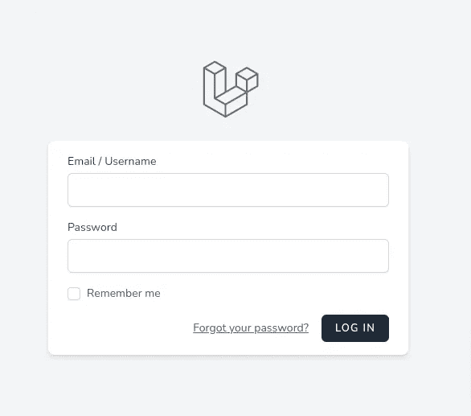

# 如何使用 Laravel + Breeze + InertiaJS 进行电子邮件或用户名认证或登录。

> 原文：<https://medium.com/geekculture/how-to-authenticate-or-login-with-email-or-username-using-laravel-breeze-inertiajs-961ee57fe9d9?source=collection_archive---------0----------------------->

让用户开心，用户体验就是一切。作为一名开发人员，代码看起来漂亮并且功能强大也很好。

比如像 Reddit 这样的应用，你可能不想要名字。我在上面做的是使名字可以为空，或者有时用名/姓字段替换它。你可能会…