# 如何使用 Integromat 自动生成带水印的视频

> 原文：<https://medium.com/geekculture/how-to-auto-generate-watermarked-videos-using-integromat-aab6e93810b7?source=collection_archive---------17----------------------->

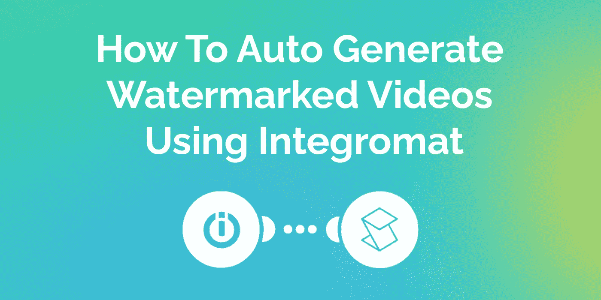

在本文中，我们将向您展示如何使用 Integromat 和 Shotstack 构建一个自动化的工作流程，该流程从 Google Drive 获取您的源素材，添加水印，并将其上传回 Google Drive。

在我们开始之前[，请将 Shotstack Integromat 应用程序](https://www.integromat.com/en/apps/invite/8271f9c0670cb6b883411cecf278cba9)添加到您的 Integromat 帐户。这为您提供了对所有 Shotstack 模块的访问，您需要开始对您的视频自动应用水印。

# 这将如何工作

[integra mat](https://www.integromat.com/)称自己是“互联网的粘合剂”，他们的平台允许你自动化手动过程，而不需要代码。这是通过创建将不同数据源和 API 链接在一起的场景来实现的。在这个例子中，我们将把 Google Drive 和 Shotstack 连接在一起，并将由两个场景组成。

第一个场景将获取您选择的 Google Drive 文件夹中的所有文件，并使用 Shotstack 应用统一的水印。

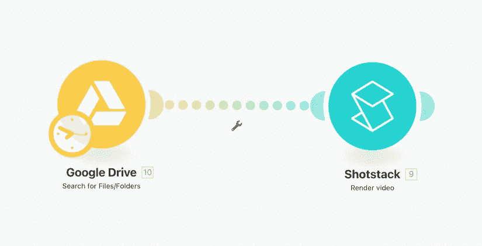

第二个场景将监听视频何时完成渲染。然后，我们下载这些带水印的视频，并将它们上传到 Google Drive 上的另一个文件夹。

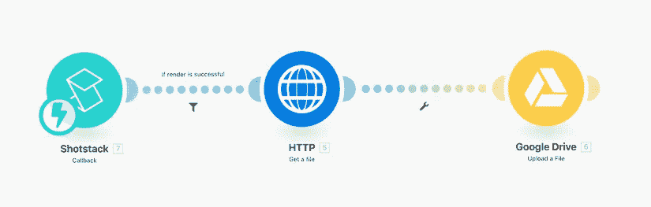

# 场景 1:给 Google Drive 文件夹中的所有视频添加水印

## 公开您的源素材

对于这个例子，我们将使用一组八个 [10 秒的无人机镜头剪辑](https://drive.google.com/drive/folders/1GjYYNCXOpqoHQUvwdDbTkmdh6vEcmP6J?usp=sharing)。

您可以使用这些示例文件或您自己的视频集，但请确保您的 Google Drive 文件夹中的所有文件都可以公开访问，以便 Shotstack 能够下载视频。你可以通过右键点击你所有的文件，然后点击*共享*来实现。

确保你所有的文件都勾选了这个选项，即*互联网上任何有这个链接的人都可以查看*。

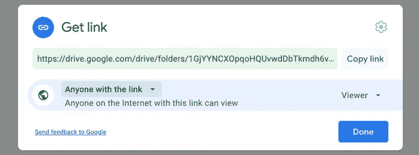

## 添加 Google Drive 模块

现在，对于我们的第一个场景，我们需要名为*的 Google Drive 模块来搜索文件/文件夹*，并通过在可用应用程序中选择它来将该模块添加到您的场景中。您需要连接您的 Google Drive 帐户，然后选择存储源视频的文件夹。

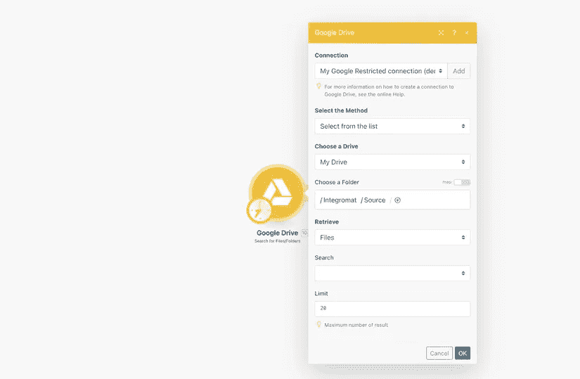

## 添加 Shotstack 模块

其次，你需要 *Shotstack 渲染模块*，并将其连接到你的 Google Drive 模块。您还需要添加您的 Shotstack API 密钥。你可以通过[注册一个 Shotstack 账户](https://dashboard.shotstack.io/register?utm_source=Geek-culture&utm_medium=tutorial&utm_campaign=2021_5_tutorial_integromat_googledrive)并登录[你的仪表盘](https://dashboard.shotstack.io/?utm_source=Geek-culture&utm_medium=tutorial&utm_campaign=2021_5_tutorial_integromat_googledrive)来获得。您可以通过点击仪表板右上角的 *API Keys* 找到您的密钥。请确保使用您的 stage 键进行测试，因为此键没有充电。一旦您对工作流程满意，您就可以切换到生产密钥。

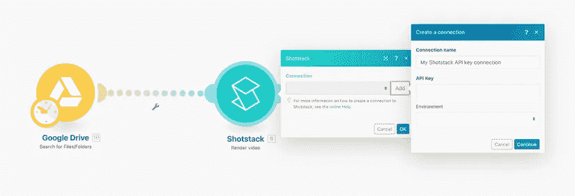

一旦您将 API 键连接到 Integromat，您就可以配置渲染模块。Shotstack 的渲染方式类似于桌面视频编辑应用程序。您可以将轨道和片段添加到时间线，并选取它们如何从一个片段过渡到下一个片段。

由于我们只想添加一个水印，我们只需要两个剪辑。一个剪辑包含我们的源视频素材，另一个剪辑覆盖图像水印。

**添加包含水印的剪辑**

我们希望编辑的顶部剪辑包含图像水印，因为我们希望将此图像覆盖在视频上。我们将使用一个[静态水印](https://shotstack-assets.s3-ap-southeast-2.amazonaws.com/logos/travel-white.png)并将`0`秒的`clip start`设为`clip length`秒的`10`，这与所有源视频的长度相同。

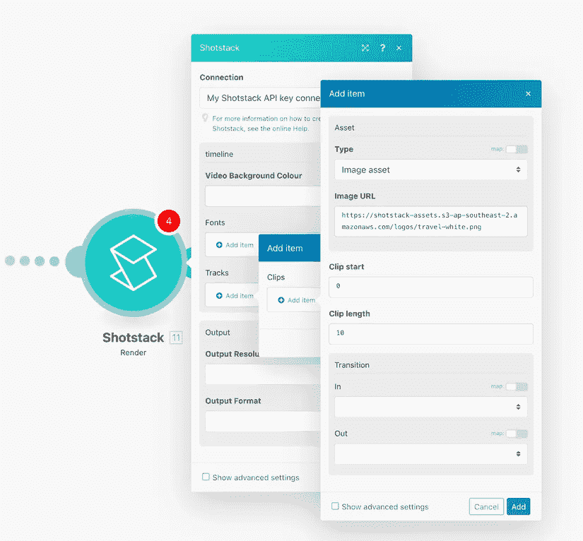

为了让带水印的视频看起来更好，我们需要在图像位置上做一些工作。点击保存按钮附近的`show advanced settings`按钮，配置`scale`、`position`和`offset`属性。

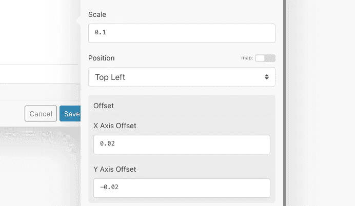

这些属性缩放图像以适合视频视区，并将其定位在稍微偏离视区左上角的位置。

**添加包含源视频素材的剪辑**

添加另一个轨道，其中一个片段包含视频资源。视频资源应该包括源视频文件的 URL。要允许 Shotstack 从 Google Drive 下载您的视频，您可以使用以下链接:

`[https://drive.google.com/uc?export=download&id=GOOGLE_DRIVE_FILE_ID](https://drive.google.com/uc?export=download&id=GOOGLE_DRIVE_FILE_ID)`

我们知道每个剪辑的长度是`10`秒，我们不会使用过渡。

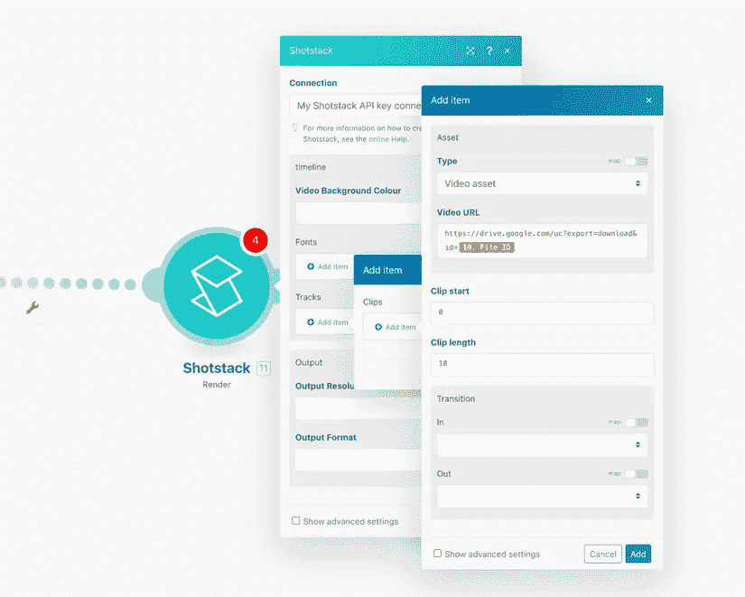

## 时间线和输出配置

最后，我们将输出分辨率设置为`HD`，并选择`mp4`作为输出格式。我们暂时将回调 URL 保留为空，但是一旦我们设置了第二个场景，我们将回到这个问题上。

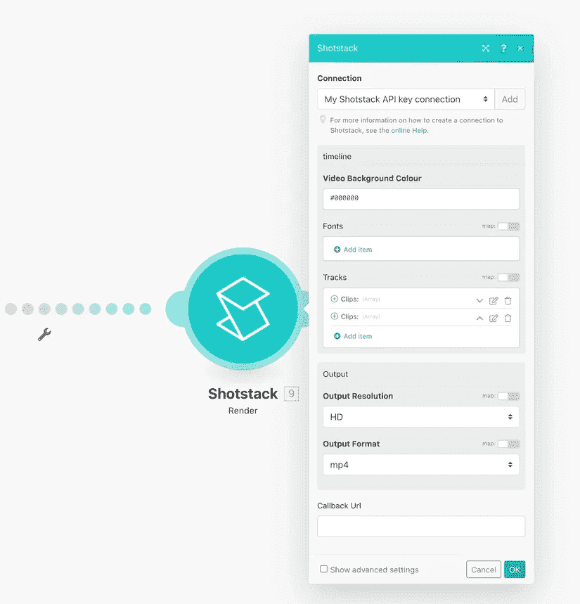

## 运行场景

现在一切都准备好了，你可以拍摄所有的视频，并对它们应用水印。点击屏幕左下角的*运行一次*，当您的水印视频被处理时，您可以坐下来享受。

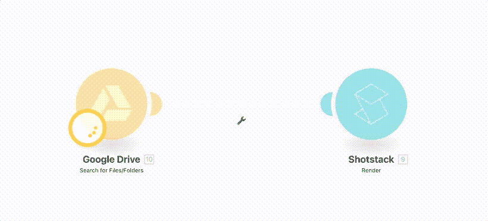

但是我们带水印的视频去哪了？他们说完了吗？我们怎么知道？为此，我们需要第二个场景。

# 场景 2:监听已完成的渲染，并将它们上传到 Google Drive

现在我们已经构建了允许我们渲染带水印的视频的场景，我们需要构建一个场景，在那里我们收听已经完成渲染的视频。我们的方法是使用 Shotstack 监听器。这个模块为你提供了一个回调 URL，你可以把它传递给你的视频渲染。

视频渲染完成后，Shotstack 会向听众发送一条消息，详细介绍您的视频。这包括 24 小时存储您的视频的 URL。然后，我们将视频下载到 Integromat，并上传到 Google Drive 上的一个新文件夹中。

## 配置 Shotstack 监听器

我们首先需要通过添加一个`webhook`来配置监听器。将 Shotstack 侦听器添加到您的场景中，并使用现有的 Shotstack 连接添加一个挂钩。

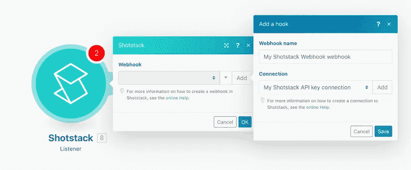

现在把你的 webhook 地址复制到你的剪贴板或者保存在某个地方。我们稍后会需要这个。

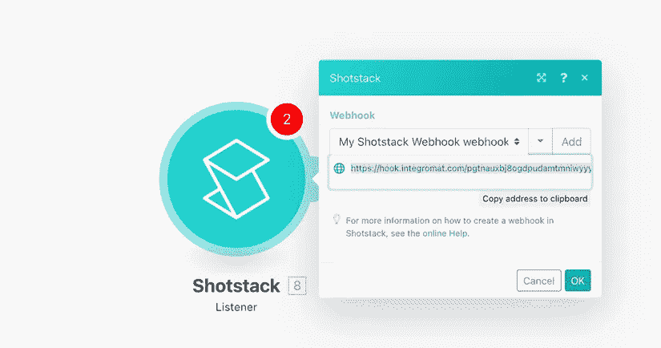

## 下载带水印的视频

现在我们已经设置了监听器，我们将使用 *Get a file* HTTP 模块通过传递渲染视频的 URL 将文件下载到 Integromat。

请注意，Integromat 的免费版本只允许下载最大文件大小为 5MB 的文件。如果你使用免费版本，我建议你使用`preview`输出分辨率来尽可能减小你的视频文件大小。

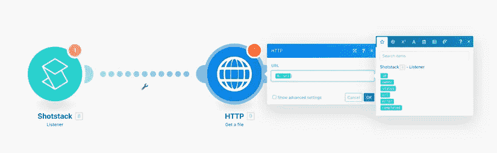

我们还将添加一个过滤器，通过只允许数据在返回的`status`属性等于`done`的地方通过，只下载渲染成功的文件。您可以通过单击连接 Shotstack 侦听器和 HTTP 模块的那一行来实现这一点。

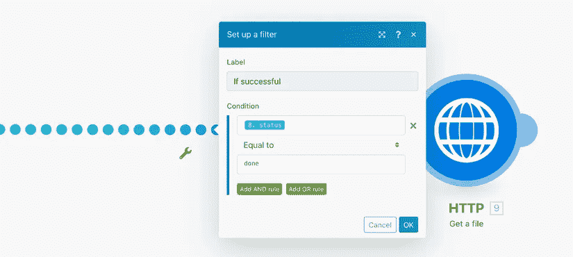

## 将带水印的视频上传到 Google Drive

我们现在添加 Google Drive `Upload a File`模块，并将其配置为上传使用 HTTP 模块下载的数据。对于`File Name`,我使用了 Shotstack `id`属性并添加了`mp4`扩展。对于数据，选择 HTTP 模块的`Data`属性。

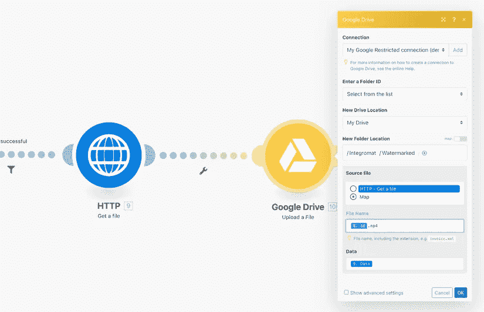

现在确保打开屏幕右上角的监听器。

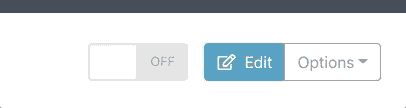

## 将您的 webhook URL 添加到您的第一个场景中

现在我们需要将这两个场景联系起来。我们通过将之前复制的 webhook URL 复制到我们的剪贴板来实现这一点。回到第一个场景，将 URL 粘贴到 Shotstack 渲染模块的`Callback URL`属性中。

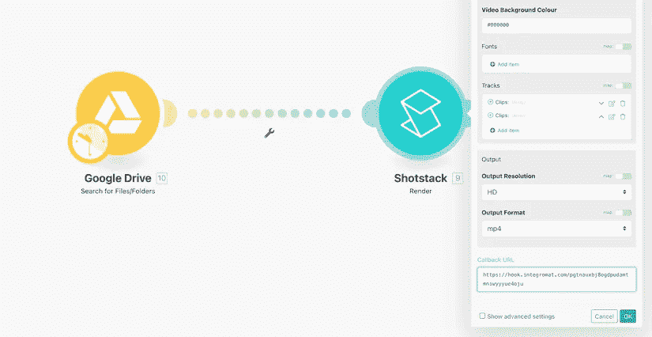

# 您的自动化视频水印工作流程

现在，您已经通过 Google Drive 和 Shotstack 使用 Integromat 构建了一个完全自动化的水印工作流程。当您运行第一个场景时，所有带水印的视频都将被 Shotstack 侦听器拦截，并将它们添加到队列中。

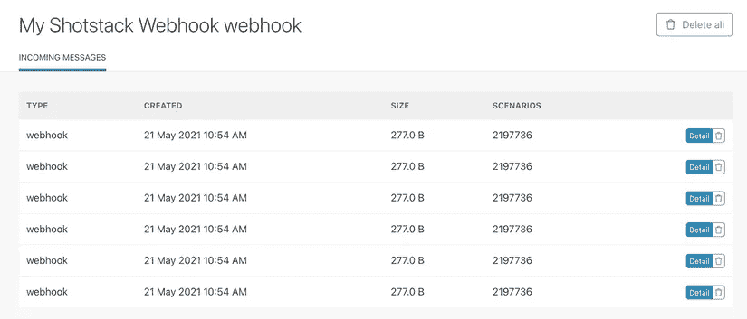

Integromat 将开始处理您的队列，并将您的水印视频上传到 Google Drive。请注意 Integromat 的速率限制，因为免费计划每次只允许 10 个视频排队。

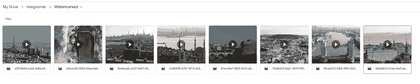

恭喜你。您的自动水印工作流程已经完成。有关如何充分利用 Shotstack 和 Integromat 的更多高级指南，请访问 Shotstack 网站[了解第](https://shotstack.io/learn?utm_source=Geek-culture&utm_medium=tutorial&utm_campaign=2021_5_tutorial_integromat_googledrive)部分。