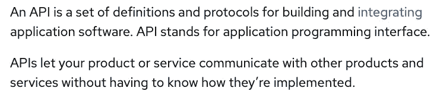
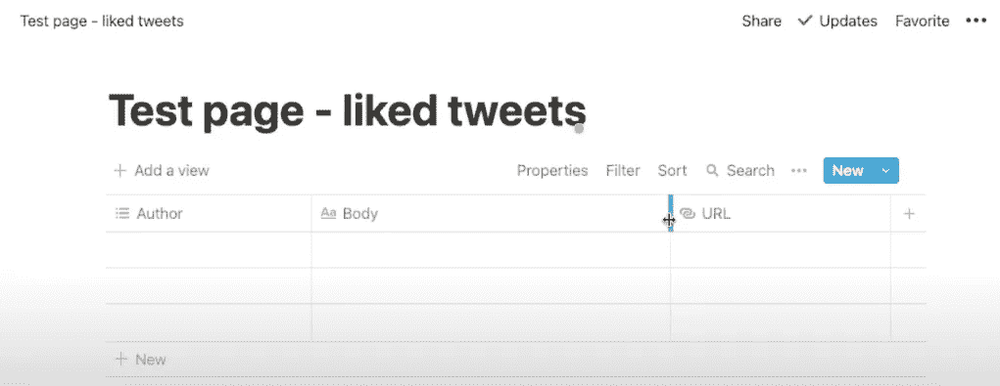
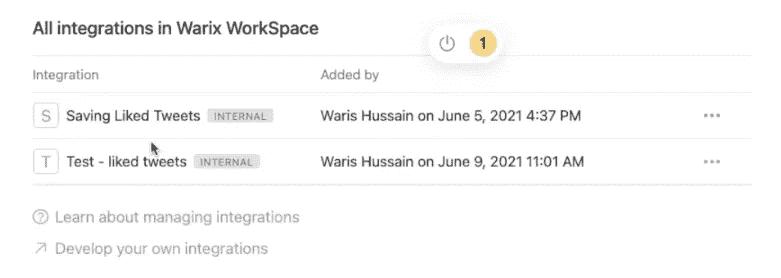
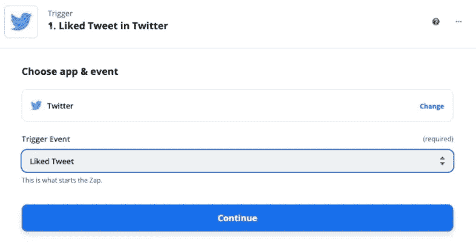
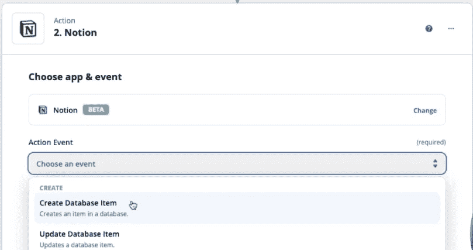
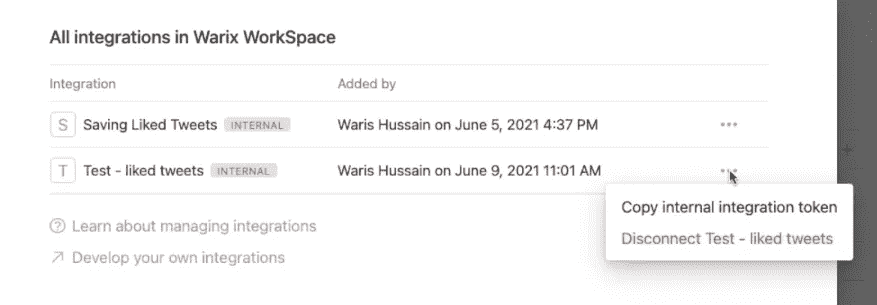
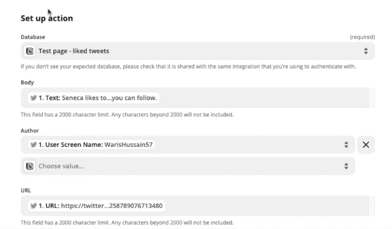

# 如何自动化:自动保存推文到概念

> 原文：<https://medium.com/geekculture/how-to-automate-auto-saving-tweets-to-notion-6bae73944f8a?source=collection_archive---------8----------------------->

大约几年前，我疯狂地看着一些 YouTubers 使用 Python 做了一些非常酷的事情——一个家伙编码了一个芯片并把它贴在一个杯子上，这样如果你在 7 秒钟内没有喝完杯子里的啤酒(或南瓜汁),它会给你一个电击——这些人做了一些很酷的事情，和一些疯狂的事情。

他们中的许多人正在做的一件事是使用 Python 来自动化他们生活中的事情并节省大量时间。这个自动化的想法真的让我很惊讶！

现在，我不知道如何用 Python 编码。但是我仍然对自动化很感兴趣！

自动化是一个非常好的东西，我们个人可以使用，各种规模的企业也可以使用——4 个人的创业公司或跨国公司——每个企业都使用某种自动化来节省他们在较小任务上的时间，减少工作量，甚至完成一些没有自动化不可能完成的工作。

这是我的自动化教程，你可以看这个视频或者阅读下面的内容

I recommend watching this video as videos are better for such tutorials!

我想做的是——每当我喜欢一条推文时，我希望它自动出现在我的笔记软件中。这样，我就有了一个我在 Twitter 上遇到的所有好主意的很好的集合。

我将要使用的软件是——Twitter(当然！)、概念——一个高级笔记软件(它做的远不止笔记)，以及 Zapier——一个自动化软件！

5 月 14 日，观念发布了它的 API。那么，什么是 API？

这是官方的定义-

Definition from RedHat

简单来说，一个公司允许另一个公司，一个公司提供一个钩子，让其他公司把自己附在这个钩子上，这样两家公司更容易沟通和融合。

使用概念的 API，我们将创建我们的自动化！

# **在概念中创建集成**

这是一个至关重要的阶段。在这里，我们将使 idea 允许 Zapier 修改其内容，这样 Zapier 就可以将那些喜欢的 tweets 添加到我们的 idea 中。

*   登录“概念”,创建一个新的空白页——就像我对“测试页:喜欢的推文”所做的那样
*   向页面添加一个表格，并添加适当的列，如“tweet body”、“author”和“URL”

Test page — our liked tweets will appear here

*   前往设置，然后点击最后一个选项“集成”

在这里，您将在一个列表中监听所有的集成(如果您是新手，您将没有集成)

*   点击“开发您自己的集成”

这将把你重定向到一个新的网页上的概念的网站，在那里你将开发自己的集成。

*   点击“新集成”

给它一个名字和一个标志，如果你想点击“提交”按钮

给你！您的新集成就这么简单！

(screenshot from my video) this is the page that’s gonna show up!

*   打开你的观点页面(测试页面:喜欢的推文)，点击右上角的“分享”按钮。在文本框中单击，您会看到所有选项，从这些选项中选择您想要的集成。

Our newly created integration “test — liked tweets” showing up in the options

# 在 Zapier 中实现自动化

观念的工作已经完成(目前)
现在是时候在 Zapier 实现自动化了！

如果在登录时，你选择了免费计划，你将获得 5 个“zaps”——你可以创建 5 个自动化！对于这个测试，1 就足够了——所以 0 美元就足够了！

*   点击“制造一个 zap”

你面前会有一个“Zap”界面。

这个界面有两个部分——触发器和动作。

“触发器”是启动事件的东西，启动自动化；而‘行动’就要完成它。

*   在“触发”阶段，单击文本框并在其中键入 Twitter。然后选择您想要作为“触发器”的事件。在我们的例子中，选择“喜欢的推文”

‘Trigger’ stage — fill in the app and triggering event and hit continue

*   登录您的 Twitter 帐户
*   在给定的文本框中输入您自己的用户名，然后单击继续按钮
*   Zapier 通过显示你喜欢的最后一条推文来提示你测试你的触发器——你必须确认它，然后你就可以开始了！
*   一旦你确认了，你就进入了第二阶段——行动
*   在文本框中输入应用程序“概念”的名称，并选择一个事件——在我们的例子中，它是“创建一个数据库项目”

‘Action’ stage — chose App and Event

*   点击“继续”后，您需要登录您的帐户。

现在，这部分是至关重要的——只要你点击“登录”按钮，就会出现一个新窗口。给你。你必须输入一个“令牌”。

你可能想知道*“代币到底是什么？?"*

别担心，我得到了楚；)

转到你的想法，点击设置按钮，然后在最后一个选项“集成”
从这里，找到我们刚刚创建的集成，并点击 3 点菜单按钮(在设计师的行话，即“烤肉串”菜单或“肉丸”菜单:D)

Integrations | Copy token from here

在该菜单中，您会发现一个复制令牌的选项—单击它，然后从那里单击“复制令牌”按钮

*   回到点击“登录”时弹出的 Zapier 窗口
*   将复制的令牌粘贴到文本框中，然后点击“继续”

是时候设置动作了！

*   搜索你想要的数据库——它应该出现在“数据库”菜单的选项中

只要你点击你的数据库，你就会得到所有的选项——你在你的概念页面上创建的所有栏目。

*   单击每个项目，并从可用选项中选择一个输入。

Upon selecting your database, you’ll get all the fields to input data — click on each and define what you want to see!

*   完成所有必需的任务，然后单击“继续”按钮！
*   您将收到一个测试您的操作的请求——在这里，验证您喜欢的推文，然后点击“测试和查看”按钮。然后回到你的想法，回到选定的页面(在我们的例子中是“测试页面—喜欢的推文”)，检查推文是否以期望的方式显示。

瞧啊。我们的测试成功了——打开 Zap，你终于完成了*

所以现在，每当你喜欢一条推文，这条推文就会自动出现在概念页面上！

# 我们刚刚完成了所谓的“T3”自动化

个人可以使用自动化来完成许多许多任务，这些任务需要我们投入时间、精力和精力。我们实际上节省了大量的时间、精力和努力，我们可以把它们投资到其他更有效率、更有趣的地方——包括你，:D

> 各种规模的公司——初创公司和跨国公司——都可以使用自动化来帮助完成招聘、项目管理、研究、信息收集等任务！

我认为自动化是技术创新带给我们的一份美妙的礼物。我们不应该把它仅仅留给编码者和开发者，利用它让我们的生活变得更好！