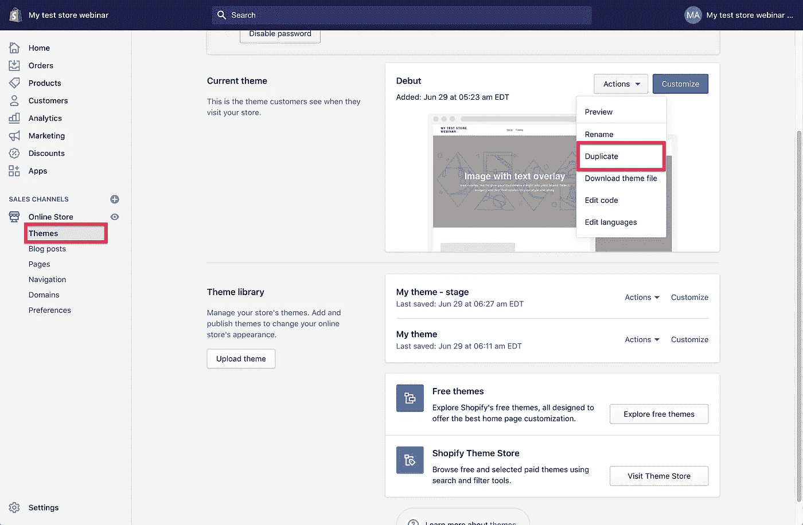
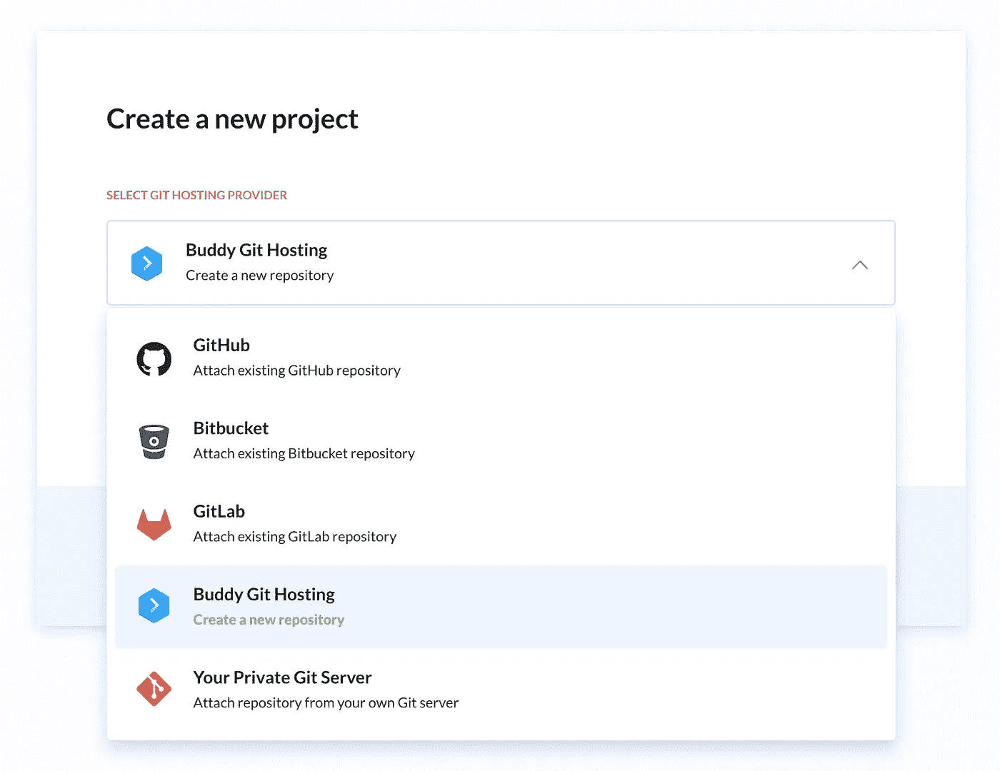
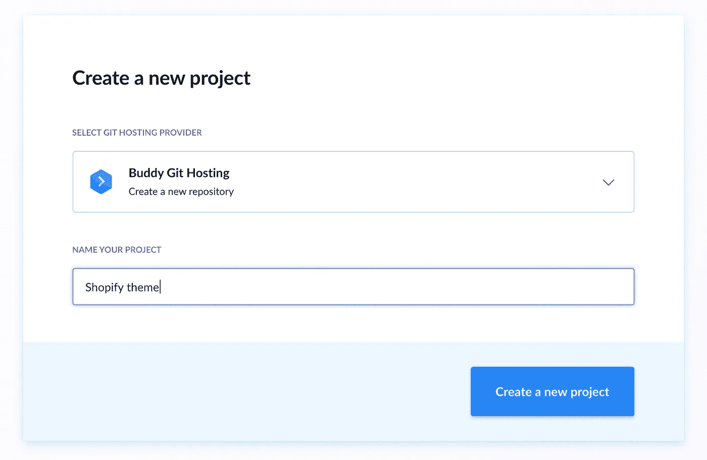
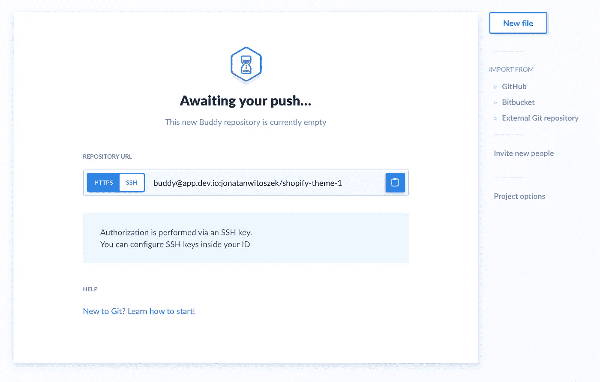
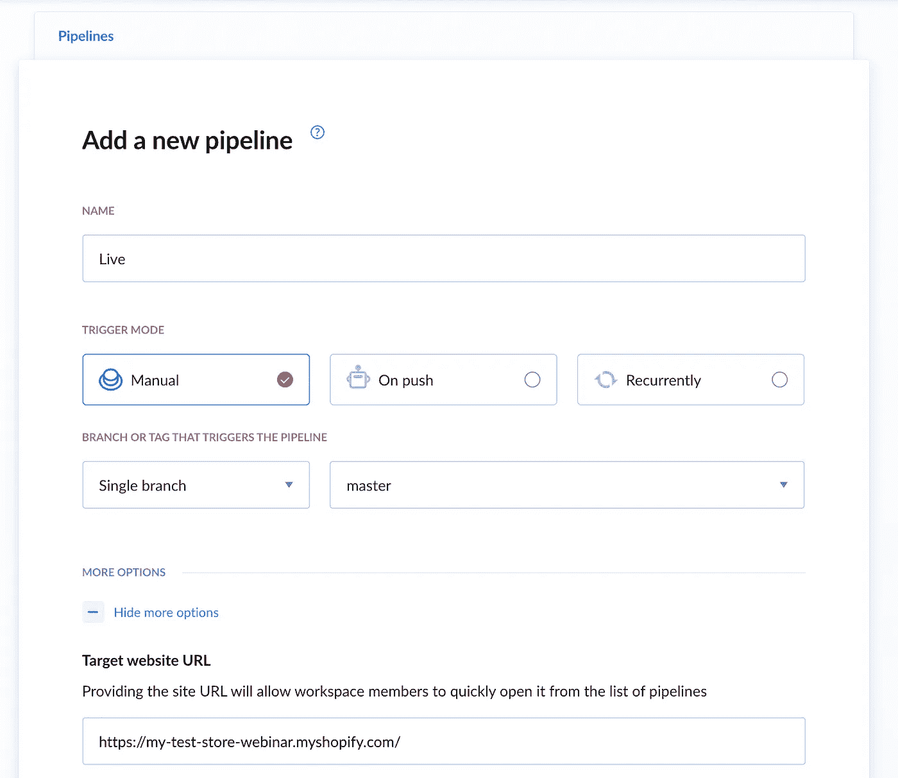
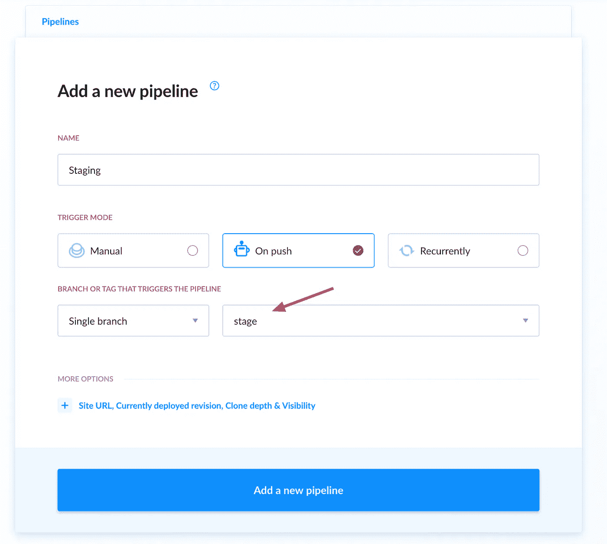
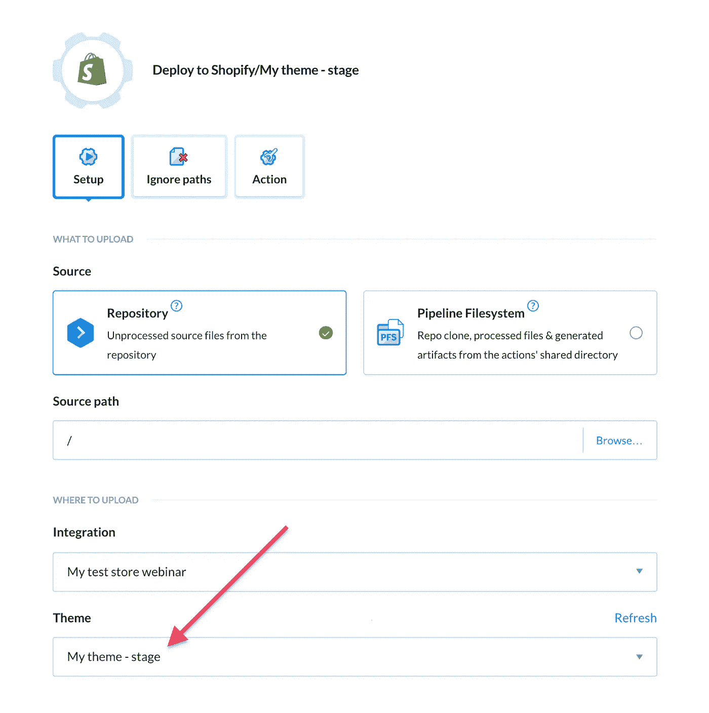
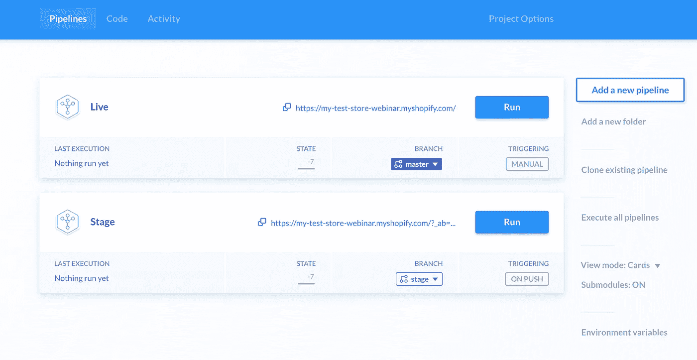
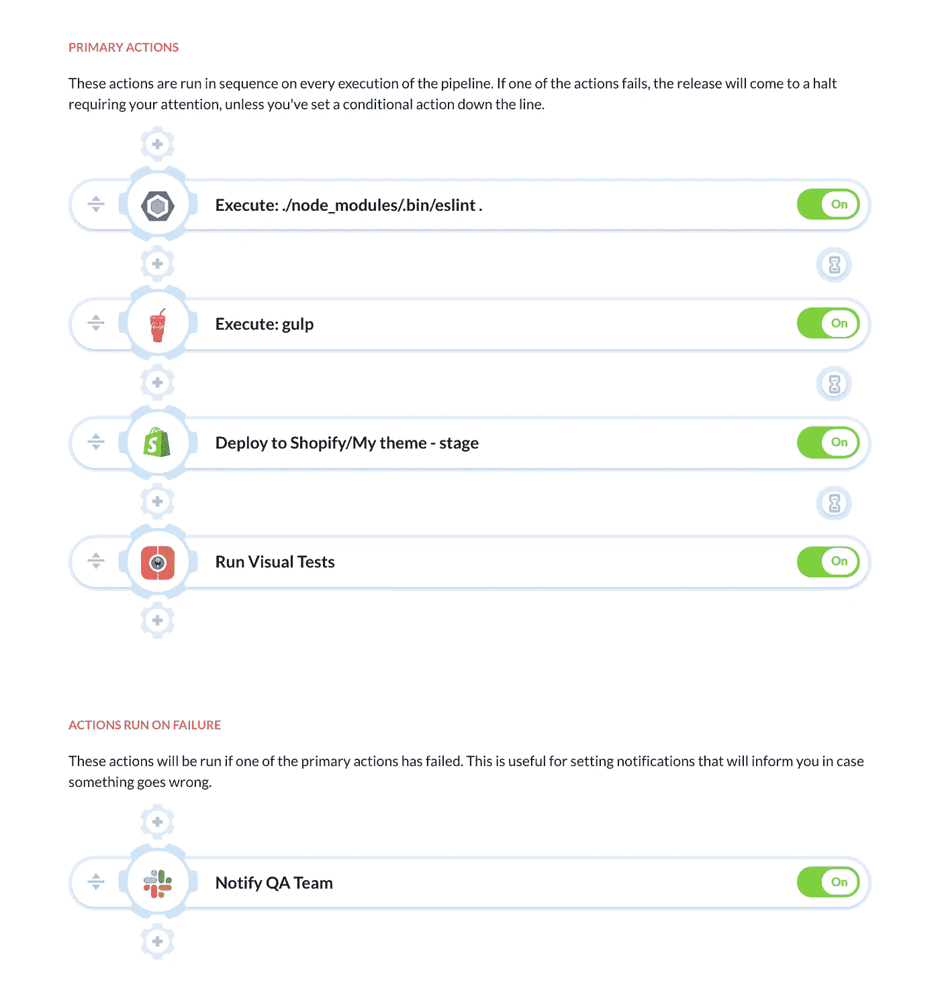

# 如何自动部署到 Shopify 商店

> 原文：<https://medium.com/geekculture/how-to-automate-deployments-to-shopify-stores-b99a89dd42d5?source=collection_archive---------0----------------------->

电子商务在封锁下蓬勃发展，每周有数千家企业开设网上商店。这意味着开发者需要做更多的工作，包括那些使用 Shopify 主题的开发者。随着数量的增长，同时部署和管理多个商店会变得很棘手。Buddy 通过交付管道解决了这个问题，这是一个快速而优雅的解决方案，让您可以在上线之前自动部署和预览更改。

> 在本指南中，我们将设置将 Shopify 主题自动部署到现有商店。我们将创建两个环境: *live* ，在这里你的主题被托管，以及 *stage* ，在发布到生产之前预览修改。

**本指南中使用的好友动作:**

*   [ESLint](https://buddy.works/actions/eslint)
*   [一饮而尽](https://buddy.works/actions/gulp)
*   [购物化](https://buddy.works/actions/shopify)
*   [视觉测试](https://buddy.works/actions/visual-tests)
*   [松弛](https://buddy.works/actions/slack)

# 步骤 1:配置主题工具包 CLI

从下载 Shopify 的主题工具包 CLI 开始。CLI 允许您通过运行命令在 Shopify 主题的上下文中运行各种操作。您可以在他们的[文档页面](https://shopify.github.io/themekit/)上找到您的操作系统的安装说明。

## 添加新的私人应用程序

完成后，你需要在商店的管理面板中创建一个新的私人应用程序，以访问 Shopify 的 API。

1.  登录您的商店管理面板
2.  转到**应用程序**选项卡
3.  点击已安装应用列表下的**管理私人应用**
4.  点击**创建新的私人应用**
5.  填写应用程序的名称(例如，`theme-kit-cli`)
6.  在管理 API 部分，向下滚动到**主题**并将其设置为`Read and write`(您可能需要扩展非活动管理 API 权限)
7.  保存应用程序并复制新生成的密码

> 运行 Shopify Theme Kit CLI 命令需要密码，请务必复制密码，因为我们稍后会用到它！

# 步骤 2:引导主题项目

对于本指南，我们将使用默认的**首次亮相** Shopify 主题。为了引导我们的项目，我们将使用主题工具包 CLI 下载它。

1.  前往商店管理面板，访问**在线商店/主题**选项卡
2.  点击**动作**按钮，选择**复制**
3.  当这个过程完成后，用名称`Stage`再次复制主题。我们将使用这个主题来预览舞台环境中的变化。



## 使用主题工具包 CLI 下载主题

创建新主题后，我们必须下载它。

1.  在您的计算机上创建一个目录，并从命令行进入该目录。
2.  在我们下载主题之前，我们必须知道它的 ID。要列出商店中安装的所有主题，请运行以下命令:

```
$ theme get --list -p=[PASSWORD] -s=[SHOP_NAME].myshopify.com
```

其中:

*   `PASSWORD` -是我们之前创建的 Shopify API 的密码
*   `SHOP_NAME` -您的店铺在网站 URL 中使用的名称(例如`my-shop.myshopify.com`

您应该从带有两个新主题的命令中获得此输出—一个用于生产环境，另一个用于暂存环境:

```
Available theme versions:
   [103746207896] Debut
   [103747092632][live] My theme
   [103749681304] My theme - stage
```

括号中的数字是主题的 ID。我们现在可以使用它从 Shopify 下载文件:

```
$ theme get --themeid=[THEME_ID] -p=[PASSWORD] -s [SHOP_NAME].myshopify.com
```

最后，检查是否所有文件都下载成功。您的文件夹结构应该如下所示:

```
❯ ls
assets config config.yml layout locales sections snippets templates
```

> [Shopify 主题套件 CLI 也可作为 Buddy 中的专用操作](https://buddy.works/actions/shopify-theme-kit-cli)(见下文)。

## 设置 Git 仓库

在本教程中，我们将使用[好友](https://buddy.works/)作为代码提供者。但是，如果您愿意，您可以使用任何 VCS，因为 Buddy 集成了所有类型的 Git 提供者，包括 GitHub、Bitbucket 和 GitLab。在这种情况下，重复下面的步骤，但在开始时选择不同的提供者。

首先在包含您的主题的文件夹中设置一个新的存储库:

```
$ git init
```

[登录您的好友帐户](https://app.buddy.works/login)，创建一个新项目并选择好友作为提供商:



输入名称并点击按钮继续:



复制新创建的远程存储库的 URL:



> 为了提高安全性，我们将使用 SSH 进行身份验证。确保您已经在好友的帐户设置中添加了您的 SSH 密钥[！](https://buddy.works/docs/version-control/ssh-keys)

使用拷贝的 URL 将遥控器添加到您电脑上的存储库中:

```
$ git remote add origin [REPOSITORY_URL]
```

现在，用文件夹中的所有文件创建一个初始提交:

```
$ git add .
$ git commit -m "first commit"
```

创建并检查`stage`分支。我们将使用它来部署对预览环境的更改:

```
$ git checkout -b stage
```

一切准备就绪后，将提交推送到 Buddy 上的远程存储库:

```
$ git push -u origin --all
```

# 第三步:交付生产

存储库中的主题安全可靠，现在是时候配置两个管道来将更改部署到 Shopify 商店。

## 管道配置

实时渠道将反映您的客户在 Shopify 商店上可以看到的内容。它将监视`master`分支上的变化。

1.  在项目页面点击**添加新管道**
2.  将名称设置为`Live`或类似名称
3.  选择`Manual`作为触发模式
4.  选择`master`作为部署分支
5.  单击蓝色按钮完成配置



将触发模式设置为手动(点击)将防止管道意外展开。然而，`master`分支应该**总是**准备好投入使用——确保你的合并是 100%测试和验证的。

> 您可以展开选项菜单，并在**目标网站 URL** 中提供您商店的 URL，以便您可以在部署后从 pipeline 视图中快速访问它。

## 部署到 Shopify

配置好管道后，我们可以添加 Shopify 部署操作:

1.  在动作列表中查找 **Shopify**
2.  在整合框中，将 URL 粘贴到您的商店，准备好后单击按钮
3.  好友会将你重定向到你的商店设置。在商店中安装好友以继续
4.  添加集成后，选择您想要部署的**主题**和商店

# 第四步:交付到舞台

## 管道配置

创建登台管道的工作方式与生产管道相同。不同之处在于我们部署的分支和触发模式:

1.  转到**管道**选项卡，点击**添加新管道**
2.  将名称设置为`Staging`或类似名称
3.  选择`On push`作为触发模式
4.  选择`staging`作为部署分支
5.  单击蓝色按钮完成配置



> 通过这些设置，管道将在每次推送时自动部署更改。

## 部署到 Shopify

再次添加 Shopify 操作。这一次，更改动作将部署到的主题:



# 步骤 4:测试交付管道

现在您应该有两个管道:一个用于预览舞台上的更改(自动)，另一个用于部署到生产环境(手动):



让我们看看它们在实践中是如何工作的。首先，对你的主题做一些修改，并把它们推送到你的 staging 分支。您将看到 Buddy 会自动选取这些更改并将其上传到`My theme - stage`:

检查网站，看看是否一切正常。如果是，将分支合并到`master`并运行生产流水线。如果您在 Buddy 上托管源代码，您可以在“代码”选项卡中合并分支:

> 恭喜你！您已经成功地将连续交付引入到您的工作流程中！

# 第五步:扩张

本指南仅涵盖了可以通过管道解决的问题之一。Buddy 的一个很酷的特性是，它可以让你快速扩展现有的管道，而不会中断你的工作流程。例如，您可以:

*   [部署失败时发送通知](https://buddy.works/docs/pipelines/notifications)
*   用 [ESlint](https://buddy.works/actions/eslint) 和 [PHP 代码嗅探器](https://buddy.works/actions/php-codesniffer)测试代码错误
*   [使用 Gulp 和 Webpack 缩小资产和捆绑文件](https://buddy.works/docs/pipelines/builds-and-testing)
*   [在浏览器中执行目视测试](https://buddy.works/guides/visual-tests)



然而，最重要的事情是保持事情简单:添加一个步骤，测试一段时间，只有当你 100%确定一切正常时，再添加一个步骤。有了这种方法和你身边的伙伴，你很快就能专注于开发令人敬畏的主题，并将操作上的麻烦远远抛在身后。

*原载于 2020 年 7 月 28 日*[*https://buddy . works*](https://buddy.works/guides/shopify)*。*