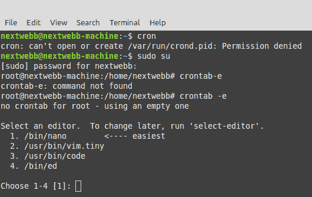
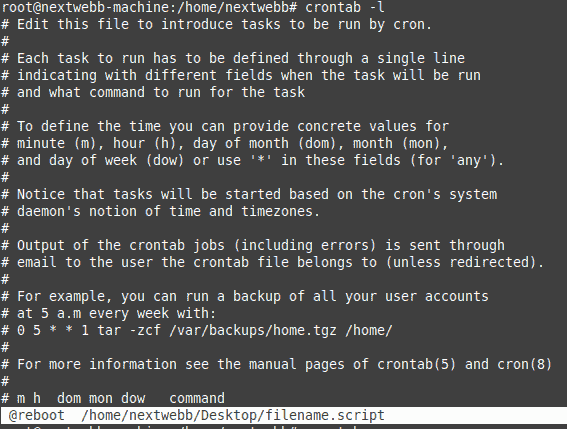

# 如何在 Linux 中自动化任务

> 原文：<https://medium.com/geekculture/how-to-automate-tasks-in-linux-7bc9d99bd5a4?source=collection_archive---------0----------------------->


# 介绍

我们很多人都喜欢 Linux 内核💙。它使用基于 Unix 的终端。它是超级可定制的。因此，我们可能会选择在没有 GNOME 这样的桌面环境下运行 Linux。
Linux 在旧的硬件上运行神奇的✨，而且它是轻量级的。我们不在 Linux 上销售或做广告，也不需要与大量的桌面膨胀软件作斗争，它是后端工程师的一个很好的平台。

我学到的另一个生产率技巧是设置 Cron 作业来调度基于时间的操作，在我的计算机上自动执行。这些作业可以用于各种任务，比如数据备份，或者在我的特殊情况下，通过在我的 shell 配置中添加一行来更改像`dotnet-ef`这样的全局工具的位置:

```
export PATH=$PATH:/snap/bin
```

# 先决条件

*   安装 Cron 守护程序
*   要做的工作

Cron 是一个基于时间的作业调度守护程序，可以在类似 Unix 的操作系统中找到，包括 Linux 发行版。几乎每个 Linux 发行版都默认安装了某种形式的 Cron。然而，如果你有一个没有预装 Cron 的 Debian Linux 发行版，你可以使用 APT 包管理器来安装它。

在 Debian 机器上安装任何软件包之前，更新计算机的本地软件包数据库:

```
$ sudo apt update
```

然后使用以下命令安装 Cron:

```
$ sudo systemctl enable cronOutput Synchronizing state of cron.service with SysV service script with /lib/systemd/systemd-sysv-install. Executing: /lib/systemd/systemd-sysv-install enable cron
```

接下来，我们在 bash 文件中编写希望自动化的作业的脚本。下面是我用来在 shell 配置中更改`dotnet-ef`全局工具位置的脚本文本。

这个文件可以在你选择的文本编辑器中创建，并作为`filename.sh`保存在你的主文件夹的根目录下。(在我这里是/home/nextwebb/Desktop)。这个脚本可以用`sh filename.sh`直接在终端上运行，并且运行正常😃。

# 使用 Crontabs 调度任务

这个练习是在终端上使用带有两个标志`-l (list)`和`-e (edit)`的`crontab`命令完成的。键入命令`crontab -e`并从一个数字[1-4]中进行选择，以选择您所选择的文本编辑器，以及您的个人 Cron 文件并编写您的 Cron 作业。我将选择 1，因为我的默认编辑器是 Nano。

```
$ crontab -e
```



终端进入编辑器模式，打开您的个人 Crontab 文件。如您所见，所有命令都显示在终端窗口的底部。

```
# For example, you can run a backup of all your user accounts
# at 5 a.m every week with:
# 0 5 * * 1 tar -zcf /var/backups/home.tgz /home/
 m h  dom mon dow   command
```

**一些特殊的语法**

这些基本上是指定的等效数字计划的快捷方式:

```
@hourly  -> 0 * * * *@daily  ->    0 0 * * *@weekly  ->    0 0 * * 0@monthly  ->    0 0 1 * *@yearly  ->    0 0 1 1 *
```

`@reboot` - >每当服务器启动时，这个简写将运行它后面的任何命令

回到正在讨论的主题，在我的例子中，我希望 bash 文件`filename.sh`在启动后在我输入的 crontab 编辑器中执行:

```
@reboot  /home/nextwebb/Desktop/filename.script
```

一旦对您的输入感到满意，您需要保存它(Ctrl+s ),现在按下(Ctrl+x ),从编辑器返回到终端。键入将显示您的新 Cron 作业，您可以确认是否一切正常。

```
$ crontab -l
```



这是一种使用 Cron 作业在引导时运行脚本的超级简单的方法。

感谢观众，希望这篇文章对你有所帮助🤗。随时联系 Github、T2、推特和 T4 的 LinkedIn。一定要点赞、评论和分享😌。

关于 Cron 作业语法和自动化设置的详细描述，请看一下 [Crontab 语法教程](https://community.linuxmint.com/tutorial/view/1072)

**快乐调度😉**。

*最初发布于*[*https://blog . next Webb . tech*](https://blog.nextwebb.tech/how-to-automate-tasks-in-linux/)*。*