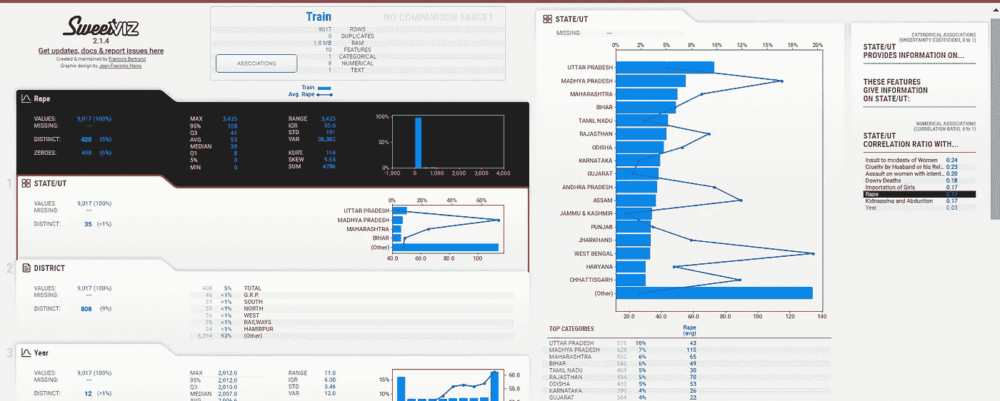
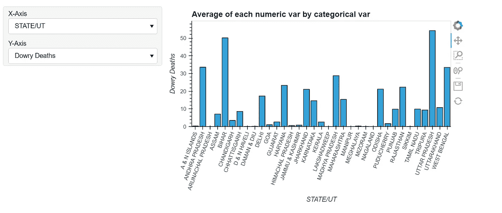
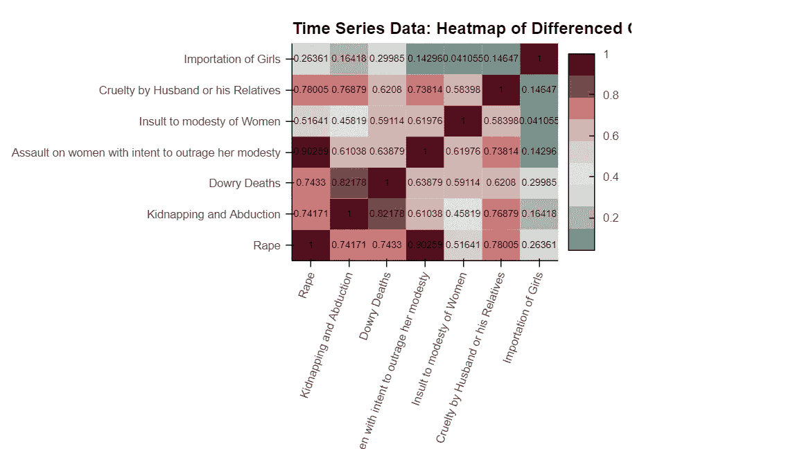
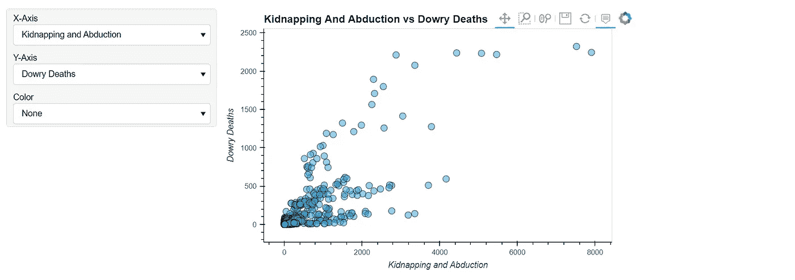
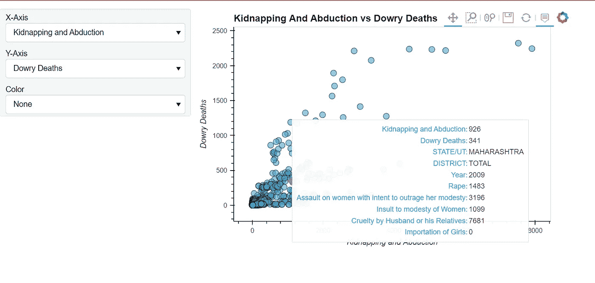
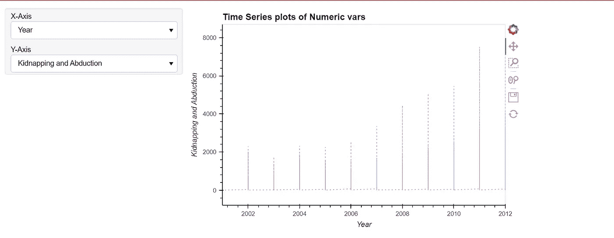

# 如何自动化探索性数据分析过程(第 2 部分)？

> 原文：<https://medium.com/geekculture/how-to-automate-the-exploratory-data-analysis-process-part-2-8b64fa603d21?source=collection_archive---------7----------------------->

本文是**自动化 EDA** 系列的 [**第 1 部分**](/@abhi2652254/how-to-automate-exploratory-data-analysis-a368678c8f04) 的延续，它将主要关注使用库 **Sweetviz 和 Autoviz** 的数据可视化。

[**Sweetviz**](https://pypi.org/project/sweetviz/)

它是一个开源的 python 库，只需几行代码就可以获得可视化效果。该库可用于**可视化变量和比较数据集**。

代码片段是

```
import sweetviz
import pandas as pd
data = pd.read_csv('42_District_wise_crimes_committed_against_women_2001_2012.csv')
```

```
#Analyzing the dataset
my_report  = sweetviz.analyze([data,'Train'], target_feat='Rape')#Display the report
my_report.show_html('FinalReport.html')
```

数据集的分析部分表明**“强奸”**变量被认为是**目标变量**并与其他特征进行比较。例如，对于强奸案件的分布，观察到分类变量“**州/UT** ”。



Sweetviz visualization (author’s image)

右上角的图表显示了相对于**邦或中央直辖区**的**数据百分比分布**。在这里，目标变量可以被不同的数据集中的其他变量所改变，可能是其他类型的犯罪。

[**Autoviz**](https://pypi.org/project/autoviz/)

**自动可视化(Autoviz)** 用于**自动创建**的**散点图、热图、小提琴图、条形图**等。

代码片段是

```
from autoviz.AutoViz_Class import AutoViz_Class
AV = AutoViz_Class()
df = AV.AutoViz('42_District_wise_crimes_committed_against_women_2001_2012.csv', header=0, verbose=0,
                lowess=False,chart_format='html',max_rows_analyzed=150000,
                 max_cols_analyzed=30)
```

为数据集生成了**对散点图、热图、分布图和分类变量图**。

关于**"州/UT"** 特征的**犯罪"**嫁妆不足受屈死亡"**的分类变量图**如下所示，尽管其他特征也可用于观察(例如，绑架和诱拐、丈夫或其亲属的虐待等)



State/UT vs Dowry Deaths distribution (author’s image)

变量之间的**关联热图**为



Correlation Heat map (author’s image)

以上也可以由 seaborn 来完成，但只有 Autoviz 在短时间内创造了这么多的情节。

**对散点图**显示了 2 个变量，尽管其他变量也可用于观察散点图。



Kidnapping vs Dowry deaths pair scatter plot (author’s image)

如果我们将光标悬停在图表中的每个数据点上，就会显示州/UT、年份、地区和其他特征的详细信息。



Details in the paired scatter plot dataset

这表明特定数据点记录为 2009 年**、**地区总数、邦/UT 为马哈拉施特拉邦**、**其他变量为登记的犯罪案件数量**。**

****

**Time Series plot for the feature Kidnapping and Abduction (author’s image)**

**以上剧情为**《绑架与诱拐》**的**时间序列**剧情。它显示随着时间的推移，犯罪率呈指数增长。对于其他功能也可以这样做。**

**上面添加的所有结果都在**中。html** 文件格式保存在本地主目录下。**

**这篇文章全面介绍了使用**自动化库**的数据可视化，并且在短时间内**很好地创建了结果**。我认为这种类型的库有时是一种很好的实践，并且在需要时会派上用场。**

**关于自动化 EDA 库的文章的第二部分到此结束。这是[**第一部分**](/@abhi2652254/how-to-automate-exploratory-data-analysis-a368678c8f04) **。**接下来，我还将在同一个数据集上做一个**适当的传统 EDA** ，这将在**数据分析**视角中详述，然后我将在 GitHub 中提供完整的代码。**

**敬请期待，在此之前，请查看我的其他 [**文章**](/@abhi2652254) ，说 [**你好**](https://www.linkedin.com/in/obhinaba17/) ，，让我知道你是否想要一个技术作家为你写作，我们可以通过一个简短的电话进行讨论。**

****参考:****

**[**https://www . analyticsvidhya . com/blog/2021/04/top-python-libraries-to-automate-explorative-data-analysis-in-2021/**](https://www.analyticsvidhya.com/blog/2021/04/top-python-libraries-to-automate-exploratory-data-analysis-in-2021/)**