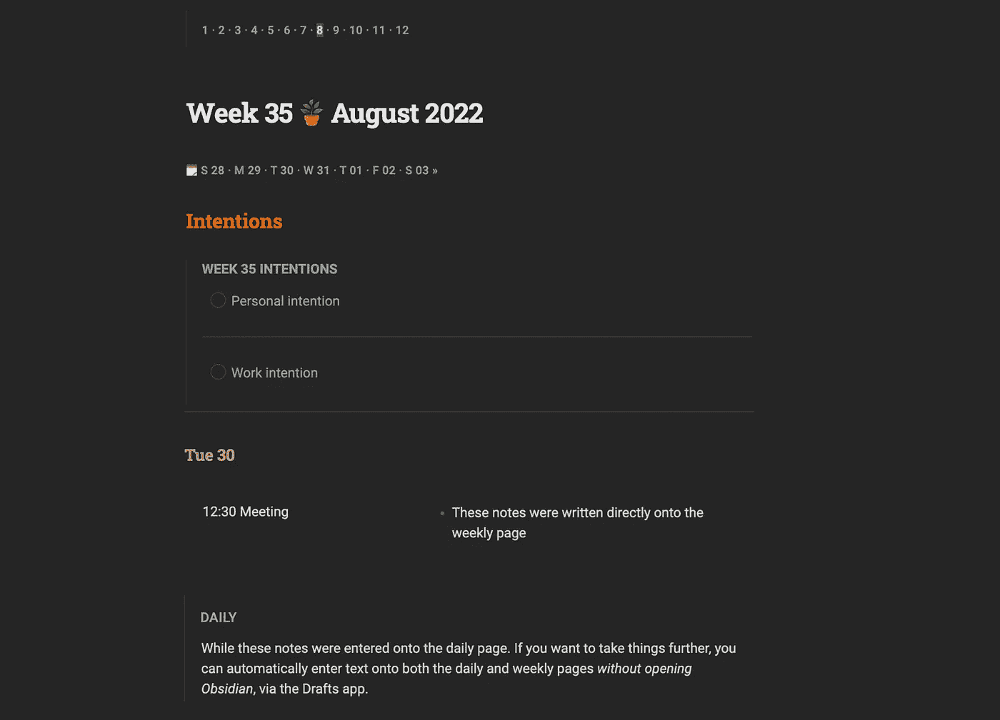

# 如何在没有数据视图的情况下，自动合并黑曜石中的每日和每周笔记

> 原文：<https://medium.com/geekculture/how-to-automatically-combine-daily-and-weekly-notes-in-obsidian-ba8155df1199?source=collection_archive---------2----------------------->

## 下载我的演示库，看看它是如何工作的

Screenshot by Author

当我用黑曜石创建我的[周日志模板](/geekculture/this-obsidian-weekly-template-can-completely-replace-your-daily-notes-cff259116c8e)时，我真的以为我已经永远放弃了每日笔记。

但是似乎这些单一的、无处不在的任何东西的仓库比我想象的更能吸引我…