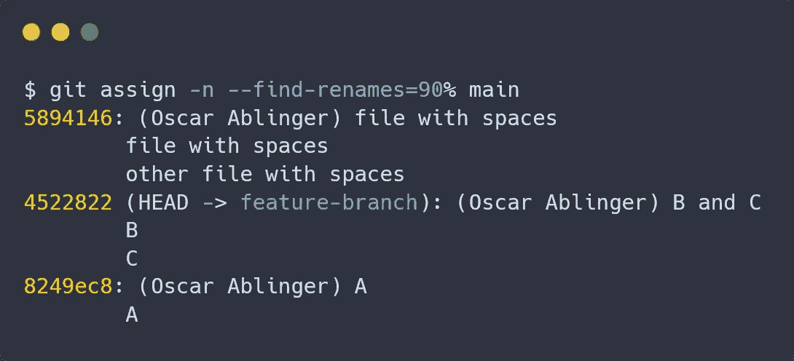
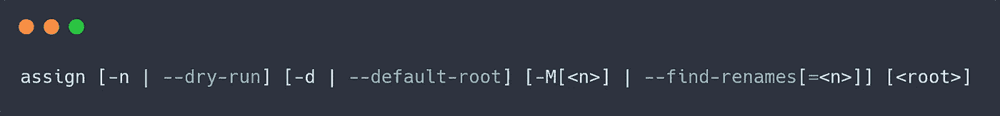
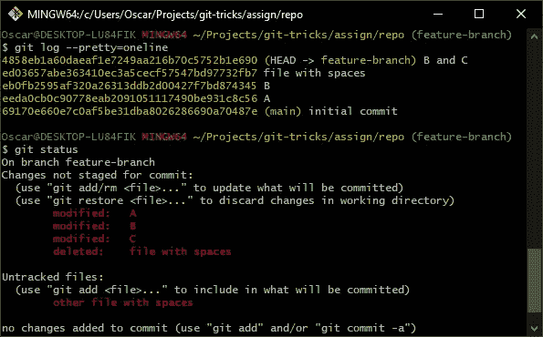
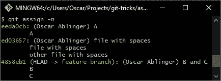

# 如何自动创建修正提交

> 原文：<https://medium.com/geekculture/how-to-automatically-create-fixup-commits-8e55a3837b00?source=collection_archive---------37----------------------->

## 使用这个简洁的脚本实现 PR 修复可以节省时间

假设您提交了一个带有良好的[原子提交](https://ablingeroscar.medium.com/ensure-atomic-commits-in-the-ci-eaa1ba2033f3)的拉请求，您的同事发现了一些改进。它们很容易实现，但是如果您想要一个好的历史，您现在必须弄清楚应该将它们添加到哪个提交中。通常这只是文件被更改的最后一次提交。但是仍然需要一段时间来找到它——或者让这个脚本来完成这项工作。



Made by the author using [carbon.sh](https://carbon.now.sh)

# 使用

在向您展示脚本之前，我首先想向您展示您可以用它做些什么。

默认情况下，该脚本会自动计算出已更改文件最后一次修改的提交，并为它们创建修正提交。对于一个原始提交，只有一个修正提交，即使在同一个提交中修改了多个已更改的文件。

您应该能够挤压所有生成的提交，而没有合并冲突(使用`git rebase -i`)。

此外，您还可以使用一些选项稍微调整它的行为:



*   纯文本参数“root”:该脚本将只查看从根提交开始的提交(但不包括根提交)。这可用于确保不会为不在当前分支上的提交创建任何修正提交。在此提交期间或之前最后更改的文件将只是保持未提交状态。
*   `-n | --dry-run`:如果指定了空运行，则不会进行持续的更改。取而代之的是，它将输出哪些文件将被分配给哪些提交。
*   `-d | --default-root`指定默认根目录。如果同时指定了默认根和根，则只考虑根。这是一个 git 别名，您可以将`main`或`master`指定为默认值，并在使用别名时覆盖它。
*   `-M<n> | --find-renames[=<n>]`:如果指定，将尝试分配重命名。格式与 [git diff](https://git-scm.com/docs/git-diff#Documentation/git-diff.txt--Mltngt) 相同。

例如，让我们看看下面的命令:

```
assign -n -d main -M master
```

这将导致脚本列出所有更改文件的提交(而不是由于`-n`创建提交)，包括重命名的文件(由于`-M`)。如果文件的最后一次更改提交是在当前`master`所在的提交之前或之中进行的，它将不会列出文件(如果只有`-d`选项，它将是`main`，但它被最后一个参数覆盖)。

参见下一章的输出示例。

# 例子

为了测试这一点，我还编写了一个小脚本来创建一个 git 存储库，并向其中添加一些提交。

```
#!/bin/shrm -rf repo
mkdir repo
cd repogit initecho "* text eol=lf" > .gitattributes
git add .
git commit -m "initial commit"
git checkout -b "feature-branch"echo a > A
git add .
git commit -m "A"echo b > B
git add .
git commit -m "B"echo with spaces > "file with spaces"
git add .
git commit -m "file with spaces"echo aAndC >> B
echo c > C
git add .
git commit -m "B and C"echo change > A
echo change > B
echo change > C
mv "file with spaces" "other file with spaces"
```

这将创建一些提交和一些未提交的更改:



Screenshot of the [git for windows](https://gitforwindows.org/) bash made by the author

如果我现在在存储库中执行`assign -M -d main -n`,输出将如下所示:



Screenshot of the [git for windows](https://gitforwindows.org/) bash made by the author

注意，在这个截图中，我已经利用了一个 git 别名，我将在最后向您展示这个别名。

# 代码

好了，解释够了，下面是代码:

这是很多，但幸运的是你可以把它复制粘贴到你电脑上的一个文件中。不要总是直接调用文件，我建议为它创建一个 git 别名。

为此，我将以下内容添加到我的`~/.gitconfig`文件中:

```
[alias]
 a = assign
 assign = !bash -c '~/.gitscripts/assign -M -d "$(git merge-base HEAD main)" "$@"' -
 assign-all = !bash -c '~/.gitscripts/assign -M "$@"' -
```

当然，你可能想稍微改变一下你别名的默认选项(比如把`main`改成`master`，但是我发现这些对我来说是最明智的默认选项。只是不要忘记替换你的脚本的路径(在我的例子中，我把它保存为`~/.gitscripts/assign`)。

哦，不保证你的文件名中是否有换行符或制表符。

# 说明

如果只是想用，现在可以不看了。但是如果你想知道它是如何工作的，这里有一个渐进的解释:

## 最简单的脚本

起初，我只是希望有一个脚本，它可以根据修改文件的最后一次提交自动创建修正提交。我想到了一个简单的 5 行脚本:

```
for file in $(git diff --name-only);
do
    git add "${file}"
    git commit --fixup "$(git log -1 --format="format:%H" -- "${file}")"
done
```

很简单，对吧？检查每个更改的文件，添加它并创建一个修正提交。

## 简单的脚本

但是前面的脚本可能会为同一个提交创建多个修复提交。我认为这很难看，所以我们没有直接添加和提交，而是首先创建一个提交到其更改文件的映射。

```
#!/bin/bash# For each changed file find the commit in which it was last changed.
# lastCommits is an associative array with the commit hash as key and
# a newline separated list of the file names as value.
declare -A lastCommits
for file in $(git diff --name-only);
do
    commit=$(git log -1 --format="format:%H" -- "${file}")
    lastCommits[$commit]+="$file"$'\n'
done# For each commit in lastCommits, we now add all of the associated
# files and then create a fixup commit for the respective commit
IFS=$'\n'
for commit in "${!lastCommits[@]}";
do
    for file in ${lastCommits[$commit]};
    do
        git add "${file}"
    done git commit --fixup "$commit"
done
unset IFS
```

## 添加一些选项

接下来，我希望能够对 times 进行一次测试，我不确定最后一次提交是否正确。所以我在开头添加了更多的命令解析样板文件和一些 if 语句。

```
#!/bin/bash# Default options
DRY_RUN=false# Read potential options
while [ "$1" != "" ];
do
    case $1 in
        -n | --dry-run)
            DRY_RUN=true
            ;;
        *)
            printf "unrecognised option: %s" "$1"
            exit 1
            ;;
    esac
    shift
done# For each changed file find the commit in which it was last changed.
# lastCommits is an associative array with the commit hash as key and
# a newline separated list of the file names as value.
declare -A lastCommits
for file in $(git diff --name-only);
do
    commit=$(git log -1 --format="format:%H" -- "${file}")
    lastCommits[$commit]+="$file"$'\n'
done# For each commit in lastCommits, we now add all of the associated
# files and then create a fixup commit for the respective commit
IFS=$'\n'
for commit in "${!lastCommits[@]}";
do
    if [[ $DRY_RUN == true ]];
    then
        printf "commit %s:\n" "${commit}"
    fifor file in ${lastCommits[$commit]};
    do
        if [[ $DRY_RUN == false ]];
        then
            git add "${file}"
        else
            printf "\t%s\n" "${file}"
        fi
    doneif [[ $DRY_RUN == false ]];
    then
        git commit --fixup "${commit}"
    fi
done
unset IFS
```

## 添加根选项

为了添加`root`选项，我在开头扩展了样板代码。读取选项后，`root`被设置为默认根或特定根。

现在，当在第一个循环中确定哪些文件属于哪个提交时，我们还指定了根提交(如果我们有一个的话)。如果在指定的提交之后没有找到相关的提交，这将导致`git log`返回空值。

不需要其他更改。

```
#!/bin/bash# Default options
DRY_RUN=false
DEFAULT_ROOT=""
ROOT=""# Read potential options
while [ "$1" != "" ];
do
    case $1 in
        -n | --dry-run)
            DRY_RUN=true
            ;;
        -d | --default-root)
            shift
            DEFAULT_ROOT="$1"
            ;;
        -*)
            printf "unrecognised option: %s" "$1"
            exit 1
            ;;
        *)
            if [[ $ROOT == "" ]];
            then
                ROOT="$1"
            else
                printf "Cannot specify root twice (specified both '%s' and '%s')" "${ROOT}" "$1"
                exit 1
            fi
            ;;
    esac
    shift
doneif [[ $DEFAULT_ROOT != "" && $ROOT == "" ]];
then
    ROOT="${DEFAULT_ROOT}"
fi# For each changed file find the commit in which it was last changed.
# lastCommits is an associative array with the commit hash as key and
# a newline separated list of the file names as value.
declare -A lastCommits
for file in $(git diff --name-only);
do
    if [[ $ROOT != "" ]];
    then
        commit=$(git log -1 --format="format:%H" "${ROOT}.." -- "${file}") # When a root is specified, a file could have no changes before that.
        # We simply ignore that file then.
        if [[ $commit != "" ]];
        then
            lastCommits[$commit]+="$file"$'\n'
        fi
    else
        commit=$(git log -1 --format="format:%H" -- "${file}")
        lastCommits[$commit]+="$file"$'\n'
    fi
done
```

## 添加查找-重命名

之前的脚本已经运行得很好了。唯一恼人的是，如果我重命名一个文件，它只会创建一个修正提交来删除原始文件，而不是添加“新”文件。

所以我增加了一个新选项:

```
# Default options
DRY_RUN=false
DEFAULT_ROOT=""
ROOT=""
FIND_RENAMES=()# Read potential options
while [ "$1" != "" ];
do
    case $1 in
        -n | --dry-run)
            DRY_RUN=true
            ;;
        -d | --default-root)
            shift
            DEFAULT_ROOT="$1"
            ;;
        -M* | --find-renames*)
            FIND_RENAMES=("$1")
            ;;
        -*)
            printf "unrecognised option: %s" "$1"
            exit 1
            ;;
        *)
            if [[ $ROOT == "" ]];
            then
                ROOT="$1"
            else
                printf "Cannot specify root twice (specified both '%s' and '%s')" "${ROOT}" "$1"
                exit 1
            fi
            ;;
    esac
    shift
done
```

请注意，变量`FIND_RENAMES`要么为空，要么具有完整的、未更改的参数。这意味着我可以将它原样提供给`git diff`，您可以自动使用该命令的所有特性。

因此，在我们已经为每个更改的文件分配了 commit 之后，我们现在还想根据 git 判断是否有任何重命名。为此，我们首先需要找到所有未转移的文件。然后我们告诉 git 我们打算添加它们(使用`git add -N`)。之后，git 将检查它是否是一个重命名的文件。我们可以通过使用`git diff --name-status`来询问它，并使用`--diff-filter=R`来过滤重命名。

然后，我们简单地保存哪个文件被重命名为什么。

```
declare -A renamedFiles=()
if (( ${#FIND_RENAMES[@]} ));
then
    # first add all files indvidually as intent-to-add
    intentToAdd=$(git ls-files -o)
    for file in $intentToAdd;
    do
        git add -N "$file"
    done# get all renames and save them into an associative array
    while IFS=$'\t' read -r origFile newFile;
    do
        renamedFiles["$origFile"]="$newFile"
    done < <(git diff --name-status --diff-filter=R "${FIND_RENAMES[@]}" | cut -f 2,3)

    # remove intent-to-add
    for file in $intentToAdd;
    do
        git reset -q -- "$file"
    done
fi
```

添加文件时，我们现在还会添加所有重命名的文件:

```
if [[ -v "renamedFiles[${file}]" ]];
then
    add_file "${renamedFiles[${file}]}"
fi
```

仅此而已。


Photo by [Alex](https://unsplash.com/@alx_andru?utm_source=medium&utm_medium=referral) on [Unsplash](https://unsplash.com?utm_source=medium&utm_medium=referral)