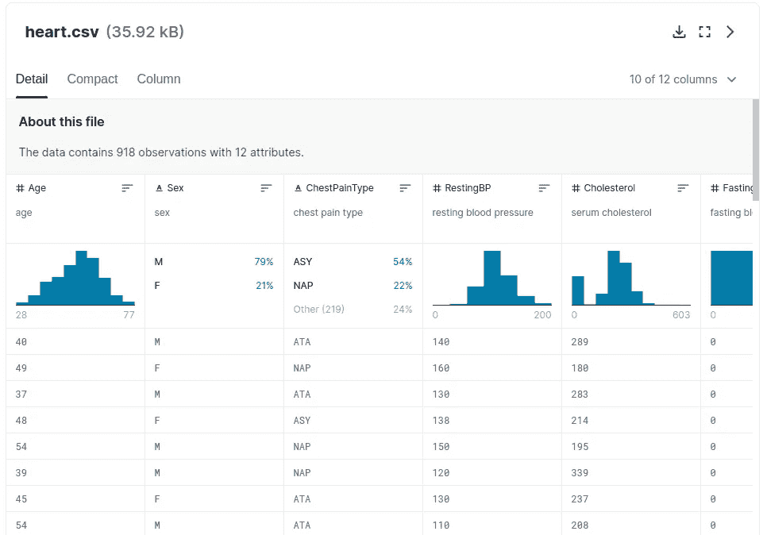
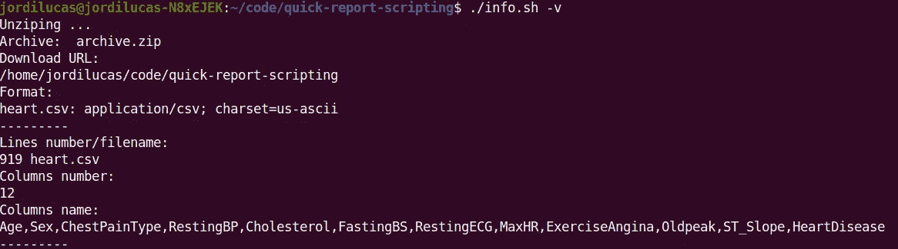
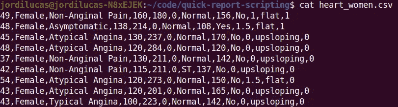
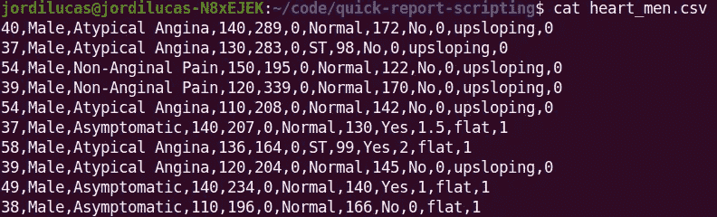
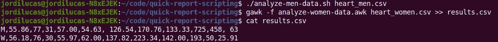
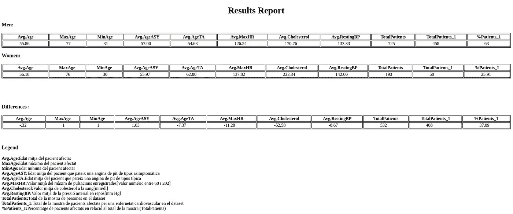

# 如何使用 shell 脚本自动生成快速数据报告

> 原文：<https://medium.com/geekculture/how-to-automatize-a-quick-data-report-with-shell-scripting-960bf18d95cd?source=collection_archive---------8----------------------->


Photo by [Gabriel Heinzer](https://unsplash.com/@6heinz3r?utm_source=medium&utm_medium=referral) on [Unsplash](https://unsplash.com?utm_source=medium&utm_medium=referral)

当我们的涉众需要经常看到我们的分析结果时，时间是宝贵的。因此，将任务自动化以节省我们的时间和精力是很重要的。如你所知，在深度分析和令人惊叹的可视化方面，有很多技术、编程语言和库可以创建。但是，当我们需要快速获得结果，进行演示或做出决定时，会发生什么呢？稍后我们会做一个难忘的 EDA。

如果你想做到这一点，地狱脚本是一个好主意。使用 *bash、awk、sed* 和*正则表达式*，我们可以对数据集进行初步分析，进行基本(或高级)特征工程，计算一些统计数据，并在静态 *html* 文件中显示结果，例如，以一种快速的方式，无需安装任何额外的软件。

# **请动手:健康问题**

我不得不承认，在我发现 shell 的强大功能之前，它对我来说是一个黑洞。现在我尽可能多地使用它。

为了向您展示如何只用 **shell 脚本**创建**快速 ETL 管道**，我选择了 [**心力衰竭预测 Kaggle 数据集**](https://www.kaggle.com/datasets/fedesoriano/heart-failure-prediction) 。在这本书里，我们有 11 个预测男性和女性心脏病事件的临床特征，我们将用它来发现两性之间的差异。目标是向您呈现一个静态报告，向您显示最终结果。



[**Heart Failure Prediction Kaggle dataset**](https://www.kaggle.com/datasets/fedesoriano/heart-failure-prediction)

F 首先，我开发了一个简单的 *info.sh* 文件来**提取**我们的数据并显示基本信息，如行数和列数，以及列名；如果我们添加-v 参数:*info . sh****-v***我们将看到更多关于数据集文件的详细信息，比如我们系统中的下载 URL 和文件格式元数据。

**info.sh -v file**

我们将使用-v 参数查看详细的文件元数据信息:



**File information in detail with -v argument**

# 数据理解过程


Photo by [Alexander Sinn](https://unsplash.com/@swimstaralex?utm_source=medium&utm_medium=referral) on [Unsplash](https://unsplash.com?utm_source=medium&utm_medium=referral)

下一步是理解我们的数据并对其进行预处理，以创建两个干净的按性别分类的 csv 文件。我使用了流编辑器 *sed* 以便通过人类可读的表达式来翻译首字母缩写列名，最后，在完成所有转换后，我使用**正则表达式***(grep)*:*heart _ women . CSV*和 *heart_men.csv* 创建了两个不同的数据集。

```
# Rename acronyms by human readable expressions with sed**sed -E** '{
# Sex: sex of the patient [M: Male, F: Female]
s/,F,/,Female,/g
s/,M,/,Male,/g

# ChestPainType: chest pain type [TA: Typical Angina, ATA: Atypical Angina, NAP: Non-Anginal Pain, ASY: Asymptomatic]s/,TA,/,Typical Angina,/g
s/,ATA,/,Atypical Angina,/g
s/,NAP,/,Non-Anginal Pain,/g
s/,ASY,/,Asymptomatic,/g

...

}' heart.csv 
```

[](https://www.gnu.org/software/sed/) [## GNU sed - GNU 项目自由软件基金会

### sed(流编辑器)是一个非交互式命令行文本编辑器。#示例:删除文件$ sed '4d '中的第 4 行…

www.gnu.org](https://www.gnu.org/software/sed/) 

```
# Separate in two individual files by gender (Female and Male)file_by_gender(){
**grep -E** '*,Female,*' $1 > **heart_women.csv**
**grep -E** '*,Male,*' $1 > **heart_men.csv**
}

# Call file_by_gender function with file name parameter
file_by_gender heart_temp.csv
```

这是结果，按性别分类的 csv:



**heart_women.csv clean file.**



**heart_men.csv clean file.**

# 统计数据分析


Photo by [National Cancer Institute](https://unsplash.com/@nci?utm_source=medium&utm_medium=referral) on [Unsplash](https://unsplash.com?utm_source=medium&utm_medium=referral)

作为**转换层**的一部分，我们的 shell 脚本 ETL 管道的下一步是获取之前按性别创建的文件，并用它们做一些基本的统计和数据分析。我们需要每个数据集的列的平均值、最大值和最小值，我们将把结果作为一行添加到第三个名为 *results.csv.* 的文件中

为此，我使用了 *bash* 来进行 heart_men.csv 数据分析，使用了 *awk* 来进行 heart_women.csv 数据分析。这两个工具都是读取文件和处理数据的优秀工具，速度非常快，非常干净。在 *bash* 文件中，我创建了函数 *calculate_avg* ,将一个数组作为要计算的数据的参数传递给它:

```
# Function to calculate average from arrayfunction **calculate_avg()**{
 arr=("$@")
 tot=0

  for i in "${arr[@]}"; do
   let tot+=$i
  done

 size=${#arr[@]}
 echo "scale=2; $tot/$size" | bc
}

# Get the max and min age values
max_age=$(printf "%d\n" "${age[@]}" | sort -n | tail -1)
min_age=$(printf "%d\n" "${age[@]}" | sort -n -r | tail -1)# Create a row with data stats values and add it to results.csv file.echo M,
$(**calculate_avg** "${age[@]}"),
$max_age,
$min_age,
$(**calculate_avg** "${asy[@]}"),
$(**calculate_avg** "${ta[@]}"),  
$(**calculate_avg** "${maxhr[@]}"),
$(**calculate_avg** "${chol[@]}"),
$(**calculate_avg** "${restbp[@]}"),
$men,
$men_1,  
$(( $men_1*100/$men | bc -l )) > **results.csv**
```

最终结果将是一个 csv 文件，其中包含两性的计算数据结果，每个数据位于不同的行中。



# 给我看看结果


Photo by [NORTHFOLK](https://unsplash.com/@northfolk?utm_source=medium&utm_medium=referral) on [Unsplash](https://unsplash.com?utm_source=medium&utm_medium=referral)

在流程结束时，我们必须计算并**加载**results . CSV 文件数据。在我们的案例中，我们不需要数据库，我们在一个静态 html 文件中显示分析结果，该文件可在笔记本电脑中显示或/和打印，并将其传递给医生(在这种情况下)。

我已经开发了 *bash* 中的最后一步，目标是计算和显示分析数据中的差异，并显示一个简单易读的报告，其中有三行:男性和女性数据及其基底，以便可视化有趣的差异。这里的策略是在嵌套的*中为*颊板获取两个阵列之间的基板。

```
**for** i in **"${!men[@]}"**; do
 **for** w in **"${!women[@]}"**; do
  if (($i == $w)); then
   a=`echo ${men[$i]}-${women[$i]} | bc -l`
   echo "<td>"
    echo $a
   echo "</td>"
  fi
 done
done
```

最后，我们有了 results.html 的*文件:*



**results.html file**

# **只有六条线；一条流水线**

最有趣的是**执行**一个 *run.sh* 文件中只有六行的所有代码。这是实现我们目标的一种非常快速的方法:从原始数据中提取必要的信息，将其转换成有价值的统计数据，并最终在一个静态文件中显示结果。

# 结论


Photo by [Pablo Arroyo](https://unsplash.com/@pablogamedev?utm_source=medium&utm_medium=referral) on [Unsplash](https://unsplash.com?utm_source=medium&utm_medium=referral)

正如所见，使用 **shell 脚本**开发**管道**是自动化流程和创建简单信息报告的好方法。脚本在开始时可能很难理解，但是如果你稍微练习一下，它会是一个很好的工具。

你可以在 [my **GitHub** 资源库](https://github.com/jordilucas16/quick-report-scripting)中查看并测试代码。