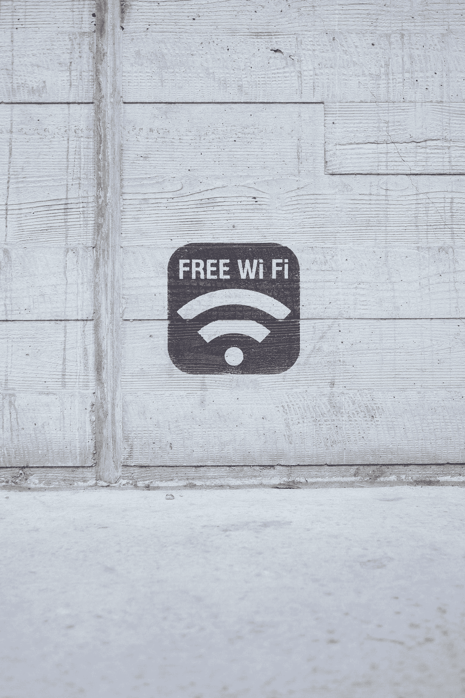

# 如何避免公共 WiFi 的危害

> 原文：<https://medium.com/geekculture/how-to-avoid-the-dangers-of-public-wifi-53591fe5e7e0?source=collection_archive---------13----------------------->

保持联系时保持安全的非技术性指南

Photo by [Paul Hanaoka](https://unsplash.com/@plhnk?utm_source=medium&utm_medium=referral) on [Unsplash](https://unsplash.com?utm_source=medium&utm_medium=referral)

我们过着互联的生活，即使是短时间的离线也不是一种选择。尽管我们都带着连接到移动网络的智能手机，但我们经常发现自己需要使用公共 WiFi 来避免数据限制或获得更好的性能。