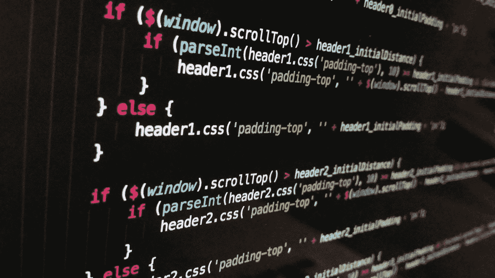

# 如何避免使用“Else”关键字来提高代码质量

> 原文：<https://medium.com/geekculture/how-to-avoid-using-the-else-keyword-to-improve-the-quality-of-your-code-415b84a29a86?source=collection_archive---------17----------------------->

## 这里有 3 个简单的方法可以避免使用“else”关键字

不久前，我发表了文章[学习这 9 条规则，立即开始编写干净的代码](https://levelup.gitconnected.com/learn-these-9-rules-to-start-writing-clean-code-immediately-a7ee40fe1e1b)，文章中的一条规则是:

**“不要使用 else 关键字”**