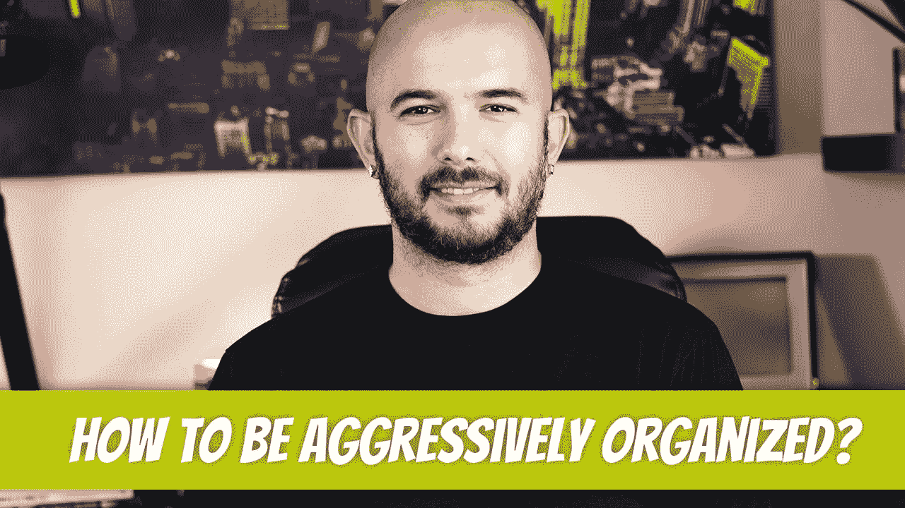

# 如何有侵略性的组织？

> 原文：<https://medium.com/geekculture/how-to-be-aggressively-organized-12c079f41108?source=collection_archive---------8----------------------->

我经常听说一天中没有足够的时间来完成我每天做的事情。我喜欢这些。这都是关于组织的。组织是如此重要，以至于我每天花大约 30 分钟思考如何改善我已经组织好的生活。这并不需要太多，但随着小增量，它会增加。

## 从吉拉开始