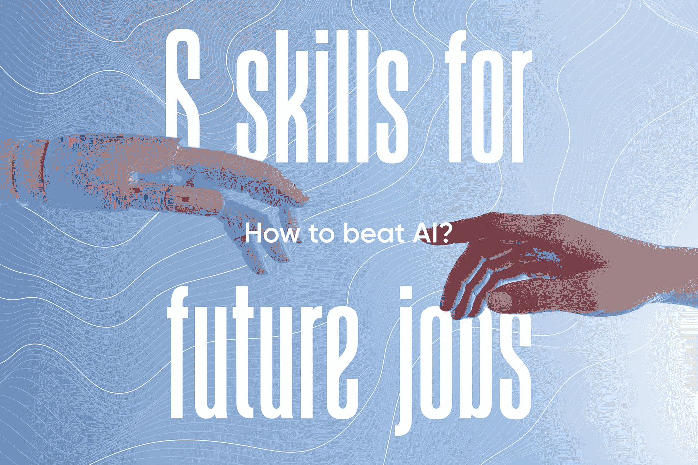

# 如何打败 AI？—未来工作的 6 项技能。

> 原文：<https://medium.com/geekculture/how-to-beat-ai-6-skills-for-future-jobs-3b801fbfce61?source=collection_archive---------3----------------------->

## 利用你的优势，而不是害怕机器人起义。

[Photo by Tara Winstead from Pexels](https://www.pexels.com/photo/person-reaching-out-to-a-robot-8386434/); Edited by Author

我不认为人类会因为人工智能而变得过时。毫无疑问，机器将继续取代人们完成他们可以快速完成的日常重复性任务。自从工业革命开始以来，这种情况就一直存在。那时候，人们…