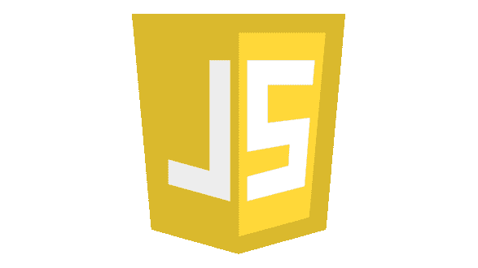
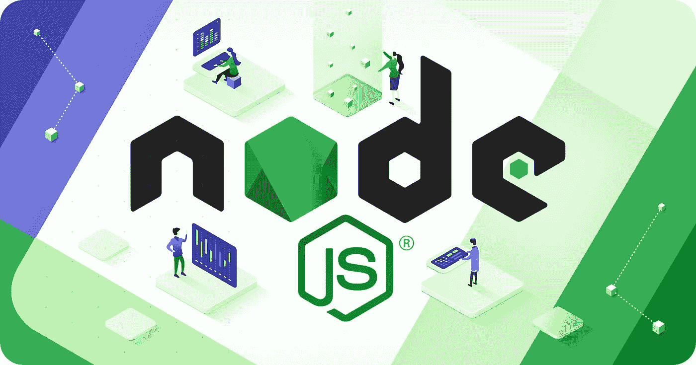
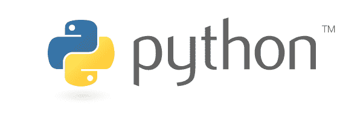
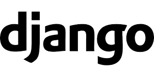
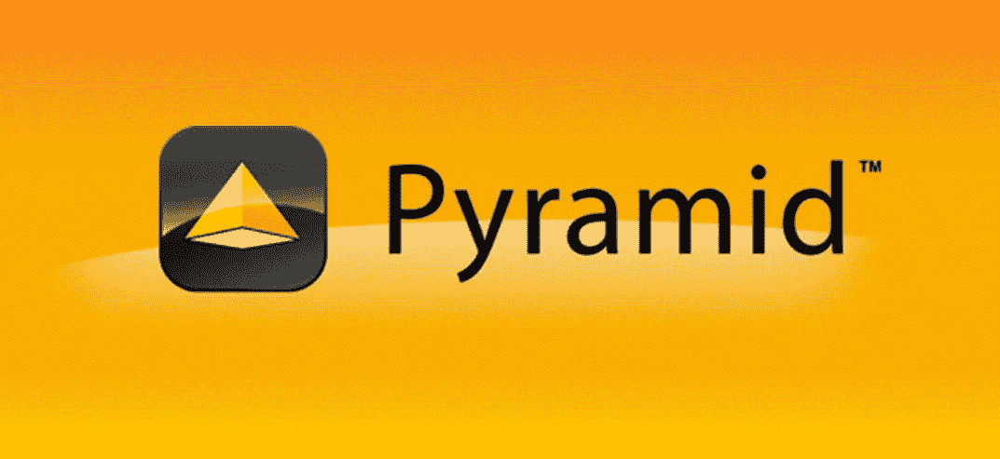
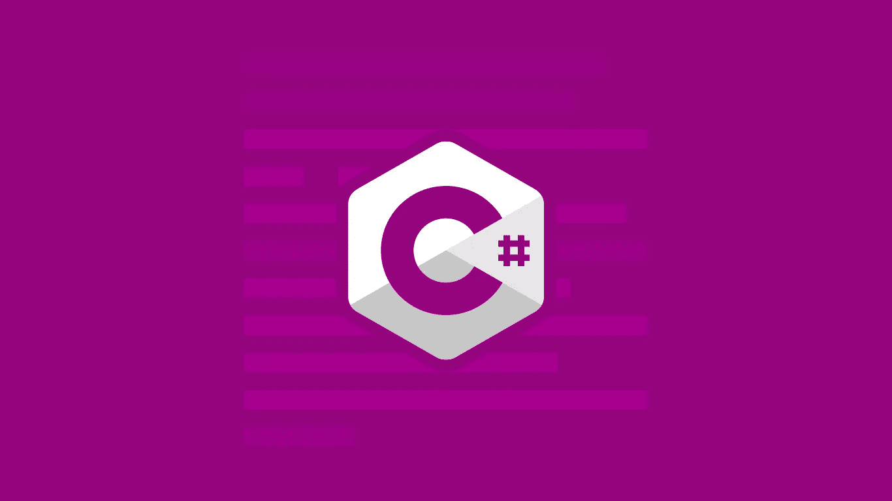
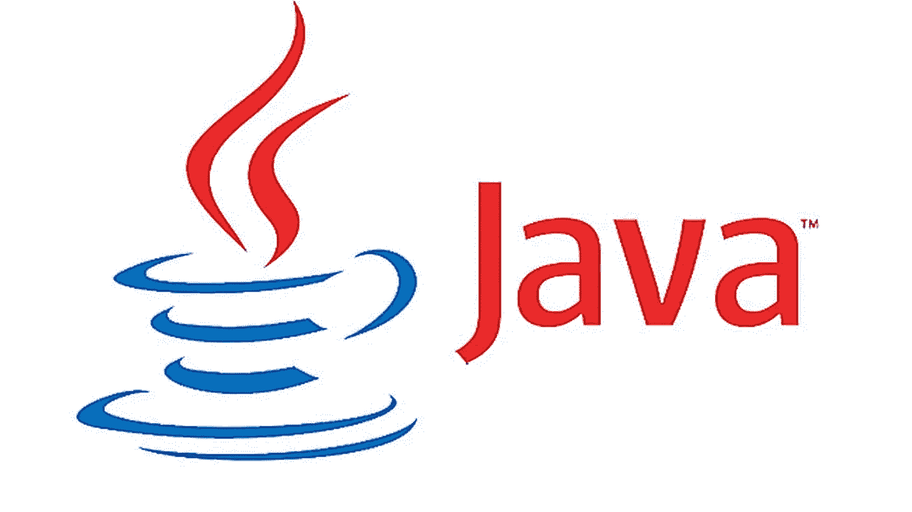
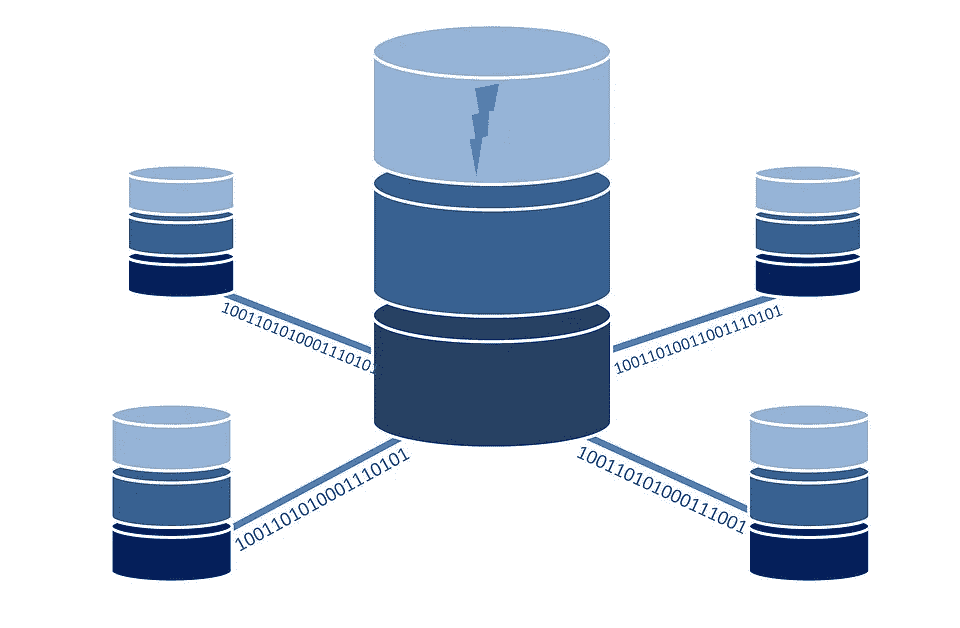

# 如何成为后端开发者

> 原文：<https://medium.com/geekculture/how-to-become-a-backend-developer-in-2021-9fd7a6c48186?source=collection_archive---------2----------------------->

你对从事后端开发感兴趣吗？公司需要 rockstar 后端开发人员设计超越用户界面的完整程序。

后端存储和处理应用程序的所有数据。幕后发生的一切都被称为后端开发。它包括数据库、业务逻辑、API 层，以及几乎所有与用户界面无关的东西。

美国后端开发人员的平均工资为每年 120，654 美元。让我们来看看成为一名后端开发人员需要什么。

# 选择一种编程语言

在开始开发后端之前，您必须首先确定您的应用程序将使用的编程语言。要成为一名优秀的后端开发人员，你需要多种才能，这取决于你使用的编程语言。

作为后端开发人员，以下是可以使用的最佳技术:

*   JavaScript 堆栈
*   Python 堆栈
*   C#堆栈
*   Java 堆栈

让我们仔细看看四种最常见的后端编程语言，以及支持它们的技术栈。

# 后端栈 1: JavaScript 栈

根据 StackOverflow 的一项研究，JavaScript 连续第七年成为最受欢迎的编程语言。包括脸书、网飞和 PayPal 在内的一些进步的财富 500 强公司使用 JavaScript 来构建他们的应用程序。作为一名 JavaScript 后端开发人员，您必须对 JavaScript 这种编程语言有透彻的理解。为了完成这个堆栈，一旦你掌握了 JavaScript，你将需要以下技能。

## **技能一:Node.js**

强大的开源服务器环境 [Node.js](https://nodejs.org/en/about/) 用于在后端运行 JavaScript 代码。在开始学习 node 之前，你必须熟悉 JavaScript。如果您正在使用 JavaScript 构建后端应用程序，Node.js 是最佳选择。它非常受欢迎，并拥有巨大的社区支持。

节点设计用于异步 JavaScript 编程。它可以用于异步任务，包括读写文件系统、管理数据库连接以及作为 web 服务器处理请求。Node.js 是一种可以与数据库和文件通信的服务器端脚本语言。

## 技能 2: Node.js 框架

如果您使用 Node.js，您需要选择一个 web 框架来构建和运行您的 web 应用程序。这方面有许多解决方案。今天有一些流行的 Node.js 框架。这里有几个选项可以考虑。

***选项一:快递***

[Express](http://expressjs.com/) 是一个快速、适应性强且简单的 Node.js web 框架。Express 因其速度而成为众所周知的 web 框架。它附带了许多实用程序和特性，让开发变得非常有趣。

***选项二:流星***

[Meteor](https://www.meteor.com/) 是一个流行且易于使用的全栈 Node.js 框架，用于开发现代在线和移动应用。它适用于各种设备。它可以用于创建 web、iOS、Android 和桌面应用程序。

***选项 3: Koa***

Express 背后的团队已经创建了一个名为 [Koa](https://koajs.com/) 的新网络框架。它有望成为一个更小、更富表现力、更稳定的 web 应用和 API 平台。Koa 允许您忘记回调，并通过使用异步函数极大地改进错误处理。

# 后端堆栈 2: Python 堆栈

Python 一直是程序员中流行的编程语言。由于其简单的语法，许多学校现在将 Python 作为第一编程语言教授给学生。如果你的 API 需要大量的计算，Python 是一个很好的选择。

如果你决定用 Python 来创建你的后端，这里是你完成学习 Python 所需要的技巧。

## 选择一个 Python 框架

有各种各样的 Python 框架，每一种都有自己的优缺点。

全栈框架和微框架是 Python 中可用的两种框架。

> 在决定选择哪个框架之前，后退一步，检查一下项目的规模和复杂性。

如果您正在构建一个具有许多复杂性和特性的大型应用程序，那么全栈框架将是有益的。如果你的程序小而简单，微框架是一个很好的选择。

让我们来看看几个最流行的 Python 框架，看看您应该为您的后端开发选择哪一个。

## **选项 1:全栈框架— Django**

Django 是一个高级 Python Web 框架，它促进了快速开发以及干净、实用的设计。它包括实用程序和功能，让您专注于开发您的应用程序，而不是重新发明轮子。它是开源和免费的。今天，这是最流行的 Python web 框架。

[PostgreSQL](https://www.postgresql.org/) 、 [MySQL](https://www.mysql.com/) 、 [SQLite](https://www.sqlite.org//index.html) 和 [Oracle](https://www.oracle.com/index.html) 是 Django 支持的最流行的数据库，尽管第三方驱动程序允许你使用任何你选择的数据库。

## 选项 2:全栈框架—金字塔

如果你想尝试新的东西，金字塔是 Django 的一个不错的选择。Pyramid 是一个开源的 Python web 应用程序框架。它试图变得简单明了，并且可以处理大的和小的应用程序。

## 备选方案 3:微型框架——烧瓶

假设你要做一个不需要全栈框架的基础应用。微框架是一种选择。 [Flask](https://flask.palletsprojects.com/en/2.0.x/) 是一个 Python 微框架，带有 BSD 许可证。Flask 是一种简单易学的轻量级编程语言。

# 后端堆栈 3: C#堆栈

使用微软技术的公司使用 C#编程语言。作为一名 C#后端开发人员，你必须对 C#这种编程语言有透彻的理解。在你掌握了 C#之后，你还需要一些能力来构建一个 web 应用程序。

Mosh 提供了 [***终极 full-stack.NET 开发者捆绑包***](https://bit.ly/3horb6y) ，它将帮助你掌握所有的。你需要的网络能力。

## 技能一:ASP.NET 核心

ASP。NET Core 是一个流行、全面、功能丰富的框架，允许开发人员使用超快的 API 创建在线应用程序。新的 ASP.NET 核心框架内置了 Angular 和 React 模板，这是两个最流行的 JavaScript 框架。

ASP.NET 核心框架可用于在 Windows、Linux 和 Mac OS 上创建和运行 web 应用程序。这为开发人员提供了一个适应性更强的工作环境。

## 技能 2:实体框架

实体框架是一个对象关系映射器(O/RM ),它支持。NET 开发人员使用。NET 对象。它消除了开发人员通常需要编写的大部分数据访问代码。

# 后端堆栈 4: Java 堆栈

Java 是一种流行的编程语言，被谷歌和亚马逊等公司用于各种后端开发项目。你觉得面向对象编程有趣吗？如果您回答是，Java 是您应该用于后端堆栈的编程语言。

## 技能 1:框架

作为后端 Java 开发人员，您需要为您的开发生态系统选择一个框架。对于后端开发，你可以使用 [Play](https://www.playframework.com/) 、 [Struts](https://struts.apache.org/) 或者 [Spring](https://spring.io/) 框架。这些框架通过提供各种内置功能和支持，帮助您创建和开发现代 Java 应用程序。

## 技能 2:构建工具

Java 程序员使用构建工具来自动化部分开发过程，并提供文档、编码最佳实践和其他资源。Maven 和 Gradle 是 Java 环境中使用最广泛的两种构建技术。您必须自学这些工具，并作为后端 Java 开发人员定期使用它们。

***注意:*** 你还需要了解 Java 作为一种编程语言、设计模式和面向对象的架构，并且能够为你的 Java 代码开发适当的测试。

# 选择一个数据库

无论您为后端选择何种编程语言，数据库总是必不可少的。您创建的任何程序都需要数据库。这是保存信息的地方。SQL 和 NoSQL 是两种最常见的数据库类型。

越来越多的人在使用 SQL 数据库。举几个例子，SQL 驱动的数据库被脸书、网飞、优步和 Airbnb 使用。要成为一名成功的后端开发人员，你必须从头到尾了解 SQL。

有各种数据库可供选择，我在下面列出了最常用的数据库。

## **选项 1: MongoDB**

[MongoDB](https://www.mongodb.com/) 是最流行的[文档数据库](https://en.wikipedia.org/wiki/Document-oriented_database)，它经常被用作 Node.js 的默认数据库。这是一个 NoSQL 数据库，这意味着它比 SQL 数据库适应性更强。

## **选项 2: MySQL**

[MySQL](https://www.mysql.com/) 是另一个在 IT 行业广泛使用的[关系数据库](https://en.wikipedia.org/wiki/Relational_database)。

## **选项 3: PostgreSQL**

PostgreSQL 是一个流行的关系数据库系统，具有很多功能。

# 还没完呢！

我们已经讨论了成为后端开发人员所需的主要学习途径。但是等等，还有呢！后端开发人员还负责各种其他任务。

后端开发人员还必须精通以下领域:
为他们的代码编写好的单元测试。

*   对算法和数据结构有很好的理解。
*   了解安全漏洞并知道如何修复它们。
*   AWS 或 Azure 等平台的云体验。
*   服务器的配置、维护和测试。

# 进一步的学习和资源

*   [***完成 Node.js 速成***](https://bit.ly/2UXJg2F)
*   [***完成 Python 精通教程***](https://bit.ly/3qEX6mi)
*   [***终极姜戈课程***](https://bit.ly/2UU7NFQ)
*   [***满栈。NET 开发者课程捆绑***](https://bit.ly/3horb6y)
*   [***实体框架 6 深度***](https://bit.ly/3hHTD2m)
*   [***终极 Java 精通课程***](https://bit.ly/3jycLCw)
*   [***完成 SQL 精通课程***](https://bit.ly/3jwYTYZ)

我希望你喜欢这篇文章！如果你喜欢它，请分享它，并在下面留下评论。