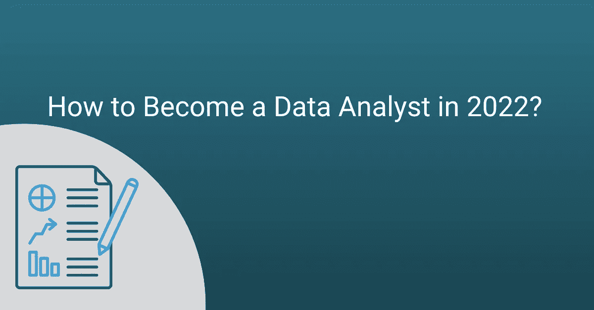

# 2022 年如何成为一名数据分析师？

> 原文：<https://medium.com/geekculture/how-to-become-a-data-analyst-in-2022-76343aaaeee2?source=collection_archive---------11----------------------->

现在是 2022 年，人类每天产生和传输的数据比以往任何时候都多。据估计，在任何一天，我们都会产生接近惊人的 [**2.5 万亿字节的数据**](https://www.domo.com/learn/infographic/data-never-sleeps-5) 。

对于我们普通人来说，这些大量的数据可能没有多大用处。但是，对于企业和组织，如谷歌，Meta，亚马逊等。这是一座包含各种信息的金矿。利用这些信息，这些公司建立商业模式，做出商业决策，确定市场状况，衡量消费者的需求等等。简而言之，正是这些信息支撑着他们。

为了从数据中挖掘或提取这些信息，需要称为数据分析师的熟练人员。这些专业人士的工作是筛选公司的数据，提炼出有价值的见解，并以易懂的方式呈现出来。

现在，我们知道一个事实，这个世界是靠数据运行的。为了充分利用这些数据，全球都非常需要数据分析师。事实上，数据分析师工作是当今最受欢迎的工作之一。

然而，成为一名数据分析师并不容易。有几个因素，如学习哪些技能，如何接近招聘人员等。，这是申请数据分析师之前需要考虑的问题。

因此，为了帮助人们，我们策划了这篇关于如何在 2022 年成为数据分析师的文章。它详细讨论了在 2022 年成为一名数据分析师所需的步骤，同时对这份工作的细节进行了一些急需的说明。总之，它给出了作为一名数据分析师的工作要求的完整画面。那么，让我们来看看我们在这里提到的一切。

# 数据分析师一览(也添加工具)

简单来说，数据分析师就是进行数据分析的专业人士(哈哈，好搞笑)。玩笑归玩笑，数据分析师的工作概况并不仅仅符合一种类型的工作。概括地说，数据分析师执行以下任务

*   从各种来源收集和组织数据
*   使用各种统计技术和辅助工具读取记录的数据
*   提炼记录的数据，得出宝贵的观察结果，如模式、异常和趋势，以便进行预测分析
*   向组织传达调查结果
*   使用多个数据库进行数据存储、检索、修改和修正
*   通过以报告的形式提供相关的摘录见解来补充组织的决策工作
*   与软件开发人员、业务主管和其他重要人员的团队合作，促进业务增长
*   为公司的利益相关者记录数据分析的整个过程

简而言之，任务清单是无穷无尽的，每家公司在招聘时对数据分析师提出的具体要求也是如此。

数据分析师可能会被视为在硅谷工作的人。但是，由于数据分析师的多面性以及数据在业务运营中日益增长的重要性，一些行业，如医疗保健、金融、食品和饮料、汽车等。，需要数据分析师来发展业务。

这也意味着数据分析师的工作需要极大的责任感和精神毅力。我们确信，在看到数据分析师必须做的事情后，您可能会不知所措。你可能还会想，“如何在没有经验的情况下成为一名数据分析师”，因为数据分析师承担的角色很重要，需要同时对几个领域有很好的理解。

但是不要担心，因为我们下面讨论的步骤会解决你所有的问题。

# 如何成为一名数据分析师

数据分析师是 2022 年最抢手的职业之一。几乎这个星球上的每个行业都在寻找强大的数据分析师，以充分利用他们的数据。他们中的大多数人也毫不避讳地提供优厚的**的薪酬待遇。**

**所以，现在你有足够的动力去考虑数据分析师的职业，让我们言归正传，看看你如何成为一名数据分析师。**

## ****1。打好基础****

**不仅仅是数据分析师，做任何工作的关键是要有扎实的基础知识。了解基础知识有助于人们相对容易和清晰地理解高级概念。**

**数据分析主要处理组织和审查数据收集，以提取有影响力的信息。因此，除了技术技能之外，数据分析师应该精通解决问题，并拥有出色的数字技能。**

**获得这些技能的一个方法是获得计算机科学、信息技术、统计学或数据分析的学士学位(理想的选择)。事实上，大多数数据分析师的招聘信息都将学士学位列为最低要求。然而，这种观念正逐渐开始改变。**

**除了学士学位，人们还可以报名参加数据分析认证计划，了解基础知识。这些课程比学士学位更有针对性，因为它们抓住了各行各业最受欢迎的技能。**

**Coursera、Udemy 和 Udacity 等网站提供了很好的数据分析课程和训练营。**

**除了追求数据分析方面的专业课程或学位课程，有志者还应该研究任何可能在不久的将来成为数据分析师核心要求的新兴技能。**

## **2.用必要的技能武装自己**

**对数据分析师所做工作的描述最多也就是模棱两可。这是可以理解的，因为数据分析师在其任期内必须履行多重职责并扮演多个角色。**

**然而，为了能够执行这些众多的职责，数据分析师需要用一套严格的基本技术技能来装备自己。这些包括**

*   ****SQL****

**数据分析中的“数据”不仅仅指数据分析师处理的大型数据集。它还指对分析数据的系统存储和管理。为此，数据分析师需要知道如何使用数据库，这就要求他们了解 SQL。**

**SQL 或结构化查询语言是一种高级语言，它使数据分析师能够处理包含在多个互连数据库中的数据。它允许他们从数据库中插入、提取、修改或删除大量数据，以挖掘有价值的见解。**

**SQL 是每个数据分析师都应该掌握的核心技能之一，以便成为成功的专业人士。**

*   ****Python 编程****

**Python 是一种无处不在的语言，在我们无法计数的更多领域找到了用途。因此，它在数据分析领域也是必要的就不足为奇了。**

**数据分析师主要使用 Python 来准备分析数据，执行统计分析和预测分析，构建数据可视化等。Python 通常与 SQL 结合使用，使读取和评估大数据集的过程变得简单而无缝。**

*   ****R 编程****

**r 是一种开源的统计编程语言，是数据分析师的饭碗。作为世界上第 11 种最流行的编程语言，R 主要用于数据挖掘和数据建模。然而，数据分析师也使用它进行数据可视化和图形数据分析。**

**r 是数据分析的必要元素，因此，每个数据分析师都应该学习它。**

*   ****机器学习****

**人工智能及其子集机器学习是在众多行业中找到应用的两种技术。**

**在数据分析的背景下，专家将机器学习与预测分析和自动化联系在一起。**

**数据分析师使用机器学习来确定模式，检测异常并预测数据趋势-这些操作曾经仅限于人类。**

**机器学习还不是核心的数据分析组件。但是，它正稳步成为数据分析师的必备技能。**

*   ****微软 Excel****

**Microsoft Excel 是一个重要的数据分析工具，最适合处理较小的数据集。**

**Excel 通常与电子表格联系在一起，它还包含一系列对许多数据分析工作至关重要的功能。数据分析师定期运行 Len()、Concatenate、Sumifs()、Vloopup()、If()等。，从数据集中提取有用的信息。**

**虽然看起来不像，但 Microsoft Excel 是每个数据分析师都应该知道如何使用的另一个基本工具包。**

*   ****MATLAB****

**MATLAB 是另一种在数据分析中广泛使用的多维编程语言。数据分析师主要使用它来清理、组织和可视化数据，实现 ML 数据模型，数据预处理等。**

**和机器学习类似，MATLAB 不是必备技能。然而，对它的运作有所了解可以增加你找到工作的机会。**

*   ****数据可视化****

**数据可视化指的是以图形格式全面地表示数据和信息。这是一个使用图形、地图、图表、信息图、动画等的过程。，来传达数据集的本质。**

**数据分析师使用[数据可视化工具](https://towardsdatascience.com/8-best-data-visualization-tools-that-every-data-scientist-should-know-2287c9c45cc4)来提出他们对大型数据集的分析，以报告趋势、模式、预测等。**

**数据可视化是所有数据分析师都应该熟悉的决策的主要先决条件。**

*   ****数据清理****

**数据清理是数据分析中的另一个重要过程，它从根本上处理损坏、不正确或冗余的数据。**

**数据分析师使用数据清理来修复或删除任何可能对整体分析有害的错误数据的痕迹。它包括纠正不正确的记录，删除不相关或重复的数据，并确保数据集中的一致性。**

**除了上面提到的技术技能，你还应该发展软技能，如强大的沟通能力、研究能力、灵活性、领域知识、批判性思维和创造力。**

## **3.处理包含真实世界数据的项目**

**一旦你获得了所有必要的硬数据和软数据分析技能，是时候测试它们了。还有什么比构建令人敬畏的项目更好的方法呢？**

**然而，随意挑选项目想法对你没有好处，因为这样做只会让你感到无所适从。为了充分利用您的项目构建工作，您需要模拟真实情况的项目。处理真实世界的数据集可以更好地理解专业数据分析师需要满足的要求。**

**为了从事这样的项目，你可以选择认证项目，这些项目提供了大量包含真实世界数据的项目。你也可以选择开放或公共数据源，如美国宇航局开放数据，世界银行开放数据，谷歌公共数据浏览器等。**

## **4.打造一个作品集来展示你的数据分析技能**

**专业作品集是招聘人员在审查工作申请时首先要做的事情之一。因此，为了确保你给人留下正确的第一印象，做一个能充分展示你的技能和优势的文件夹。**

**然而，对于大多数求职者来说，收集作品集是求职过程中最艰难的挑战之一。首先，这是因为他们弄不清哪些项目应该添加到投资组合中，哪些应该排除。构建投资组合具有挑战性的另一个原因是，候选人过分强调设计独特投资组合的必要性。**

**专业作品集的主要目的是向招聘人员传达为什么他们应该选择你。为此，你需要确保你的作品集包含你想要展示的东西——你的知识、技能和任何其他让你与众不同的因素。**

**因此，构建投资组合的第一步是将它设计成易于遍历的。没有人喜欢看起来晦涩难懂、信息分散的投资组合。**

**此外，当向投资组合中添加项目时，不要说，“啊，我完成了。我们把所有东西都放进去吧”。花些时间整理一下那些让你成为专业数据分析师的项目。他们不一定总是你最好的朋友。包括那些你不得不做出冒险决定或尝试新方法的事情，也会有积极的效果。这也意味着你需要致力于高质量的数据分析项目，为你的投资组合增加有价值的东西。**

**最后，投资组合的形式也很重要。pdf 和印刷文件夹是过去时代的遗物。相反，许多新手和有经验的数据分析师在更新 LinkedIn 和 Github 个人资料的同时，会去投资组合网站。你没有理由不照着做。**

## **5.建立专业网络**

**职业关系网是与其他专业人士建立熟人或关系以换取共同职业利益的过程。对每个人来说，这都是求职过程中至关重要的一个方面，不管他们在这个行业已经工作了多少年。毕竟，谁知道什么时候这种联系会派上用场。**

**与专业人士建立关系网听起来就像获取他们的联系信息一样简单。然而，它需要的远不止这些。你需要确保与你交往的人不会把你视为无意义的资源，而是一个有创造力、有抱负、想交朋友的真实的人。因此，与其直接切入正题，不如彻底了解对方，让他们相信你不仅仅是一笔有用的资产。**

**此外，当你开始人际交往时，从你的学校、大学、工作场所或朋友圈的人开始，因为你更了解他们。**

## **6.考虑硕士学位或类似的高级课程**

**数据分析是一个不断发展的领域，如果你想在即将到来的未来保持相关性，你目前的技能组合是远远不够的。**

**因此，为了增加你在数据分析方面的专业知识，试着去参加一个高级课程，比如一个著名机构的硕士学位或者任何在线高级认证项目。**

**从数据分析的高级课程毕业将在相当多的方面帮助你。它将提升你的职业前景，满足你对知识的渴望，为你的未来做好准备。**

# **结论**

**像今天的大多数其他 IT 工作一样，数据分析师的职业需要满足一整套资格和领域专业知识。有抱负的数据分析师除了打磨行业所需的技能之外，还需要学习大量的硬技能。**

**因此，在缺乏适当指导的情况下，成为数据分析师的道路可能会比人们想象的更加动荡。**

**这篇关于如何成为数据分析师的文章讨论了六个关键步骤，以帮助寻求从事数据分析的候选人。如果你也是这些候选人之一，我们希望这篇文章中提到的一切对你有用，让你在一家好公司找到一份工作。**