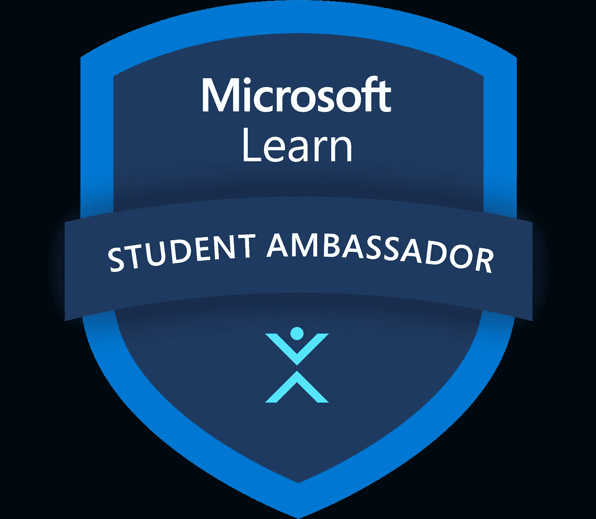
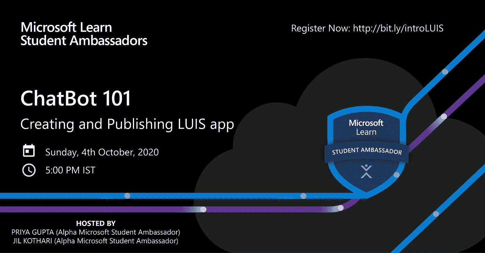
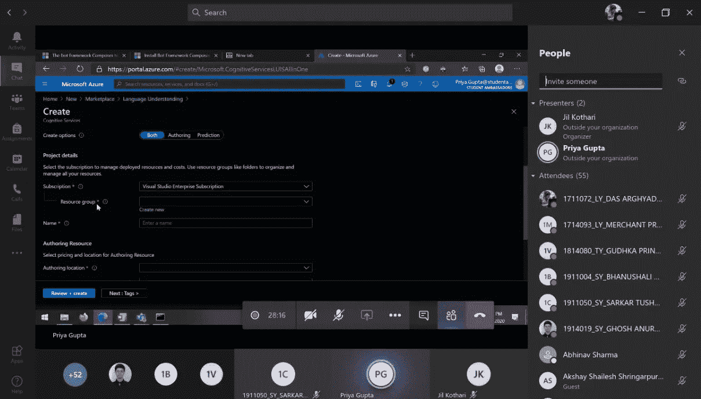
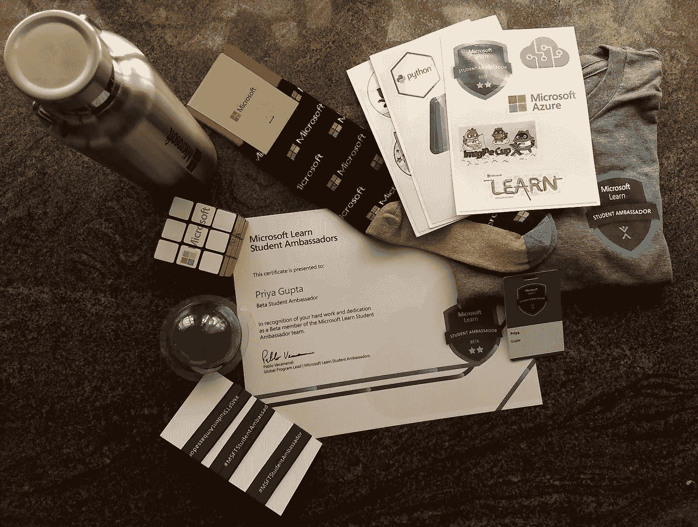

# 如何成为微软学生大使(MLSA)并主持你的第一次活动

> 原文：<https://medium.com/geekculture/how-to-become-a-microsoft-learn-student-ambassador-45e3348e399d?source=collection_archive---------0----------------------->

## *学习。教书。连接。*

It 不管你是大一还是大四的本科生还是硕士生，你都可以申请！你需要的只是对技术的热情。

通过加入[微软学生大使计划](https://studentambassadors.microsoft.com/en-US/)(早期的微软学生合作伙伴)，您可以-

1.  通过微软课程提升自己的技能，获得微软专业人员的指导，获得徽章和证书。
2.  在你的大学举办活动、研讨会和黑客马拉松，教人们如何编码并成为领导者。
3.  与全球社区建立联系。

我在去年(2020 年)5 月初知道了这个项目，到 5 月 12 日，我完成并提交了我的申请。我在 8 月 7 日收到了选择邮件。现在，我正处于工程学的最后一年。

# 额外津贴

*   微软赠品和好东西
*   每月 150 美元 Azure 信用点数
*   Office 365、Visual Studio Enterprise、Techsmith Snagit 和 Camtasia 软件免费。
*   MTC 认证考试代金券和 LinkedIn 学习免费 6 个月。
*   与微软专业人员的指导和交流。
    **还有更多！**

激动吗？立即申请！

# **后续步骤**

1.  访问他们的[官方网站](https://studentambassadors.microsoft.com/en-US/)，点击“立即申请”并注册。
2.  申请表包括基本信息，书面样本，技术技能，简历和一个简短的视频介绍。
3.  制作一个视频，解释你对技术的热情以及你为什么想加入这个项目。上传到 YouTube(或 Google drive)上。
    [【我的视频供参考】](https://www.youtube.com/watch?v=O-EHycJiBPw)
4.  填写表格并提交。

## 记住

*   全年都可以填申请表。这个项目每季度接收新生。
*   提交后，您可以编辑您的应用程序，直到它进入微软的审查状态。你会在填写申请表时了解截止日期。
*   不要跳过视频拍摄；它增加了你被选中的机会！

# 入选？现在怎么办？

## 里程碑

一旦您被该计划选中，您就可以实现以下里程碑。每个里程碑都有它自己的好处。

1.  **Alpha**-完成 [Microsoft Learn](https://docs.microsoft.com/learn/roles/student?WT.mc_id=StudentContent__-web-cxa) 路径并解锁 Azure 点数和您的 Visual Studio Enterprise 订阅价值。您还会收到一张认证凭证和一个免费域名。
2.  **Beta** -获得 swag 套件。在您的社区举办一次活动，释放活动支持和资源优势。这项工作可能包括邀请参加我们的年度 Microsoft Learn 学生大使峰会。
3.  **黄金** -当你在赢得徽章和服务当地社区方面取得超越时，获得黄金里程碑的邀请。你将成为学生大使区域负责人，获得参加特别活动的机会，并可能被邀请成为微软[最有价值专业人士](https://mvp.microsoft.com/) (MVP)。

## 联盟

联盟旨在让你参与你热衷的话题，同时让你发展技能，与你的社区分享知识，并获得专业指导。你可以加入任何两个联盟，包括一个技术联盟和一个社会影响联盟。

## **技术联盟**

*   人工智能和机器学习
*   数据和分析
*   新兴技术
*   物联网
*   移动和发展
*   低代码开发

## **社会影响力联盟**

*   数字无障碍
*   教育
*   绿色科技
*   卫生保健

# 举办活动，成为技术摇滚明星！

在你对 Azure、Visual Studio Code、PowerBI 或任何其他微软服务有了一点点熟悉之后，是时候举办一个活动/研讨会，在那里你可以向他人传授你所获得的技能。

## 一些提示

*   与其他 MLSAs 合作，选择一个你感兴趣的、有影响力的、适合教学的主题。
*   花大部分时间决定主题和确切的内容。
*   在实际活动的 3 到 4 天前，准备好要在不同平台上发送的宣传材料，如海报、信息、登记表。
*   提前发送带有活动链接的电子邮件给注册的人，并在活动当天发送，以避免任何不幸。
*   兑现你的承诺——不要让听众对你阅读演示文稿感到厌烦。向他们展示一些实际操作的演示！

我和我的朋友吉尔·科塔里合作举办了我们的第一次活动。当我们寻找主题想法时，有一些陈词滥调的主题，如'*Github 入门'*和'*使用 HTML 进行 Web 开发& CSS'* ，我们试图避免这些，于是我们想到了' **ChatBot 101 —创建和发布 LUIS 应用程序**'。我们解释了一些基本的聊天机器人术语以及使用 LUIS 的语言理解应用程序演示，并使用微软的机器人框架从头开发了一个机器人。这是一个 1.5 小时的会议，有 50 多人参加。

*PS:如果你是 MLSA，可以在这里* *观看我的事件记录* [*。*](https://web.microsoftstream.com/video/98fe430f-6428-481d-a8c6-12763c2e1782)

一旦您的第一个活动获得批准，您将被提升到 Beta Milestone，并获得微软提供的礼包。

> 没有什么比错过机会更昂贵的了。

> 那么，你还在等什么？立即申请！
> 观看[我的申请视频](https://www.youtube.com/watch?v=O-EHycJiBPw)获得一些灵感。
> [我在聊天机器人开发上的活动](https://web.microsoftstream.com/video/98fe430f-6428-481d-a8c6-12763c2e1782)正在微软流上播放。

**我们来连线**:**[https://www.linkedin.com/in/priya18](https://www.linkedin.com/in/priya18)**