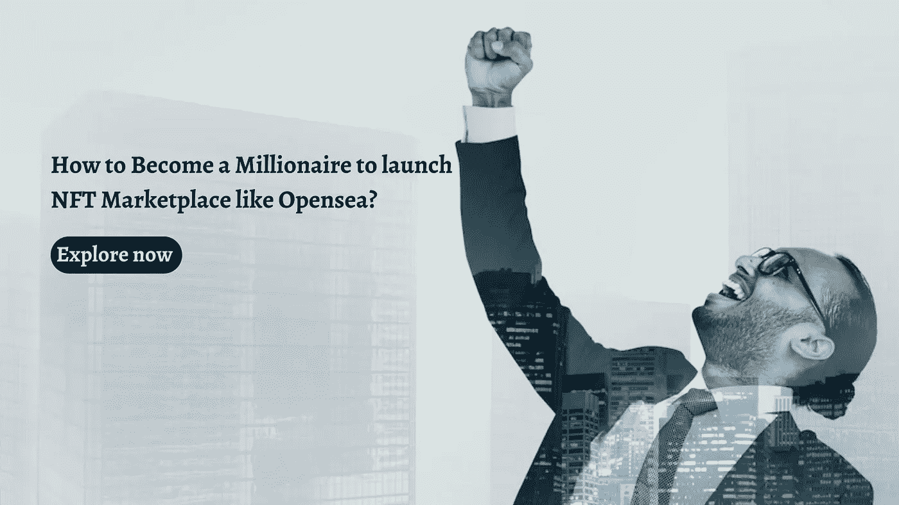

# 如何成为百万富翁来启动像 Opensea 这样的 NFT 市场？

> 原文：<https://medium.com/geekculture/how-to-become-a-millionaire-to-launch-nft-marketplace-like-opensea-da0b98166655?source=collection_archive---------16----------------------->

近年来,“不可替代的代币”这个词已经被滥用了。你知道是什么让它独一无二并在加密货币爱好者中流行吗？这个博客将告诉你一个 [**OpenSea 克隆脚本**](https://www.cryptocurrencyscript.com/opensea-clone-script) 的开发过程，以及一个启动 NFT 市场的有效方法。

我们的区块链开发公司因为客户创建精心制作的 NFT 平台而闻名，我们还提供完全定制。在这种情况下，你可以融入功能和创意设计来获得更多用户，创业者没有限制。这种适应性强的开发过程是其他区块链开发公司所没有的。请耐心等待！如果我告诉你，一个企业没有必要从零开始，会怎么样？

事实上，我们的区块链开发者提供了一个现成的 NFT 市场，如 OpenSea，它可以节省您的时间，而且价格合理。现在让我们继续讨论我们将整合到你的白色标签 OpenSea 克隆中的诱人特性。

## **OpenSea 克隆人的诱人特征**

**引人注目的店面—** 对于 NFT 平台来说，店面在为用户提供大量吸引人的细节方面至关重要。店面将充满不可替代代币的生动细节，如创建者的姓名、价格、出价和预览。这样，为你的用户提供一个有吸引力的店面将会吸引他们购买数字资产或者在你的 NFT 平台上交易。

**创建列表—** 允许您的用户在您的数字收藏平台上发布或标记加密货币用户。因此，他们可以及时了解最新发布的不可替代代币及其价格。

**高级过滤器—** 当您想要构建一个包含大量数字资产的白色标签 OpenSea NFT 市场时，您必须将它们组织成类别。这极大地帮助了加密用户获得他们想要购买、出售或交易的数字资产。

**加密货币钱包—** 要在 NFT 平台上进行高效的加密货币转账，需要集成多个钱包。管理员可以允许您的用户将他们的帐户链接到任何基于以太坊的钱包，包括元掩码、格式等。

**清盘**

总之，你可以联系我们随时可用的专家。像 OpenSea 一样，Zodeak 是一个强大的 NFT 白牌市场，希望在 NFT 市场立足。这是开始铸造的理想时间。希望你喜欢这种方式，否则你可以开始开发自己的 NFT 市场，从零开始充满你的想法。去接触领导 [**NFT 市场发展公司**](https://www.cryptocurrencyscript.com/nft-marketplace-development) 像佐藤。