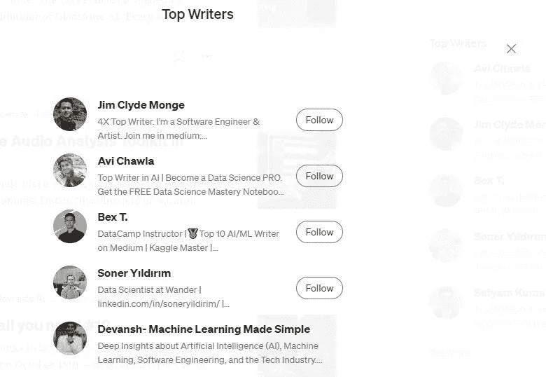
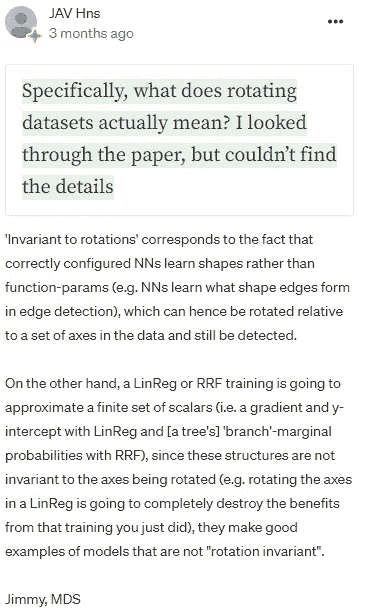

# 如何变得非常擅长机器学习

> 原文：<https://medium.com/geekculture/how-to-become-very-good-at-machine-learning-a78e3d93fe96?source=collection_archive---------0----------------------->

## 我如何自学数据科学、机器学习和计算机科学中的复杂思想

Medium 有一份他们认为是顶级作家的名单。这些列表按主题进行跟踪。我在他们官方的人工智能、技术、商业和教育顶级作家名单上已经有一段时间了。昨天，我为 AI 破解了他们的前 5 名作家。在科技文章方面，我排名第 6，在教育方面，我排名第 10。在过去的 2-3 个月里，我的内容有了爆炸性的增长，其中很大一部分是你们大家。你分享的所有反馈都帮助我改进了我的内容。

为了庆祝这个，我有一个特别的帖子给你。我要说的是，我曾经在没有硕士学位或没有支付昂贵的新兵训练营/课程的情况下，独自掌握困难的机器学习思想和概念的方法。我利用互联网上的免费资源做了这件事。即使你对军情六处恨之入骨，请继续读下去。这个学习系统将有助于你掌握你所选择的领域。

不，我不会告诉你去 Kaggle/或做一些普通的个人项目。我有一些东西可以帮助你更全面地了解机器学习背后的主题。

你准备好了吗？许多向我寻求指导的人都从这种方法中受益匪浅。

# 主要亮点

1.  **目前 ML 初学者的标准建议-** 说到告诉 ML 初学者应该如何学习 ML，标准建议是做一个项目。通常还附有一份标准项目清单，每个想成为 ML 的人都会在简历中列出。有些人甚至抛出“做一门课程”。
2.  **为什么这个建议不好-** 项目和课程之所以伟大，是因为它们提供的结构。然而，完全依赖他们会把这种优势变成劣势。项目会教你如何做事。他们不会教你做什么。很多时候，教程和课程会帮你做很多跑腿的工作。因此，你不会为现实世界的混乱挑战做好准备。
3.  **你应该做的反而是——**阅读。是的，我经常这么说。因为这个管用。具体来说，开始阅读实际的机器学习研究论文。是的，即使你是一个知之甚少的初学者。我将在这篇文章中概述一下要做什么。关于如何与非常技术性的文档/会谈进行互动的更深入的内容将在另一个周六发布。
4.  **为了获得最佳效果-** 一旦你有了想法，现在就是你可以尝试小项目来学习如何实际实施这些想法的时候了。这将向您展示编码和各种可用的框架。两全其美。

如果你不是一个 ML 的人，用你所在领域的深度技术博客/讲座来代替 ML 论文。互联网在每个重要领域都有免费资源。使用它们。我将在这封邮件/文章的其余部分使用 ML 文件，因为这是我最熟悉的。因为 ML 文件是我用来变得更好的。

Photo by [Arseny Togulev](https://unsplash.com/@tetrakiss?utm_source=medium&utm_medium=referral) on [Unsplash](https://unsplash.com?utm_source=medium&utm_medium=referral)

# 学习 ML 的建议和为什么它是不完整的

作为机器学习领域的一名教育工作者，我经常看到许多人就初学者如何进入机器学习领域并在那里做得很好给出建议。通常，该建议遵循以下思路:

1.  上数学课的组合。通常涉及概率和统计、微积分、线性代数和逻辑。
2.  找一两个你感兴趣的个人项目。真正好的建议是建立一个端到端的管道，从数据收集一直到分析和报告生成。
3.  查看一些在线教程/文档来学习实现。
4.  享受你的 ML 专业知识。

有些人可能会推荐在线 ML 课程。但这是他们建议的要点。严格来说，这些都不是坏事。然而，它是不完整的。这样的建议会对你有用，但要达到更高的水平会是一种折磨。如果你正试图从其他领域过渡到 ML(或者有任何其他时间义务)，你没有时间进行这种自下而上的方法。这样的人怎么能和全职做 ML 的人竞争呢？或者是在课堂上花几个小时学习这些系统的来龙去脉的人。我花了 3 年的数学时间来学习卷积、拉普拉斯变换和多元优化。我还在学习更多的东西。你没有三年时间。那么你应该怎么做呢？如何才能打入更高的机器学习行列？你能给大师们推荐的训练增加什么？

> 我注意到的一件事是，教授给硕士学生的机器学习和正在进行的机器学习研究之间有很大的差异。

> —扬尼克·基尔彻，ML YouTuber。即使获得硕士学位也不足以跟上深度学习(尽管公平地说，你学习的基础将是有帮助的)。[点击此处了解我和 Yannic 之间的更多对话](/geekculture/learning-from-the-biggest-machine-learning-research-youtuber-4040dc5a56ec)

简单。阅读 ML 中的研究。拿一些看起来有趣的论文去读。关注 YouTubers，比如我自己、T2、亚尼奇·基尔彻、T4 的两分钟论文，这些论文以人们可以理解的方式对研究进行了细分。去 Twitter 和 LinkedIn，开始关注那些分享有趣的 ML 论文和博客的人。关于我广泛依赖的人的更多名单，[查看 LinkedIn 上关于这个话题的帖子](https://www.linkedin.com/posts/devansh-devansh-516004168_officially-a-top-5-writer-ai-writer-on-medium-activity-6976963412316614656-WFGg?utm_source=share&utm_medium=member_desktop)。

# 但是我没有太多的专业知识。论文不会太复杂吗？

是也不是。就其本身而言，阅读论文(或观看某人解释论文)不会立即有用。他们会有很多你不知道的关键词。他们用的技术你一半都不会。但是它会让你养成搜索和学习新事物的习惯。它会教你熟悉复杂的问题。这是巨大的。随着时间的推移，你会发现自己对论文理解得更好了。你会开始明白为什么作者做了一件特别的事情。你可能会问为什么他们选择了一种特定的数据增强技术而不是另一种。一篇接一篇，你会发现你的知识在进步。这将有助于你解决专注于项目时会遇到的问题。它解决了这种方法的缺陷。

# 什么瑕疵？

以项目为中心的方法对于学习技术方面是非常特别的。它会很好地教会你如何体验。没有比亲身经历更好的学习方法了。就*如何进行机器学习而言，*没有更好的方法。但它忽略了一件事。在 ML 中,“是什么”通常和“如何”一样重要。你需要学会如何识别问题的不同方面。你需要能够理解管道中的不同步骤。教程和课程是非常结构化的。**它们提供指导，但通常不会让您了解构建解决方案的所有方式。阅读解决类似问题的不同团队和研究不会有这个缺陷。你会接触到不同的想法和观点。例如，阅读所有的计算机视觉研究(以及在恶意软件检测中使用机器学习的研究)产生了我的 Deepfakes 检测想法(我在这里提到过)。**

你还可以接触到社区中的其他人。你可以和有经验的专业人士讨论研究。他们将分享自己的经历，为讨论增添内容。你可以看到一个例子，我和我作品的读者讨论了 SimCLR(一个可视化学习架构)。**他们告诉我不平衡数据集的潜在问题。**这对我来说是全新的。这是参与研究社区的一个被忽视的优势。可以向专家学习。这是我经常做的事情。我向我的读者征求他们对不同主题的意见，并从他们的互动中学习。这帮助我对各种想法有了更深刻的理解。因为教程/课程将会朝着最佳路径精简，你将没有机会经历混乱的探索阶段。

Another example of me learning from experts. I recently covered a paper that showed [Why Tree-Based Models Beat Deep Learning on Tabular Data](/geekculture/why-tree-based-models-beat-deep-learning-on-tabular-data-fcad692b1456) and I didn’t understand one of the details. So I just asked and Jimmy was kind enough to give me an explanation. Exposing yourself to ideas will help you grow.

# 简单地

将自己暴露在研究中会打开你的世界，让你知道有多少种方法可以解决问题。它会让你接触到不同的想法和概念。你甚至可能遇到新颖的实现(比如你如何[通过将二进制文件转换成图像来对恶意软件进行分类](https://medium.datadriveninvestor.com/what-convolutional-neural-network-architecture-works-best-for-classifying-malware-images-5a1215542f6a))。简单来说就是黑。它将允许你像全职员工那样参与到 ML 中。它将帮助你像人们在工作中学习 ML 一样学习(遇到和测试新的想法)，而不需要你自己花费那么多时间去试错。

# 如何进行

我将在另一个周六(不想让这个太长)详细讲述如何自己阅读研究论文(为了不同程度的数学舒适)。所以如果你对此感兴趣，一定要在不同的平台上关注我的工作。但是快速浏览一下。我会建议这样的事情。每周花大约 2-4 个小时接触新的 ML 研究(通过其中一个渠道，或者只是跟随出版物)。确保你理解了这些文件，这样你就可以在高层次上解释它们是做什么的。即使低端，2 篇论文/周也就是 8 篇论文/月。这将成倍增加(复利回报会产生惊人的效果)。使用互联网与人互动。这是一件很棒的事情，你可以将它最大化。

Photo by [Stephen Dawson](https://unsplash.com/@dawson2406?utm_source=medium&utm_medium=referral) on [Unsplash](https://unsplash.com?utm_source=medium&utm_medium=referral)

如前所述，你会花很多时间在谷歌上搜索事物和术语。这没什么丢人的(我经常这么做)。但是很快，你就会足够舒服，能够阅读一篇论文，并对所讨论的观点给出一个非常高层次的概述。当你到达这个阶段时，现在是我希望你进入下一步的时候。开始评论报纸。看研究论文的步骤。你会有什么不同的做法？或者至少喜欢尝试增加他们分享的东西。你读过另一篇使用了可能有用的技术的论文吗？你一直痴迷的那个新想法？这怎么能整合到这里呢？以这种方式思考将激活更高层次的学习，让你对论文及其思想有更深的理解。从这里开始，你的学习将会突飞猛进。

 [## 数学是一种语言。这是你应该如何学习它。

### 如何自学数学中的难题，为自己在人工智能、技术和工程领域的职业生涯打下坚实的基础

medium.datadriveninvestor.com](https://medium.datadriveninvestor.com/math-is-a-language-this-is-how-you-should-learn-it-cbc7aac45a8b) 

对于技术方面，构建一个简单版本的酷项目。这只是为了让您熟悉技术堆栈和实现。确保你很好地学习了这些技术。并利用从研究中获得的知识为这个项目添加新的内容。随着你不断遇到越来越多的想法，你会开始将它们联系起来，并开始看到模式。这是你的专业知识开始变得真正有价值和独特的地方。你的个人技能、专业知识和兴趣会让你以新颖的方式结合想法。天空突然变得无限广阔。就这样，我们在山顶见。

如果你喜欢这篇文章，你会喜欢我的每日电子邮件简讯[技术使之变得简单](https://codinginterviewsmadesimple.substack.com/)。它涵盖了算法设计、数学、人工智能、数据科学、最近的技术事件、软件工程等主题，让你成为更好的开发人员。 [**我目前正在进行全年八折优惠，所以一定要去看看。**](https://codinginterviewsmadesimple.substack.com/subscribe?coupon=1e0532f2) 使用此折扣会降低价格-

***每月 800 印度卢比(10 美元)→ 533 印度卢比(8 美元)***

***每年 8000 印度卢比(100 美元)→6400 印度卢比(80 美元)***

[你可以在这里了解更多关于时事通讯的信息](https://codinginterviewsmadesimple.substack.com/about)

# 向我伸出手

使用下面的链接查看我的其他内容，了解更多关于辅导的信息，或者只是打个招呼。另外，查看免费的罗宾汉推荐链接。我们都得到一个免费的股票(你不用放任何钱)，对你没有任何风险。所以不使用它就等于失去了免费的钱。

为了帮助我了解你[填写此调查(匿名)](https://forms.gle/7MfQmKhEhyBTMDUD7)

查看我在 Medium 上的其他文章。:【https://rb.gy/zn1aiu 

我的 YouTube:[https://rb.gy/88iwdd](https://rb.gy/88iwdd)

在 LinkedIn 上联系我。我们来连线:[https://rb.gy/m5ok2y](https://rb.gy/f7ltuj)

我的 insta gram:[https://rb.gy/gmvuy9](https://rb.gy/gmvuy9)

我的推特:[https://twitter.com/Machine01776819](https://twitter.com/Machine01776819)

如果你想在科技领域发展事业:[https://codinginterviewsmadesimple.substack.com/](https://codinginterviewsmadesimple.substack.com/)

获得罗宾汉的免费股票:[https://join.robinhood.com/fnud75](https://join.robinhood.com/fnud75/)