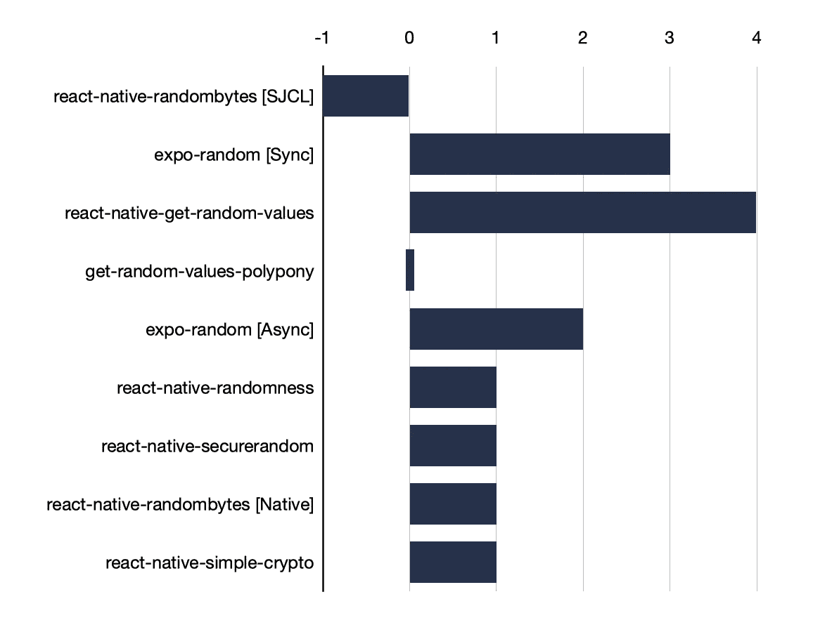
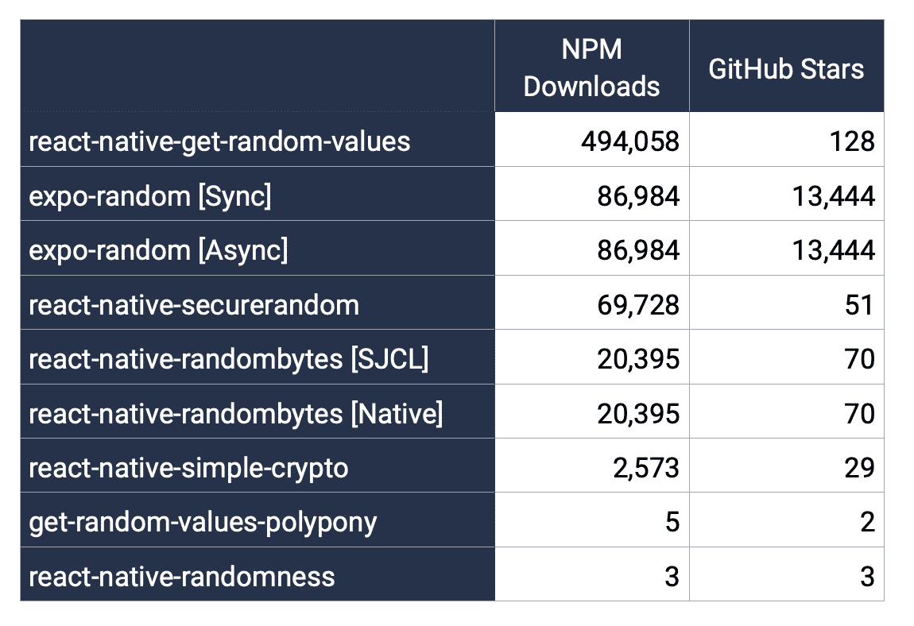
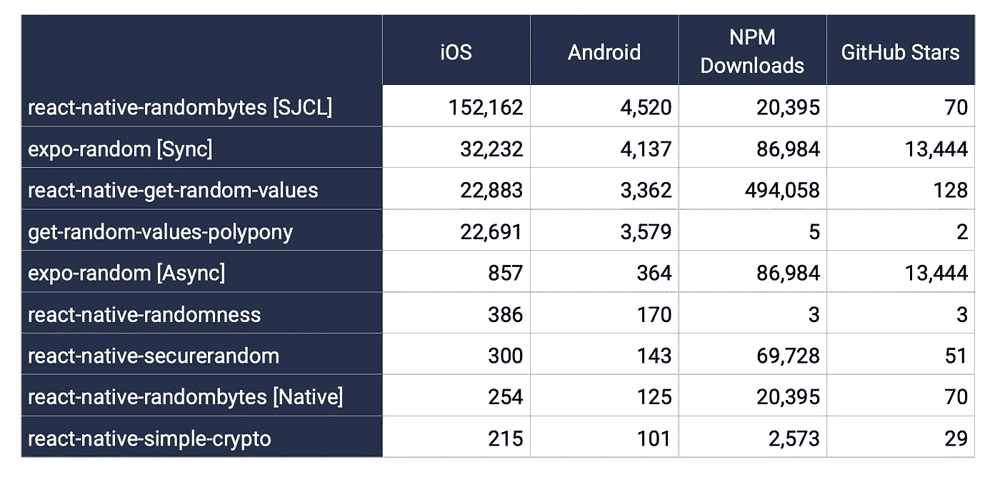

# 如何在 React Native 中测试随机数生成(RNG)

> 原文：<https://medium.com/geekculture/how-to-benchmark-random-number-generation-rng-in-react-native-fda8308c026d?source=collection_archive---------15----------------------->

## 通过 React Native 中的 JavaScript 层在 iOS 和 Android 上生成加密保存随机数的分析。

How to benchmark random number generation (RNG) in React Native

## **动机**

这篇文章开始是为了寻找一个伟大的 UUID 一代图书馆。结果，它让我用 Typescript 重写了我现有的 [react-native-uuid](https://www.npmjs.com/package/react-native-uuid) 库。然而，我并没有就此止步。UUID 生成是基于随机数生成(RNG)，这是一个更大的密码学主题，特别是 [RNG](https://en.wikipedia.org/wiki/Random_number_generation) 。

> 如果你没有得到正确的 RNG，你就有 UUIDs 之间发生冲突的风险，你的加密将更容易受到统计攻击。

## TL；速度三角形定位法(dead reckoning)

[RNBenchmark](https://github.com/eugenehp/RNBenchmark) 回购与 RNG 标杆的所有代码。
[React-Native-benchmark](https://www.npmjs.com/package/react-native-benchmark)库在 React Native 中运行你的基准。

Subjective security ranking from -1 to +4 (more is better)

我添加了基于库的实现和性能的主观安全等级。例如，`react-native-randombytes [SJCL]`只使用了 **JavaScript 的**实现，因此它是在移动设备上使用的最不安全的库。`react-native-get-random-values`库具有良好的性能和回退能力。`get-random-values-polypony`被评为 0，因为它只对 36 字节或更少的随机值有效。

## 放弃

本文描述了基准测试方法的早期结果，它并不完美。我相信会有更好的方法来衡量 Javascript 性能和本机代码性能。任何反馈都是受欢迎的，我希望随着对上述库的更多更改的发布，我会更新这篇文章。

## 概述

1.  RNG 为什么重要
2.  碰撞及其含义
3.  本文分析了哪些库
4.  基准工具
5.  方法学
6.  挑战
7.  结果
8.  限制
9.  外卖食品
10.  后续步骤

## RNG 为什么重要

它是一个非常小众的话题，大多数开发者使用现成的库来解决随机生成。然而，由于 React Native 与浏览器环境和 Node.js 环境相比，是一个不同的组件生态系统，因此理解这种差异非常重要。默认情况下，React Native 中没有标准的 [Crypto](https://developer.mozilla.org/en-US/docs/Web/API/Crypto) 库，这意味着您可以选择一个库来生成真随机数，而不是在 JavaScript 中使用`Math.random()`生成伪随机数。

## 碰撞及其含义

弱随机生成会给你带来问题并危及加密算法的安全性，这有两个主要原因。

[XKCD](https://xkcd.com/221/) comics about RNGs

1.  [通用唯一标识符冲突](https://en.wikipedia.org/wiki/Universally_unique_identifier#Collisions)。
2.  [您的加密协议漏洞增加。](https://en.wikipedia.org/wiki/Random_number_generator_attack)

DILBERT © 2001 Scott Adams. All rights reserved.

我喜欢可视化分析，它显示了不同随机数生成器之间的差异。

Visual comparison of two RNGs. Courtesy of [https://www.random.org/analysis/](https://www.random.org/analysis/)

因此，如果你使用一个弱 RNG 或伪 RNG，你很可能会损害你的加密算法，使攻击者利用这个漏洞非常便宜。问你的 [CISO](https://en.wikipedia.org/wiki/Chief_information_security_officer#:~:text=A%20chief%20information%20security%20officer,and%20technologies%20are%20adequately%20protected.) 。

## 本文将分析什么

以下是社区仍在维护和使用的前 7 个库。

你可以在这里找到完整的库列表。在研究这个主题的时候，我发表了另一个库，它使用 iOS 和 Android 中严格的本地方法生成随机数[这里](https://www.npmjs.com/package/react-native-randomness)。参见下面关于它是如何构建的一步一步的教程。

 [## 如何在 2021 年构建一个 react-native 插件

### 关于使用 Objective-C 和 Kotlin 编写的本机代码构建 TypeScript 包装的分步指南。

medium.com](/reactivelions/how-to-build-a-react-native-plugin-in-2021-60704edc0c28) 

## 基准工具

有很多很棒的 Objective 基准测试和性能分析库——C、C、C++、Java、Kotlin，有几个是针对 JavaScript 的，但是据我们所知，没有一个是针对 React Native 的。

首先，我尝试了一个 10 年前的库 [benchmark.js](https://github.com/bestiejs/benchmark.js) ，它对其他 web 项目来说很棒，但在 React Native 上失败了，因为它依赖于浏览器的环境，并且仍然支持 Safari 2.x 和 IE🤯

我还发现了围绕 benchmark.js 的一个很好的包装器[,它大大降低了复杂性，但仍然不能在 React Native 上运行。](https://www.npmjs.com/package/benny)

我最终构建了一个使用异步回调和 benchmark.js 使用的类似 API 的 drafty 端口。我使用了和他们一样的统计分析方法。并使用 TypeScript 来简化调试。

 [## react-native-基准

### 受 benchmark.js 启发，用 TypeScript 编写的 React 原生基准测试库。警告:此库正在…

www.npmjs.com](https://www.npmjs.com/package/react-native-benchmark) 

它并不完美，我欢迎任何关于我们如何改进和压力测试的反馈！

## 方法学

[react-native-benchmark](https://www.npmjs.com/package/react-native-benchmark) 运行一套基准测试，其中每个基准测试执行每个有效负载函数至少 5 次，每次至少 1 秒。

在对每一个被测试的库进行了更精确的观察之后，我发现它们中的许多都退回到了计算量较小的一代，因此我对其中的几个进行了分解。

1.  [expo-random](https://www.npmjs.com/package/expo-random) —这个库应该在 [Expo](https://expo.io/) 中测试，以获得更好的结果。但是我是在 clean React Native 项目中的“弹出”状态下测试它的。有同步方法`getRandomBytes`和异步方法`getRandomBytesAsync`。在[源代码](https://github.com/expo/expo/blob/master/packages/expo-random/src/Random.ts#L29-L33)中，你可以发现如果有，它首先调用`ExpoRandom.getRandomBytes`，否则，它调用`ExpoRandom.getRandomBase64String`。[这是它在 Objective-C 中的原生对应物](https://github.com/expo/expo/blob/master/packages/expo-random/ios/EXRandom/EXRandom.m#L37-L48)。如果你正在安装`expo-random`,你可能想先看看这些黑客。
2.  [react-native-randombytes](https://www.npmjs.com/package/react-native-randombytes) 是第四流行的库，它也有两种不同的实现方法。一个是使用[斯坦福 javascript 加密库(SJCL)](https://www.npmjs.com/package/sjcl) 仅在 Javascript 中执行。另一个——使用[本地执行](https://github.com/mvayngrib/react-native-randombytes/blob/master/index.js#L38-L55)。SJCL 利用`Math.random`给[他们的池重新播种](https://github.com/bitwiseshiftleft/sjcl/blob/master/core/random.js#L370)。它还使用不同事件的熵值，这很聪明，但是如果设备不动的话可能会受到影响。
3.  [react-native-get-random-values](https://www.npmjs.com/package/react-native-get-random-values)是最受欢迎的库，它模仿了`Crypto.getRandomValues`，并后退到了`ExpoRandom.getRandomBytes`。在这里检查它的核心逻辑[。](https://www.npmjs.com/package/react-native-get-random-values)
4.  [react-native-securerandom](https://www.npmjs.com/package/react-native-securerandom)是下载量排名第三的库，它实现了伪 RNG 修复，这让我们回到了谷歌工程师关于 Android 安全性的帖子。
5.  [get-random-values-poly ony](https://www.npmjs.com/package/get-random-values-polypony)继承了[@ consento/sync-random bytes](https://www.npmjs.com/package/@consento/sync-randombytes)的大部分代码。它创造性地解决了 RNG，通过[使用本地 UUID 调用](https://github.com/consento-org/get-random-values-polypony/blob/main/entropyFromUUID.js)播种随机池 [，与其他本地实现相比，当您需要生成短(=36 字节)序列时，它在 iOS 和 Android 上提供了非常好的性能。然而，如果你想生成超过 36 个字符(默认 UUID 长度)的东西，你可能会希望得到更好的熵，并运行几次。](https://github.com/consento-org/get-random-values-polypony/blob/main/ios/GetRandomValuesPolyPony.m#L27)
6.  [react-native-simple-crypto](https://www.npmjs.com/package/react-native-simple-crypto)库是使用本机代码实现一些加密方法的更大努力。
7.  [React-Native-randomness](https://www.npmjs.com/package/react-native-randomness)是我的 React Native 的 RNG 库版本。

**下面是主要的基准测试逻辑:**

Main benchmarking logic

## 挑战

这是 React 本地架构的样子。

Courtesy of [https://dev.to/goodpic/understanding-react-native-architecture-22hh](https://dev.to/goodpic/understanding-react-native-architecture-22hh)

在本地代码和 javascript 线程之间有一座沟通的桥梁。Bridge 只通过 JSON 进行通信，这意味着我们不能来回发送原始字节。通过[本机模块](https://reactnative.dev/docs/native-modules-ios)调用本机代码也有开销，在我们的例子中——将字节数组转换为 base64，然后再转换回来。

## 结果

Performance of RNG libraries for React Native

## 限制

我没有分析 Windows 和 Web 平台，上面的一些库支持它们。

我没有分析每个 RNG 库的冲突生成及其质量。这可能会在某个时候成为单独的研究。请在评论中告诉我。

## 外卖食品

现在有 7 个 RNG 库可用于 React Native，每一个对于特定的用例都足够好。没有放之四海而皆准的完美图书馆。

如果你正在生成少量的随机字节(低于 36 字节)，你可以使用[get-random-values-poly ony](https://www.npmjs.com/package/get-random-values-polypony)。

如果你不想要本地依赖，你最好的选择是使用[react-native-random bytes](https://www.npmjs.com/package/react-native-randombytes)并启用 SJCL👇。

 [## sjcl

### 斯坦福 Javascript 加密库 12.02.2014:当前开发版本在 ecc 模块中有一个偏执 bug

www.npmjs.com](https://www.npmjs.com/package/sjcl) 

如果你需要比 RNG 更好的使用本地代码实现的`Crypto`库:

 [## 反应-本地-简单-加密

### 一个更简单的 React-Native 加密库

www.npmjs.com](https://www.npmjs.com/package/react-native-simple-crypto) 

**要注意:**Java 和 Kotlin 中的 Android RNG 有其自身的缺陷:

 [## 一些安全世界的想法

### Android 安全团队一直在调查比特币交易泄露的根本原因，该交易导致…

android-developers.googleblog.com](https://android-developers.googleblog.com/2013/08/some-securerandom-thoughts.html) 

## 后续步骤

在分析了[get-random-values-poly ony](https://www.npmjs.com/package/get-random-values-polypony)的实现后，它启发我在未来的版本中为我的库 [react-native-uuid](https://www.npmjs.com/package/react-native-uuid) 添加原生 UUID 代。

**我希望听到社区的反馈，并确定需要改进的地方。**

我的另一个库[react-native-randomness](https://www.npmjs.com/package/react-native-randomness)中 RNG 实现的 Java 部分肯定需要更多的关注。

也许所有这些变化都可以提炼为简单的`C++`代码，这样它就可以在 Android 和 iOS 平台上重用。

## 关于作者

Eugene Hauptmann, CEO of [Reactive Lions](https://www.reactivelions.com/)™

尤金是一个以信仰为中心的技术专家，一个连续的企业家，天使投资人，顾问和导师。

他是 [REACTIVE LIONS INC.](https://www.reactivelions.com/) 的创始人兼首席执行官，在这里，他正在实现自己的愿景，即在科技世界中以信念驱动创业精神。他目前在美国管理着一个由 40 多名才华横溢的工程师组成的团队。

Eugene 是建立技术团队的专家，也是可扩展软件产品的首席架构师。他的经验超越了 B2B 和 B2C，涉及多个行业，如[网络安全](https://www.reactivelions.com/services/#Cyber)、深度技术、金融科技、媒体、人工智能、人工智能、数据平台、市场、健康、医疗保健、空间、并购等等。

[联系我们](https://www.reactivelions.com/contact/)了解我们如何帮助您的企业打造卓越的技术。