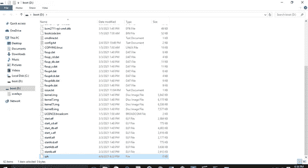
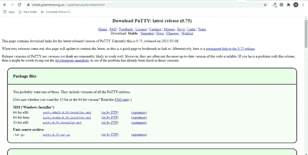
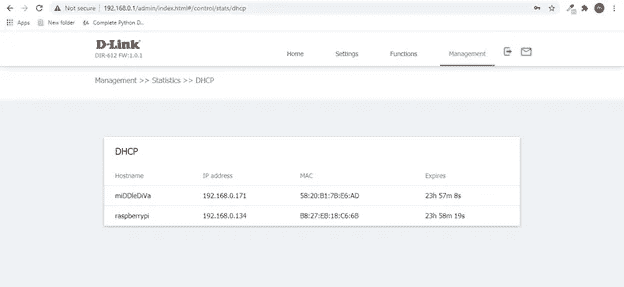
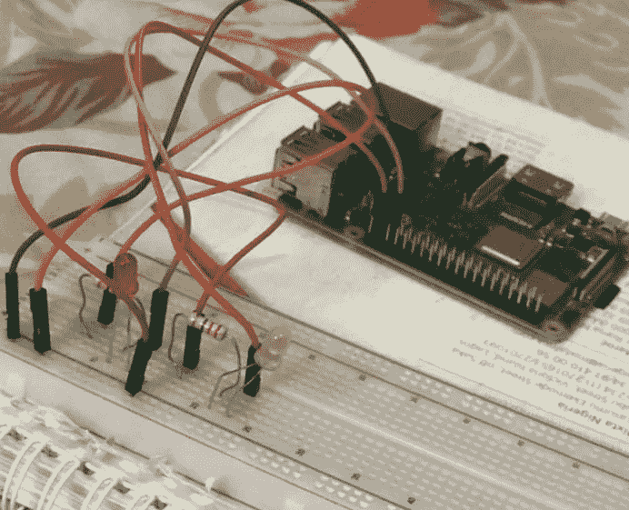
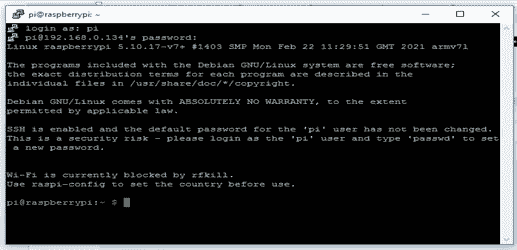
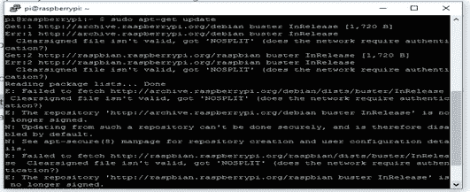
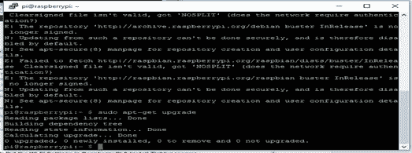
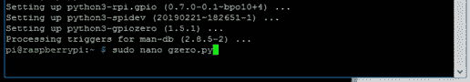
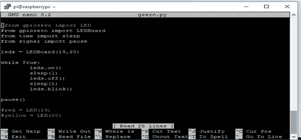

# 如何使用 Raspberry Pi 闪烁 Led

> 原文：<https://medium.com/geekculture/how-to-blink-led-using-raspberry-pi-8351b06348d7?source=collection_archive---------20----------------------->

> 本文将介绍如何使用 Raspberry Pi 闪烁 LED(发光二极管),以及如何在其上使用 GPIO(通用输入/输出)引脚。此时，如果你还没有安装 Raspbian OS，可以在这里阅读我之前关于安装 Raspbian OS 的文章[。](https://elijahmaria04.medium.com/getting-started-with-raspberry-pi-and-installing-raspberry-pi-os-f20cbee4c008)

在我们深入实际方面之前，让我们先回顾一下 Raspberry Pi 的一个特殊组件— GPIO

*   GPIO 被称为通用输入/输出引脚，是 Raspberry Pi 的一个强大功能。这些引脚可用于向元件提供信号，也可从元件读取信号。例如，引脚 1，2 供电(分别为 3.3V 和 5v)。GPIO 引脚的功能是可定制的，可以使用多种编程语言和工具进行控制。欲了解 GPIO 引脚的更多信息，请查看此处的。

GPIO Pins

GPIO 引脚很容易损坏，因此使用 3.3 V 逻辑时要小心。

> 让我们开始吧！

**所需硬件:**

1.  发光二极管
2.  220 欧姆电阻器
3.  跳线
4.  试验板
5.  树莓 Pi 3 型号 B+
6.  以太网电缆
7.  路由器
8.  一个 5V 2A 微型 USB 电源适配器。

**所需软件:**

1.  油灰

**首先，启用 ssh 连接**

I .将 MicroSD 卡插入读卡器并连接到 PC。

二。将“ssh”文件添加到 MicroSD 卡根目录。在 MicroSD 卡的引导分区上创建 ssh 文件名(不带任何扩展名)

三。安全取出 MicroSD 卡。现在 SSH 已经启用。

四。将 MicroSD 卡插入 Raspberry Pi 上的相应插槽。

**接下来，在 PC 上下载并安装**[**Putty**](https://www.chiark.greenend.org.uk/~sgtatham/putty/latest.html)

****

**PuTTy**

**PuTTY 是一个 SSH 和 Telnet 客户端，是用于 Windows 平台的免费开源软件。它用于远程访问另一台计算机。**

****获取树莓派的 IP 地址****

**我们需要 IP 地址来连接树莓派。**

*   **将以太网电缆的一端连接到 Raspberry Pi，另一端连接到路由器。**
*   **将 PC 连接到路由器**
*   **转到路由器的 DHCP 表，复制树莓派的 IP 地址**

****

****设置组件****

**使用试验板和 Raspberry Pi 上的 GPIO 引脚连接 led、电阻和跳线。**

**此时，应该关闭 Raspberry Pi，因为这样在连接组件时更安全。**

**步骤 1:将发光二极管(分别为红色和黄色)连接到试验板上。**

****

**LED image from [energy-saving lighting](https://www.google.com/url?sa=i&url=https%3A%2F%2Fwww.energysavinglighting.org%2Fthe-history-of-led-lighting%2F&psig=AOvVaw3SbKMyj32zNzjnePs4mBxU&ust=1622806124865000&source=images&cd=vfe&ved=0CAMQjB1qFwoTCKDrjdet-_ACFQAAAAAdAAAAABAS)**

> **我首先注意到的是 LED 的边缘。它有一个曲边和一个平边。LED 的弯曲侧为正，而平坦侧为负。我打赌我们现在的眼光比我那时更敏锐了😀请注意，LED 有一个长边和一个短边，分别为正极和负极。**

**第二步:选择负极，使用电阻器，将其连接到 GND ( **引脚 39** )。**

**第三步:将另一端分别连接到 GPIO(引脚 20 和 19)。请随意使用图片作为参考。**

****

**An image depicting the connection**

**我们可以使用不同的 GPIO 引脚进行连接，但要确保遵守所有规则。**

****接下来，打开树莓酱。****

****

**注:如果 LED 自动亮起，说明连接有问题。**

****设置树莓派****

*   **启动 PuTTy，粘贴我们之前复制的 Raspberry Pi 的 IP 地址。默认端口是 22**

****

*   **输入用户名和密码，默认分别为' **pi** 和 **raspberry'** 。**

****

*   **升级和更新 Pi。每次我们使用 pi 时，总是更新和升级它是一个好习惯。输入“sudo apt-get 更新”和“sudo apt-get 升级”**

********

****使用 Python 代码控制 led****

*   **输入“sudo apt-get install python3”安装 python。**

****

*   **安装 **gpiozero** 库。**

****

*   **创建一个文件“ **gzero.py** ”。**

****

*   **编写以下代码。**

****

****LEDBoard** 在有一个以上 **LED** 时使用。使用**led 板**可以访问一组 led。如果是 **LED** ，我们就导入**“LED”**而不是**“LED board”**。**

**保存文件并返回控制台。**

**要运行程序，只需写“ ***python3 file-name.py”。*****

**注意:使用正确数量的 GPIO 管脚。**

**只要代码继续运行，LED 就会打开/关闭。输入 Ctrl + C 停止 python 程序**

****结论****

**确保正确连接组件，并在代码中使用正确数量的 GPIO 引脚。**

**复习时间。还记得当我们需要 PI 的 IP 地址时，我们使用了路由器。这种方式不太好。每次我们需要连接到 Raspberry Pi 时，我们都必须设置一个路由器来获取 IP 地址。用我们的移动热点连接怎么样？在我的下一篇文章中，我们将学习[如何使用移动热点](/geekculture/how-to-connect-to-the-raspberry-pi-using-mobile-hotspot-2362a6b02efc)连接到树莓派。**