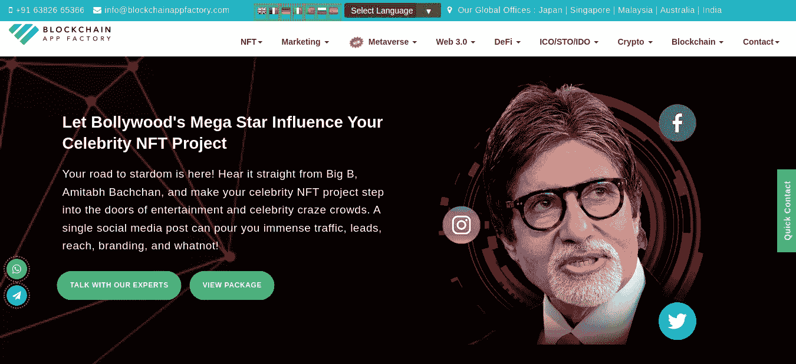
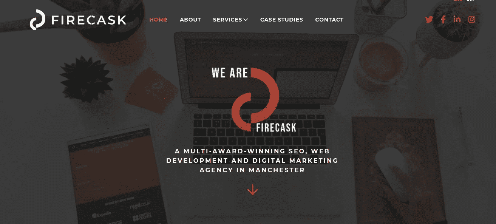
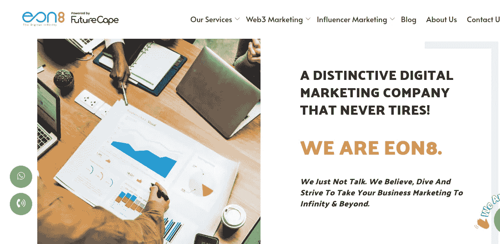
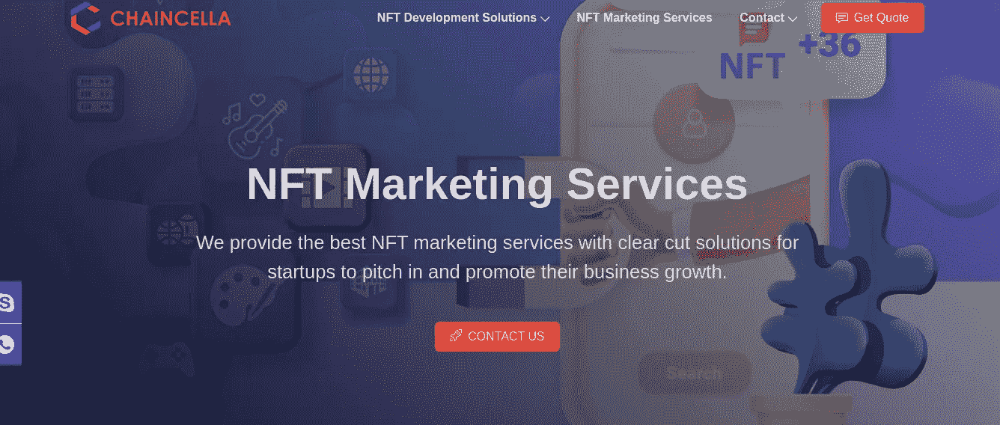
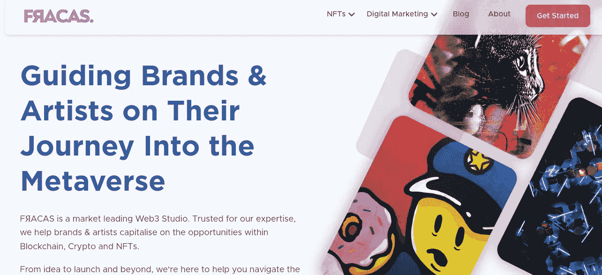
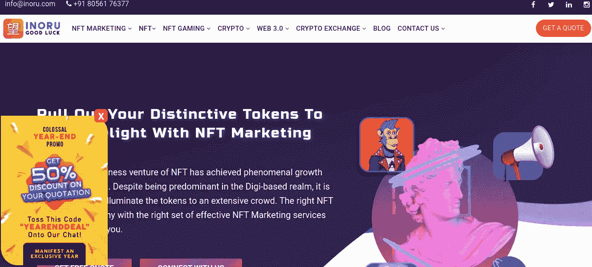
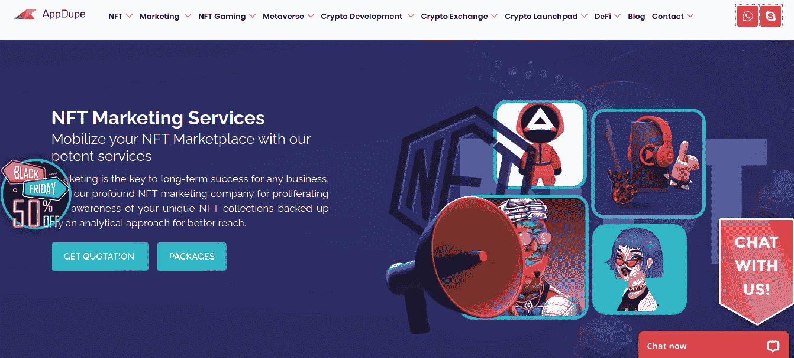

# 如何让非专利技术引人注目，在 NFT 市场赚大钱？

> 原文：<https://medium.com/geekculture/how-to-bring-nfts-to-the-limelight-to-earn-big-bucks-in-the-nft-market-d571e77e577f?source=collection_archive---------17----------------------->

## 我们整理了一份 NFT 顶级营销公司的名单，可以帮助你在 NFT 开展营销活动。

NFT Marketing

不可替代的代币和 NFT 正在为数字领域的企业创造一个更好的空间。由于最大限度地利用了这一机会，Instagram、脸书、阿迪达斯、HBO、世博娱乐等市场领导者已经带着 NFT 和 marketplaces 进入了 NFT 市场。尽管这对 NFT 市场来说是健康的，但这可能会让小企业和初创公司感到紧张，因为他们需要与领先的公司和企业竞争。

即使是一个潜力巨大的 NFT 也可能在数字空间的非功能性数字技术的海洋中迷失方向。这就是 NFT 营销在帮助 NFT 在 NFT 舞台上接触到他们的目标受众方面发挥重要作用的地方。如果你想更广泛地接触 NFT，并在 NFT 市场建立稳固的存在，那么一个熟练的 NFT 营销机构可以为你做到这一点。

[**区块链 APP 工厂**](https://bit.ly/3WN420h)

区块链应用工厂因其一流的 NFT 营销服务而被视为加密领域最成功的 NFT 营销机构。

> 它拥有 10 年的广告经验，与 POLYGON、SHELL、RADIOSHACK、MC DONALDS、ECONET、LI & FUNG、GLOBANT、BREVAN HOWARD 等客户建立了合作伙伴关系。

该公司有一个高度透明的营销结构，提供背靠背的营销策略，以产生最大的结果与 NFT。

从了解项目的分析和制定一致的营销路线图到成功地将计划付诸行动，区块链应用工厂为其客户提供了端到端的营销解决方案。众所周知，该机构瞄准正确的受众，并为高销售线索生成部署合适的营销策略。该公司为众多国内外客户成功开展了几次营销活动。

区块链应用工厂在区块链行业拥有超过 10 年的经验，已经发展成为最受欢迎的区块链开发和营销公司。

## [**火桶**](https://bit.ly/3UMaN0H)

Firecask 是一家屡获殊荣的数字营销机构，总部位于英国。它在营销方面的专业技能和知识迎合了来自世界各地的大、中、小型企业的需求。

就 NFT 营销而言，它提供高度创新的基于研究的营销策略来帮助你接触 NFT 大众。Firecask 提供全面的营销服务，包括市场研究、品牌推广、铸造、品牌合作等。

如果您正在寻找一家致力于为 NFTs 执行优质营销策略的营销机构，fire buck 可能是理想的选择。

## [**EON8**](https://bit.ly/3ToaOqk)

EON8 是一家 360 度营销机构，凭借其设计巧妙的营销活动成功提升了业务。凭借在加密领域超过 10 年的经验，该公司已经与 1000 多家客户成功开展了营销活动。

该公司的营销专家部署全面的营销服务，以帮助 NFT 创作者实现他们的营销目标，并为他们的 NFT 产生高投资回报率。

如果你希望围绕你的 NFT 建立真正的宣传并影响 NFT 市场，那么 EON8 是你应该下注的地方。

## [**链条**](https://bit.ly/3NRiqAB)

Chaincella 正在成长为 NFT 市场上领先的 NFT 营销机构之一。该公司为 NFT 品牌在 NFT 市场建立稳固的存在提供了一个明确的计划。

该机构提供全面的营销包，包括构思、分析、教育您的目标市场以及执行成功的营销策略。

雇用 Chaincella，因为它的成熟和强大的营销策略可以帮助你从人群中脱颖而出。

> “投资自己。当你这样做的时候，你就按下了成功的快进键。”—约翰·李·杜马斯

## [**FRACAS 数字**](https://bit.ly/3NWTfNe)

Fracas Digital 是一家基于区块链的数字营销机构，为其客户提供优质的 NFT 营销服务。作为一家 NFT 营销机构，该公司的目标是为 NFTs 提供最高水平的服务，以获得最大的投资回报。

凭借其经验丰富、知识渊博的营销团队，它可以帮助其客户保持其 [**NFTs**](https://en.wikipedia.org/wiki/Non-fungible_token) 在 Web3 世界中的吸引力中心。

## [**INORU**](https://bit.ly/3WNocqV)

INORU 是 NFT 领先的营销公司之一，提供全面的 NFT 推广服务。该公司以其成本效益、营销专长、先进工具的使用和适应性而闻名。

Inoru 拥有一支由 web3 营销专业人员组成的熟练团队，他们拥有区块链营销服务的实时经验。公司的营销服务包括推荐营销、动态驱动、影响者营销、不和谐社区营销、社交媒体营销、电子邮件营销、公关营销等。

如果你正在寻找一家技术娴熟、以结果为导向的 NFT 营销公司，那么 INORU 可能是你的理想选择。

## [**APPDUPE**](https://bit.ly/3TrqGsd)

Appdupe 是另一家领先的区块链开发和 NFT 营销公司，提供高效的 NFT 营销服务。它在 web3 领域因其一流的、以结果为导向的营销策略而闻名，这种策略能在规定的时间内产生最大的效果。

Appdupe 通过其先进的尖端营销工具提供复杂和个性化的营销策略。Appdupe 部署的一些营销策略包括内容营销、附属营销、社交媒体营销、上市等。

如果你正在寻找一家有前途的营销公司，通过其高度结果驱动的营销活动来产生线索，那么 Appdupe 可能是你的完美选择。

**整理文字**

如果你是一名企业家，正在寻找一家顶级的 NFT 营销公司，让你的 NFT 成为众人瞩目的焦点，并增加你与你的 NFT 成功出游的机会，那么尝试与上述任何一家 NFT 营销机构合作。