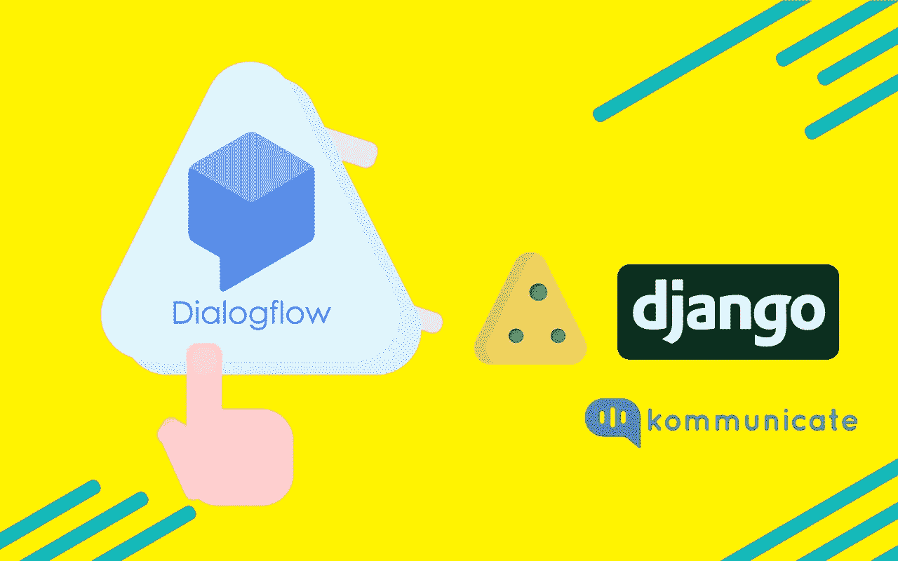
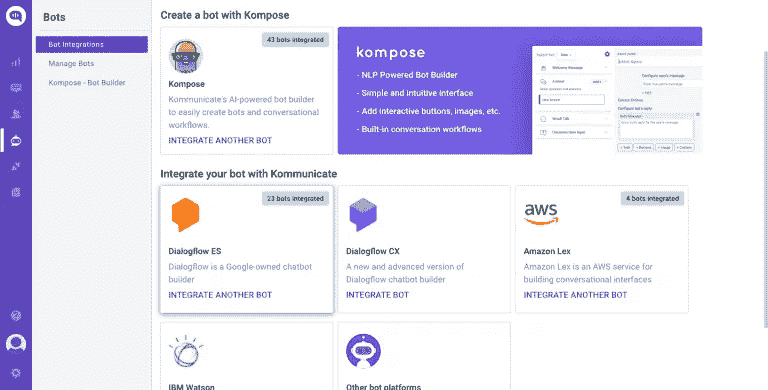
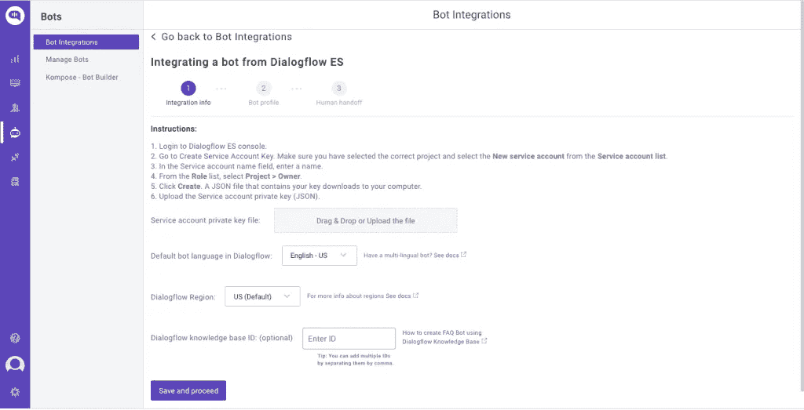

# 如何使用 Dialogflow 构建 Django 聊天机器人:分步指南

> 原文：<https://medium.com/geekculture/how-to-build-a-django-chatbot-using-dialogflow-a-step-by-step-guide-ade0c41f30f1?source=collection_archive---------2----------------------->



[Python](https://www.python.org/) 是当今最流行的编程语言之一，而 [Django](https://www.djangoproject.com/) 是一个免费、开源的 Python web 开发平台，是一个非常通用的 web 开发工具，可以用来构建任何需要的网站或应用程序。

在本文中，我将努力让你很容易理解如何将 Dialogflow chatbot 集成到 Django 网站中。

如果你还没有 Dialogflow 聊天机器人，那么这里有一个[的分步教程来构建你自己的聊天机器人](https://www.kommunicate.io/blog/dialogflow-tutorial-create-chatbots/)。然而，Dialogflow 有其自身的局限性。它没有提供我们聊天对话所需的 UI。

由于我们现在不是 80 年代，我们需要一个前端，而不是一个为非技术人员提供的沉闷黑暗的命令行用户界面，来提供一个能够引起共鸣并且对用户友好的聊天机器人。

因此，我们正在将 Dialogflow 与 Kommunicate 集成，它为聊天小部件和管理仪表板提供了预建的 UI。

如果您没有通信帐户，[请在此](https://www.kommunicate.io/product/dialogflow-integration)注册免费帐户以继续。

为了便于理解，这篇文章分为两部分。

*   将 Dialogflow bot 与通信集成在一起
*   将通信与 Django 框架相结合

# 第 1 部分:将 Dialogflow 与通信集成

要在 komunicate 中集成您的 Dialogflow bot，请登录到您的 komunicate 仪表板并导航到 bot 集成部分。如果您没有帐户，您可以在这里创建一个[。找到 Dialogflow 部分，然后单击 Integrate Bot。](https://dashboard.kommunicate.io/signup?product=kommunicate)



现在，导航到您的 Dialogflow 控制台并下载服务帐户密钥文件。以下是查找文件的步骤:

1.  通过单击设置图标打开对话流代理设置
2.  点击谷歌项目栏中提到的**谷歌云链接**
3.  在 google 云页面中，通过单击 API & services 导航到凭据部分
4.  在“凭据”下，找到服务帐户，然后单击“对话流集成”的“编辑”
5.  在屏幕的底部，点击 ADD key 按钮并创建一个 key 选项，一个 JSON 密匙将被下载
6.  现在上传**密钥文件**



通过为您的机器人命名，完成设置并在最后一步启用/禁用机器人到人的切换，然后您可以在两个地方检查和测试您新开发的机器人:

仪表板→ Bot 集成→管理 Bot:您可以在这里检查您所有集成的 Bot
仪表板→Bot 集成:您的 Dialogflow 图标应该是绿色的，显示您成功集成的 Bot 数量。


# 第 2 部分:用 Django 框架集成 Kommunicate

既然我们已经有了 Dialogflow 聊天机器人及其用户界面，现在我们可以将它与 Django web 框架集成。在创建了 Django 项目之后，有两种可能的方法将 kommunicate 脚本代码添加到您已经创建的 HTML 模板中

1.从 kommunicate dashboard 中复制 javascript 代码，并将其粘贴到您创建的 HTML 页面的结束 body 标记(

```
<h1>Hello, World!</h1> <body> <script type="text/javascript"> (function(d, m){ var kommunicateSettings = {"appId":"kommunicate-support","popupWidget":true,"automaticChatOpenOnNavigation":true}; var s = document.createElement("script"); s.type = "text/javascript"; s.async = true; s.src = "https://widget.kommunicate.io/v2/kommunicate.app"; var h = document.getElementsByTagName("head")[0]; h.appendChild(s); window.kommunicate = m; m._globals = kommunicateSettings; })(document, window.kommunicate || {}); /* NOTE: Use webserver to view HTML files as the real-time update will not work if you directly open the HTML file in the browser. */ </script> </body>
```

2.在 settings.py 文件中定义 STATIC_URL，如下所示，并将该文件直接加载到模板中

```
STATIC_URL = '/static/'
```

使用下面的表达式加载模板中的静态文件

```
1 
```

在您的项目中，首先创建一个“静态”目录，并将文件存储在其中。在静态目录中创建 js 文件，并将 Kommunicate 脚本添加到您生成的 js 文件中。

HTML 模板应该是这样的

```
<!DOCTYPE html> <html lang="en"> <head> <meta charset="UTF-8"> <title>Index</title>  <script src="" type="text/javascript"></script> </head> <body> <h1>Hello, World!</h1> </body> </html>
```

Script.js 文件应该是这样的(注意:用安装部分提到的您自己的应用程序 ID 替换 APP-ID)

```
(function(d, m){ var kommunicateSettings = {"appId":"APP-ID","popupWidget":true,"automaticChatOpenOnNavigation":true}; var s = document.createElement("script"); s.type = "text/javascript"; s.async = true; s.src = "https://widget.kommunicate.io/v2/kommunicate.app"; var h = document.getElementsByTagName("head")[0]; h.appendChild(s); window.kommunicate = m; m._globals = kommunicateSettings; })(document, window.kommunicate || {});
```

使用以下命令启动安装了 Dialogflow bot 的新创建的网站。

```
1 python manage.py runserver
```

瞧啊。有多简单？通过这几个简单的步骤，您可以将 Dialogflow bot 集成到 Django 网站中。这是聊天小部件在网站上的外观:

*原载于 2020 年 12 月 29 日*[*https://www . komunicate . io*](https://www.kommunicate.io/blog/dialogflow-chatbot-django-website/)*。*