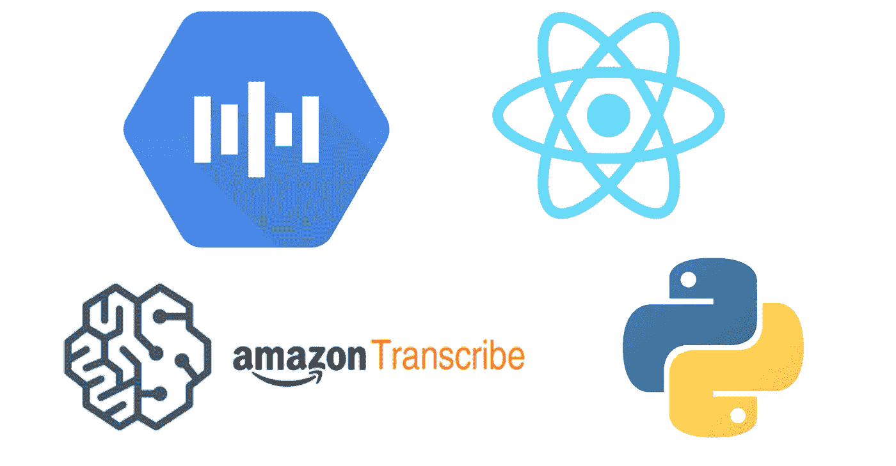

# 如何用 Google Cloud，React，Python 构建全栈转录 app

> 原文：<https://medium.com/geekculture/how-to-build-a-full-stack-transcription-app-with-google-cloud-react-and-python-2dfdcb5e556f?source=collection_archive---------14----------------------->

Photo by the author

语音识别的研究在过去几年取得了重大进展，例如脸书的 [wav2letter](https://github.com/flashlight/wav2letter) 和最近的 [HuBERT](https://analyticsindiamag.com/hubert-facebooks-latest-approach-to-self-supervised-speech-representation-learning/) 。随着诸如 [OpenAI 的 GPT-3](https://openai.com/blog/gpt-3-apps/) 和[微软的 ZeRO-Infinity](https://www.microsoft.com/en-us/research/blog/zero-infinity-and-deepspeed-unlocking-unprecedented-model-scale-for-deep-learning-training/) 的突破，NLP 研究的兴趣和资金也达到了历史最高水平。