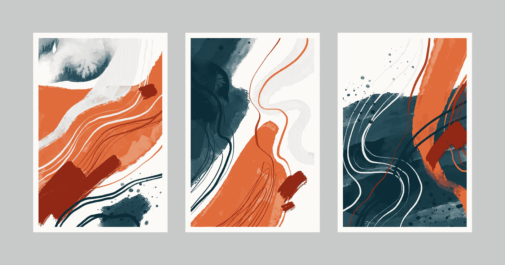
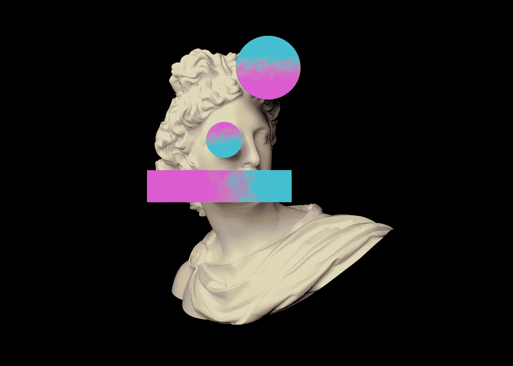

# 如何建立一个低成本的 NFT 制作工作室？

> 原文：<https://medium.com/geekculture/how-to-build-a-low-cost-nft-production-studio-628930051e1f?source=collection_archive---------16----------------------->

在您可承受的预算内，释放您最重要的***【NFT】制片厂*** *。但是理想的工作室是什么样子的呢？你能阅读这个博客来了解更多吗？*

NFT Production Studio

你为期一年的 NFT 投资正在走向成熟。你希望更上一层楼，但不知道从哪里开始！

记住——可扩展性是让你从一个朴实无华的投资者成为成功企业家的关键。对 NFT(不可替代代币)感兴趣而对 NFT 产品不感兴趣是荒谬的。

> 你有兴趣在 NFT 建立一个工作室吗？想知道先决条件是什么？

这个博客将教你如何在不花费太多的情况下建立你的 [**NFT 制作工作室**](https://www.appdupe.com/nft-studio?utm_source=medium&utm_medium=blog1apr&utm_campaign=Yasmeen) 。

# **什么是理想的 NFT 工作室？**

建立一个 NFT 工作室可以让你在你想要的时间内，以你想要的方式，和你想要的人，创造代币。一个内部的 NFT 工作室允许你实验不同的算法生成的 NFT，并听取 NFT 爱好者的反馈。

你想知道——理想的 NFT 制片厂是什么样子的吗？让我们在这里给你一个要点:

## **#1 多重主题**

由于 NFT 工作室涉及到从零开始创造一个令牌，主题(背后)是精髓。一个人不可能制造出一个随机且毫无意义的 NFT 并将其货币化，你能吗？但这不是正在发生吗？我能听到你这么说。的确如此。但问题是，它们没有价值(从长远来看)。另一方面，具有艺术(或任何上下文主题)的非功能性主题具有很高的重要性。

另一个方面是创作背后的背景故事是什么？NFT 系列的灵感来自哪里？人们/NFT 买家在投资 NFT 项目时会寻找这些细节。

想象一下，你已经建立了自己的创意 NFT 工作室，有人找你设计他们的 NFT 系列。试着问——是什么让你产生了这个想法？寻找这些问题的答案会有所帮助，比如 CryptoPunks 的灵感如何帮助 Eric Calderon big time 推出他的项目(艺术块)。

## **#2 项目特定颜色&纹理**

仅仅因为有人拥有一个 NFT 工作室，他们就不能再复制同样的纹理和颜色。颜色的选择和应用是一个成败的关键，要有独特和引人注目的调色板。此外，如果处理得当，纹理和阴影可以将 gen 艺术收藏提升到一个新的高度。

这里是 NFT 工作室的理想机制:

*   保持调色板、纹理和阴影的独特性。
*   使调色板多样化。
*   一个理想的 NFT 工作室:让艺术家选择调色板或让算法选择组合。

## **#3 决定供应品**

**根据客户的要求开发 NFT 系列**是 NFT 工作室的主要职责。然而，这并没有结束！不可替代令牌的一个主要方面是它们的稀缺性。稀缺性和供给有着千丝万缕的联系，应该基于算法能力而不是经济考虑来做出决策。请记住，从金融角度来看，稀缺藏品中的个别作品可能会卖得更高，因为供应是有限的。此外，根据艺术家的受欢迎程度，他们可能会根据卖光的可能性来选择收藏。

确保早期的稀缺性是你的 **NFT 工作室**的精髓，让它成为一个经济的或算法的决定。

## **催生艺术潮流**

如果你是 NFT 的粉丝，你可能听说过“生成艺术”这个术语，用来描述像那些无聊的猿猴一样的“轮廓图片”NFT，它们的特征是使用“稀有”算法随机选择的。信不信由你，矮胖的企鹅和摇摆的鲸鱼是二十世纪一些最重要的艺术家的开创性作品的后代。

**【Art Blocks】是一个专门面向创意人员的 NFT 平台，允许他们上传买家可以“创造”迭代的算法。Art Blocks 带来了数百万美元的销售额，这对长期遭受痛苦的数字艺术家来说是一个巨大的福音。由 Fred Wilson 的 Union Square Ventures 创办的 NFT 巡回画廊 Bright Moments 在现场活动中铸造作品，让买家可以实时看到泰勒·霍布斯(Tyler Hobbs)的“不完全控制”等作品的迭代。**

# ****如何打造一个有创意的 NFT 工作室？****

**当建立你的 NFT 工作室时，确定你想要创造什么是很重要的。你的工作室会是什么样子？你想做一个元宇宙风格的 NFT 工作室吗？你希望你的客户如何参与？**

**很有可能，在你的 [**创意 NFT 工作室**](https://www.appdupe.com/nft-studio?utm_source=medium&utm_medium=blog1apr&utm_campaign=Yasmeen) 与你共事的大多数人都是第一次。使用您的工作室简化客户入职流程将会带来好处。**

**发展你的 NFT 工作室的一个关键因素是拥有优秀的平面设计技能。找一个也能做视频编辑的人，这样对视频 NFT 项目会有帮助。**

## ****结论****

**NFT 工作室正在成为一种趋势，不断努力在一个方便的位置提供所有最新的 NFT 产品。这个 NFT 工作室可以用于各种目的，因为它提供了一整套服务。NFT 工作室拥有一切，从概念到营销。你所要做的就是和他们互动。**