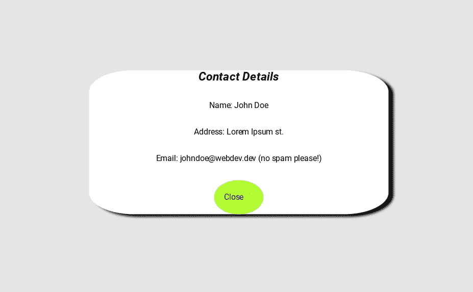

# 如何建立一个模型

> 原文：<https://medium.com/geekculture/how-to-build-a-modal-8ed6a70642d9?source=collection_archive---------30----------------------->

关于如何使用 Javascript、HTML 和 CSS 构建模型的简短教程。

# 什么是情态动词？

模态是弹出窗口或对话框，在网页上显示某种内容。它们通常由点击按钮等事件触发。它们也可以自动弹出(有时会非常烦人！).我们都可能在浏览网页时遇到过这样的问题。很多时候，他们会显示一些内容，要求你的电子邮件或注册某种促销优惠。好了，今天我们不会注册任何东西，我们将自己建立一个！

# 建立模型

为了构建我们的模型，我们将使用普通的 Javascript、HTML 和 CSS。首先，我们将设置我们的 HTML 模板。我们需要几个零件来组成我们的模型。一个外部的`div`元素，我们将用 id `overlay`标记它。这将是我们的模态盒将位于其上的窗口。模式将包含我们希望在模式打开时显示的所有主要内容，包括隐藏模式的关闭按钮。我们还需要一个按钮来触发打开模态。最后，我们将链接 CSS 和 Javascript 文件。

现在，我们可以添加一些样式，通过样式化我们的按钮和实际的模态本身，使我们的模态在视觉上更有吸引力。

让我们看看目前为止我们的封闭模型是什么样子的。

看起来棒极了！现在我们只需要用 Javascript 把它连接起来。我们需要监听用户点击*联系我*按钮和关闭模式时的点击事件。

这为打开和关闭我们的模态设置了功能。现在，当用户点击*联系我*按钮时，我们的用户将看到显示所有联系信息的模式。

# 摘要

模态是为了抓住用户的注意力。当模式被触发时，页面上的其他所有内容都被暂时停用。这就产生了对模型所呈现信息的直接关注。有时这可以增强用户体验，有时却可能适得其反。这完全取决于用例，以及模态是否呈现与用户相关的有用内容。

# 了解更多关于情态动词的信息

*   [模态窗口(维基百科](https://en.wikipedia.org/wiki/Modal_window))
*   [如何创建一个模态框(W3 学校)](https://www.w3schools.com/howto/howto_css_modals.asp)